# Multi-Window Runtime & Expanded API Architecture for FlowUi

## Executive Summary

This document presents a comprehensive analysis of the existing multi-window capabilities in **FlowUi** and provides a detailed architectural design for expanding and maturing the multi-window runtime.

- **Section 1** details the current multi-window API surface, internal mechanics, frame triad lifecycle (`beginFrame` -> `build UI` -> `endFrame` -> `drawFrame`), file locations, and friction points in the existing codebase.
- **Section 2** proposes three new categories of high-level multi-window APIs designed to eliminate boilerplate, improve configuration ergonomics, and support declarative element binding using FlowUi's C++20 `FlowElement` concept system. Furthermore, it outlines a roadmap for evolving the runtime from synchronous single-threaded frame orchestration to concurrent multi-threaded UI building and GPU submission.

---

# Section 1: Existing Multi-Window APIs & Uses

## 1.1 Architecture & Core Concepts

In FlowUi, multi-window support revolves around the central [App](file:///home/lkukhale/kodi/FlowUi/include/FlowUi/App.hpp#L89-L619) class, which acts as the owner and orchestrator of native window backends, Vulkan swapchains, transient frame storage, and UI management subsystems.

Key components involved in multi-window runtime management include:

1. **`WindowId` Identity**:
   Defined in [WindowId.hpp](file:///home/lkukhale/kodi/FlowUi/include/FlowUi/WindowId.hpp), `WindowId` is a 32-bit unsigned integer identifier (`uint32_t`).
   - `MainWindowId = 1`: Reserved stable identifier for the primary window created during `makeApplication(config)`.
   - `InvalidWindowId = 0`: Sentinel value representing an uninitialized or invalid window handle.
   - Secondary windows receive monotonically increasing IDs starting at `2` allocated via `reserveWindowId()` in [src/FlowUi.cpp:L1030-1044](file:///home/lkukhale/kodi/FlowUi/src/FlowUi.cpp#L1030-L1044).

2. **Per-Window Storage & Data Structures (`AppWindow`)**:
   Internally in [src/FlowUi.cpp](file:///home/lkukhale/kodi/FlowUi/src/FlowUi.cpp), each active window (main or secondary) is represented by an instance of `AppWindow`:
   - `IWindowBackend` / `GlfwWindowBackend`: Handles GLFW native window creation, input callbacks, monitor resolution, surface creation, and system clipboard operations ([Window.hpp](file:///home/lkukhale/kodi/FlowUi/include/window/Window.hpp#L125-L424)).
   - `VkSurfaceKHR` & `VulkanSwapchain`: Per-window Vulkan surface and swapchain handling framebuffers, presentation modes, and MSAA images.
   - `UiManager`: Per-window Clay layout context, transient text/string arenas, cursor state, and interactive widget tracking.
   - `ViewPortManager`: Per-window texture interop and custom Vulkan rendering viewport management.
   - `InputQueue`: Independent input event buffer capturing mouse position, button clicks, key events, and text input for the window.
   - Storage registration in `FlowStorageSystem`: Registers per-window render instance buffers and descriptor bindings.

---

## 1.2 Existing API Surface

The public API for managing secondary windows is exposed on [FlowUi::App](file:///home/lkukhale/kodi/FlowUi/include/FlowUi/App.hpp). The following table summarizes the existing multi-window functions:

| API Function | Return Type | Description | File Reference |
| :--- | :--- | :--- | :--- |
| `mainWindowId()` | `WindowId` | Returns the constant identifier (`1`) of the semantic main window. | [App.hpp:L114](file:///home/lkukhale/kodi/FlowUi/include/FlowUi/App.hpp#L114) |
| `createWindow(const WindowConfig& config)` | `Result<WindowId>` | Creates and initializes a new secondary native window, Vulkan swapchain, and `UiManager`. | [App.hpp:L134](file:///home/lkukhale/kodi/FlowUi/include/FlowUi/App.hpp#L134) |
| `destroyWindow(WindowId id)` | `Status` | Drains pending GPU work and destroys a secondary window. Main window cannot be destroyed via this API. | [App.hpp:L144](file:///home/lkukhale/kodi/FlowUi/include/FlowUi/App.hpp#L144) |
| `hasWindow(WindowId id)` | `bool` | Queries if `id` names an active, registered window. | [App.hpp:L151](file:///home/lkukhale/kodi/FlowUi/include/FlowUi/App.hpp#L151) |
| `pollEvents()` | `Status` | Polls global GLFW platform events and advances shared maintenance tasks. Must be called once per outer loop pass before individual window frame triads. | [App.hpp:L165](file:///home/lkukhale/kodi/FlowUi/include/FlowUi/App.hpp#L165) |
| `shouldClose(WindowId id)` | `bool` | Queries whether a specific window requested close/shutdown (e.g. user clicked window 'X'). | [App.hpp:L189](file:///home/lkukhale/kodi/FlowUi/include/FlowUi/App.hpp#L189) |
| `setShouldClose(WindowId id, int val)` | `void` | Manually sets or clears the close request flag for a window. | [App.hpp:L210](file:///home/lkukhale/kodi/FlowUi/include/FlowUi/App.hpp#L210) |
| `beginFrame(WindowId id)` | `Status` | Begins input processing and Clay layout arena allocation for window `id`. Requires `pollEvents()` to have run. | [App.hpp:L247](file:///home/lkukhale/kodi/FlowUi/include/FlowUi/App.hpp#L247) |
| `endFrame(WindowId id)` | `Status` | Concludes Clay layout calculation and generates render commands for window `id`. | [App.hpp:L270](file:///home/lkukhale/kodi/FlowUi/include/FlowUi/App.hpp#L270) |
| `drawFrame(WindowId id)` | `Status` | Submits render commands for window `id` to Vulkan and presents the swapchain image. | [App.hpp:L291](file:///home/lkukhale/kodi/FlowUi/include/FlowUi/App.hpp#L291) |
| `ui(WindowId id)` | `UiManager&` | Returns the `UiManager` instance for building UI elements inside window `id`. | [App.hpp:L477](file:///home/lkukhale/kodi/FlowUi/include/FlowUi/App.hpp#L477) |
| `viewPorts(WindowId id)` | `ViewPortManager&` | Accesses the Vulkan interop viewport manager for window `id`. | [App.hpp:L436](file:///home/lkukhale/kodi/FlowUi/include/FlowUi/App.hpp#L436) |
| `setWindowTitle(WindowId id, ...)` | `void` | Sets the native window title bar text. | [App.hpp:L512](file:///home/lkukhale/kodi/FlowUi/include/FlowUi/App.hpp#L512) |
| `windowSize(WindowId id)` | `pair<int,int>` | Returns window dimensions in screen coordinates. | [App.hpp:L523](file:///home/lkukhale/kodi/FlowUi/include/FlowUi/App.hpp#L523) |
| `framebufferSize(WindowId id)` | `pair<int,int>` | Returns window framebuffer size in actual pixels (high-DPI aware). | [App.hpp:L534](file:///home/lkukhale/kodi/FlowUi/include/FlowUi/App.hpp#L534) |

---

## 1.3 Current Multi-Window Usage Pattern

Currently, a multi-window FlowUi application must manually orchestrate the event loop, state management, window creation/destruction, and explicit frame triads for each window. 

The canonical pattern (as demonstrated in [example/main.cpp:L144-179](file:///home/lkukhale/kodi/FlowUi/example/main.cpp#L144-L179)) is:

```cpp
#include <FlowUi/Flow.hpp>
#include <vector>

int main() {
    FlowUi::AppConfig config{};
    config.window.title = "Main Application Window";
    config.window.width = 1280;
    config.window.height = 720;

    FlowUi::App app = FlowUi::makeApplication(config);
    std::vector<FlowUi::WindowId> secondaryWindows;

    while (true) {
        // 1. Poll global OS platform events
        if (!app.pollEvents()) break;

        // 2. Check main window closure
        if (app.shouldClose(app.mainWindowId())) break;

        // 3. Destroy secondary windows that requested close
        for (auto it = secondaryWindows.begin(); it != secondaryWindows.end(); ) {
            if (app.shouldClose(*it)) {
                app.destroyWindow(*it);
                it = secondaryWindows.erase(it);
            } else {
                ++it;
            }
        }

        // 4. Main Window Frame Triad
        if (app.beginFrame(app.mainWindowId())) {
            FlowUi::UiManager& ui = app.ui(app.mainWindowId());
            // Build Main UI...
            app.endFrame(app.mainWindowId());
            app.drawFrame(app.mainWindowId());
        }

        // 5. Explicitly create secondary window if requested
        if (/* spawn condition */ false) {
            FlowUi::WindowConfig secConfig{};
            secConfig.width = 600;
            secConfig.height = 400;
            secConfig.title = "Secondary Window";
            auto result = app.createWindow(secConfig);
            if (result) {
                secondaryWindows.push_back(result.value());
            }
        }

        // 6. Secondary Windows Frame Triads
        for (FlowUi::WindowId winId : secondaryWindows) {
            if (app.beginFrame(winId)) {
                FlowUi::UiManager& ui = app.ui(winId);
                // Build Secondary UI...
                app.endFrame(winId);
                app.drawFrame(winId);
            }
        }
    }

    // Cleanup
    for (FlowUi::WindowId winId : secondaryWindows) {
        if (app.hasWindow(winId)) app.destroyWindow(winId);
    }
    return 0;
}
```

---

## 1.4 Limitations and Friction Points in the Existing API

1. **Repetitive Frame Triad Boilerplate**:
   For every single secondary window, the developer must explicitly call:
   `beginFrame(id)` -> `build UI code` -> `endFrame(id)` -> `drawFrame(id)`.
   If any call in the sequence is missed or called out of order, runtime logic errors or thread assertion failures occur (`std::logic_error: another window frame triad is active`).

2. **No Configuration Inheritance or Cloning**:
   Currently, `app.createWindow(const WindowConfig& config)` requires constructing a complete `WindowConfig` instance from scratch. Properties configured in `AppConfig` (such as `highDPI`, `resizable`, `decorated`, `input` modes, or Vulkan/UI scaling preferences) are not automatically cloned unless manually re-assigned field by field.

3. **Manual Window Lifecycle Tracking**:
   The developer is forced to store `std::vector<WindowId>` or `std::unordered_map<WindowId, State>`, poll `app.shouldClose(id)` manually, and execute `app.destroyWindow(id)` explicitly during the loop pass.

4. **Strict Single-Threaded Constraints**:
   Current window creation (`createWindow`) and frame operations enforce `requirePlatformThread()` and `requireQuiescent()`. There is no built-in dispatch mechanism to build UIs for multiple windows concurrently or process background windows safely.

---

# Section 2: Architecture & Implementation Design of Expanded Multi-Window APIs

To mature the multi-window runtime, we propose three complementary API layers, followed by a multi-threaded execution runtime architecture.

```
+-----------------------------------------------------------------------------------+
|                   High-Level Declarative Element-Driven APIs                      |
|  +--------------------------------+  +-----------------------------------------+  |
|  |  createWindow(overrides,       |  |  createWindow(overrides, element,       |  |
|  |    elementTag, params)         |  |    builderConfiguratorLambda)           |  |
|  +--------------------------------+  +-----------------------------------------+  |
+-----------------------------------------------------------------------------------+
                                          |
                                          v
+-----------------------------------------------------------------------------------+
|                           Managed UI Build Callback API                           |
|  +-----------------------------------------------------------------------------+  |
|  |  createWindow(overrides, UiBuildCallback)                                   |  |
|  |  - Auto-stages beginFrame -> buildUi -> endFrame -> drawFrame                 |  |
|  |  - Auto-manages lifetime & close requests                                   |  |
|  +-----------------------------------------------------------------------------+  |
+-----------------------------------------------------------------------------------+
                                          |
                                          v
+-----------------------------------------------------------------------------------+
|                        Config Cloning & Inherited Overloads                       |
|  +-----------------------------------------------------------------------------+  |
|  |  createWindowLikeMain(overrides) / createWindow(overrides)                  |  |
|  |  - Clones AppConfig.window & merges partial overrides                       |  |
|  +-----------------------------------------------------------------------------+  |
+-----------------------------------------------------------------------------------+
                                          |
                                          v
+-----------------------------------------------------------------------------------+
|                         FlowUi Multi-Window Frame Runner                          |
|    Single-Threaded Sequential Dispatch  -->  Multi-Threaded Parallel UI Worker Pool |
+-----------------------------------------------------------------------------------+
```

---

## 2.1 API 1: Window Creation with Config Duplication & Overrides

### 2.1.1 Design & Concept
Instead of requiring a full `WindowConfig` struct, FlowUi will provide overloads that clone the configuration of the main window (or `AppConfig.window`) as a base template, applying only explicitly specified override fields.

We introduce `WindowConfigOverrides`, a partial configuration struct using standard C++ `std::optional` fields:

```cpp
namespace FlowUi {

/**
 * @brief Partial window configuration override options.
 * Unset (std::nullopt) fields default to the application's base main window configuration.
 */
struct WindowConfigOverrides {
    std::optional<int> width;
    std::optional<int> height;
    std::optional<std::string> title;
    std::optional<bool> resizable;
    std::optional<bool> decorated;
    std::optional<bool> maximized;
    std::optional<bool> fullscreen;
    std::optional<bool> highDPI;
    std::optional<WindowInputConfig> input;
};

} // namespace FlowUi
```

### 2.1.2 API Signatures

```cpp
namespace FlowUi {

class App {
public:
    /**
     * @brief Create a secondary window duplicating the main window's configuration exactly.
     * Generates an automatic title suffix (e.g. "Main Title - Window 2").
     */
    [[nodiscard]] Result<WindowId> createWindowLikeMain();

    /**
     * @brief Create a secondary window by cloning the main window configuration and applying field-level overrides.
     * @param overrides Partial configuration struct containing field overrides.
     */
    [[nodiscard]] Result<WindowId> createWindow(const WindowConfigOverrides& overrides);

    /**
     * @brief Convenience overload specifying title, width, and height while inheriting all other settings.
     */
    [[nodiscard]] Result<WindowId> createWindow(
        std::string_view title,
        int width = 0,
        int height = 0);
};

} // namespace FlowUi
```

### 2.1.3 Internal Attachment & Implementation Mechanics

Inside `App::Impl` ([src/FlowUi.cpp](file:///home/lkukhale/kodi/FlowUi/src/FlowUi.cpp)):

```cpp
WindowConfig mergeWindowConfig(
    const WindowConfig& base,
    const WindowConfigOverrides& overrides)
{
    WindowConfig result = base;
    if (overrides.width.has_value())      result.width = overrides.width.value();
    if (overrides.height.has_value())     result.height = overrides.height.value();
    if (overrides.title.has_value())      result.title = overrides.title.value();
    if (overrides.resizable.has_value())  result.resizable = overrides.resizable.value();
    if (overrides.decorated.has_value())  result.decorated = overrides.decorated.value();
    if (overrides.maximized.has_value())  result.maximized = overrides.maximized.value();
    if (overrides.fullscreen.has_value()) result.fullscreen = overrides.fullscreen.value();
    if (overrides.highDPI.has_value())    result.highDPI = overrides.highDPI.value();
    if (overrides.input.has_value())      result.input = overrides.input.value();
    return result;
}

Result<WindowId> App::createWindow(const WindowConfigOverrides& overrides) {
    const WindowConfig& baseConfig = impl_->config.window; // Main window configuration base
    WindowConfig merged = mergeWindowConfig(baseConfig, overrides);
    if (!overrides.title.has_value()) {
        merged.title += " - Window " + std::to_string(impl_->nextWindowId);
    }
    return impl_->createWindow(merged);
}
```

---

## 2.2 API 2: UI Build Callback & Managed Frame Triad Runtime

### 2.2.1 Design & Concept
The Managed UI Build Callback API transfers ownership of frame triad staging (`beginFrame` -> `buildUi` -> `endFrame` -> `drawFrame`) and window close handling to `FlowUi::App`.

Developers pass a callback (`UiBuildCallback`) during window creation. The `App` framework maintains an internal managed window registry and executes frames automatically during event loop passes.

### 2.2.2 Callback Signature & Registration APIs

```cpp
namespace FlowUi {

/**
 * @brief Signature for a managed window UI construction callback.
 * @param ui Reference to the window's dedicated UiManager instance.
 * @param winId Identity of the managed window.
 */
using UiBuildCallback = std::function<void(UiManager& ui, WindowId winId)>;

struct ManagedWindowFlags {
    /** Destroy window automatically when user clicks close button. Default: true. */
    bool autoDestroyOnClose = true;
};

class App {
public:
    /**
     * @brief Create a managed secondary window driven by a UI build callback.
     */
    [[nodiscard]] Result<WindowId> createWindow(
        const WindowConfigOverrides& overrides,
        UiBuildCallback buildUi,
        ManagedWindowFlags flags = {});

    /**
     * @brief Attach or update the UI build callback for an existing window.
     */
    [[nodiscard]] Status setWindowUiCallback(
        WindowId id,
        UiBuildCallback buildUi,
        ManagedWindowFlags flags = {});

    /**
     * @brief Remove the managed callback for a window (reverting to manual triad mode).
     */
    void removeWindowUiCallback(WindowId id);

    /**
     * @brief Run all registered managed secondary window frame triads.
     * Called automatically after main window presentation, or explicitly in custom loops.
     */
    [[nodiscard]] Status dispatchManagedWindows();
};

} // namespace FlowUi
```

### 2.2.3 Ordering & Execution Rules

1. **Post-Main Draw Staging**:
   When `app.drawFrame()` is called for the main window (or via `app.dispatchManagedWindows()`), `App` executes all registered secondary managed window triads sequentially in registration order.

2. **No-Main-Window / Headless Execution**:
   If no main window exists (or after the main window is closed), calling `app.dispatchManagedWindows()` executes any active secondary triads and ensures GPU work is submitted before returning control to the next global `pollEvents()`.

3. **Automated Lifecycle & Cleanup**:
   Before executing `beginFrame(id)` for a managed window:
   - `App` queries `shouldClose(id)`.
   - If `shouldClose(id)` is true and `autoDestroyOnClose` is enabled, `App` automatically drains GPU commands, calls `destroyWindow(id)`, unregisters the callback, and skips triad execution for that window.

4. **Exception Safety & Frame Recovery**:
   If a user's `UiBuildCallback` throws an exception during execution:
   - `App` catches the exception cleanly.
   - The active frame is canceled safely without leaving an orphaned `beginFrame` state.
   - Error notification is dispatched via `reportError(ErrorCode::UiBuildCallbackFailed)`.
   - Other registered window triads continue processing without crashing the application.

### 2.2.4 Internal Architecture in `App::Impl`

```cpp
struct ManagedWindowEntry {
    WindowId id;
    UiBuildCallback buildUi;
    ManagedWindowFlags flags;
};

// In App::Impl definition:
std::unordered_map<WindowId, ManagedWindowEntry> managedWindows_;

Status App::dispatchManagedWindows() {
    requirePlatformThread("FlowUi::App::dispatchManagedWindows");
    requireQuiescent("FlowUi::App::dispatchManagedWindows");

    std::vector<WindowId> toDestroy;

    for (auto& [id, entry] : impl_->managedWindows_) {
        if (!hasWindow(id)) continue;

        // Auto-close check
        if (shouldClose(id)) {
            if (entry.flags.autoDestroyOnClose) {
                toDestroy.push_back(id);
            }
            continue;
        }

        // Execute Managed Frame Triad
        Status status = beginFrame(id);
        if (!status) continue;

        try {
            entry.buildUi(ui(id), id);
        } catch (const std::exception& ex) {
            reportError(makeError(ErrorCode::UiBuildCallbackFailed, ErrorSite::AppFrameDispatch, id));
            // Ensure frame is safely closed/canceled
            endFrame(id);
            continue;
        }

        if ((status = endFrame(id))) {
            drawFrame(id);
        }
    }

    // Process automated destructions
    for (WindowId id : toDestroy) {
        impl_->managedWindows_.erase(id);
        destroyWindow(id);
    }

    return Status::success();
}
```

---

## 2.3 API 3: Declarative Element-Driven Window Creation APIs (Current Element System)

### 2.3.1 Architectural Foundation of the Current Element System
In FlowUi, the Element System is built around static compile-time contracts specified by the `FlowElement` C++20 concept defined in [FlowUiElementConcepts.hpp:L383](file:///home/lkukhale/kodi/FlowUi/include/managers/structs/FlowUiElementConcepts.hpp#L383).

An **Element** (such as `FlowUi::FSEL::Button`, `kButton`, `kDevBasicInputField`, or custom user elements) is an empty tag struct defining compile-time metadata and static hooks:

```cpp
// Example of a FlowElement tag struct under the current system
struct CustomDialogElement {
    using Parameters = CustomDialogParameters; // Parameter struct (retrieved via ParametersOf<Element>)
    using State = CustomDialogState;            // Per-instance persistent state (StateOf<Element>)
    using BuildContext = ElementBuildContext<CustomDialogElement>;
    using InteractionContext = ElementInteractionContext<CustomDialogElement>;

    static constexpr FlowDefinitionID definitionId = DefinitionID("app.custom_dialog");
    static constexpr std::string_view debugName = "Custom Dialog";

    static void onHovered(InteractionContext& ctx) { /* Interaction logic */ }
    static void onPressed(InteractionContext& ctx) { /* Interaction logic */ }

    // Static build hook for DrawableFlowElement concept
    static void buildElement(BuildContext& ctx) {
        // UI construction using Clay & UiManager...
    }
};

// Constexpr tag instance used for deduction
inline constexpr CustomDialogElement kCustomDialog{};
```

Elements are invoked inside a frame via `UiManager::createElement()`, which returns an `ElementBuilder<Element>` ([FlowUiElementBuilder.hpp:L151](file:///home/lkukhale/kodi/FlowUi/include/managers/FlowUiElementBuilder.hpp#L151)):

```cpp
ui.createElement(kCustomDialog, "dialog/main")
  .setParameters(CustomDialogParameters{ .title = "Settings" })
  .draw();
```

The **Declarative Element-Driven Window API** directly binds a secondary window to a `FlowElement` tag, completely automating canvas layout wrapping, parameter passing, and frame triad execution.

---

### 2.3.2 Proposed API Signatures

We introduce three strongly-typed overloads on `FlowUi::App` leveraging the `FlowElement` concept:

```cpp
namespace FlowUi {

class App {
public:
    /**
     * @brief Spawn a secondary window whose UI is driven directly by a FlowElement tag.
     * @tparam Element Type satisfying the FlowElement concept.
     * @param overrides Window configuration overrides (title, width, height, etc.).
     * @param element Tag instance (e.g. kButton, kDevBasicInputField) or tag object.
     * @param params Initial parameters object for the element (defaults to ParametersOf<Element>{}).
     * @param localName Local element ID assigned to the root element inside the window canvas.
     */
    template <FlowElement Element>
    [[nodiscard]] Result<WindowId> createWindow(
        const WindowConfigOverrides& overrides,
        const Element& element,
        ParametersOf<Element> params = {},
        LocalElementName localName = "window/root-element");

    /**
     * @brief Spawn a secondary window driven by an ElementBuilder configurator callback.
     * Allows fluent builder calls (.setParameters(), .withID(), etc.) per frame.
     * @tparam Element Type satisfying the FlowElement concept.
     * @param overrides Window configuration overrides.
     * @param element Tag instance of the FlowElement.
     * @param configurator Callback receiving (ElementBuilder<Element>& builder, WindowId winId).
     */
    template <FlowElement Element>
    [[nodiscard]] Result<WindowId> createWindow(
        const WindowConfigOverrides& overrides,
        const Element& element,
        std::function<void(ElementBuilder<Element>& builder, WindowId winId)> configurator,
        LocalElementName localName = "window/root-element");

    /**
     * @brief Spawn a secondary window bound to a std::shared_ptr<ParametersOf<Element>>.
     * Re-reads shared parameters every frame, allowing live updates to the window content from external threads or models.
     */
    template <FlowElement Element>
    [[nodiscard]] Result<WindowId> createWindowWithState(
        const WindowConfigOverrides& overrides,
        const Element& element,
        std::shared_ptr<ParametersOf<Element>> sharedParams,
        LocalElementName localName = "window/root-element");
};

} // namespace FlowUi
```

---

### 2.3.3 Auto-Staging & Implementation Mechanics

When creating an element-driven window, `App` injects an automatic root container canvas and delegates frame management to the Managed UI Callback runner (API 2):

```cpp
template <FlowElement Element>
Result<WindowId> App::createWindow(
    const WindowConfigOverrides& overrides,
    const Element& element,
    ParametersOf<Element> params,
    LocalElementName localName)
{
    auto buildUiLambda = [element, params = std::move(params), localName](UiManager& ui, WindowId winId) {
        // Auto-staged root full-window page container
        Clay_ElementDeclaration rootPage{};
        rootPage.layout.sizing = {
            .width = CLAY_SIZING_GROW(0),
            .height = CLAY_SIZING_GROW(0),
        };
        rootPage.layout.layoutDirection = CLAY_TOP_TO_BOTTOM;
        rootPage.backgroundColor = FlowUi::Flow_Color("#18181b");

        CLAY(ui.toClaySID("window/root-container"), rootPage) {
            // Invoke the FlowElement using the current Element System & ElementBuilder
            ui.createElement(element, localName)
              .setParameters(params)
              .draw();
        }
    };

    return createWindow(overrides, std::move(buildUiLambda));
}

template <FlowElement Element>
Result<WindowId> App::createWindow(
    const WindowConfigOverrides& overrides,
    const Element& element,
    std::function<void(ElementBuilder<Element>& builder, WindowId winId)> configurator,
    LocalElementName localName)
{
    auto buildUiLambda = [element, configurator = std::move(configurator), localName](UiManager& ui, WindowId winId) {
        Clay_ElementDeclaration rootPage{};
        rootPage.layout.sizing = {
            .width = CLAY_SIZING_GROW(0),
            .height = CLAY_SIZING_GROW(0),
        };
        rootPage.layout.layoutDirection = CLAY_TOP_TO_BOTTOM;
        rootPage.backgroundColor = FlowUi::Flow_Color("#18181b");

        CLAY(ui.toClaySID("window/root-container"), rootPage) {
            auto builder = ui.createElement(element, localName);
            configurator(builder, winId);
            builder.draw();
        }
    };

    return createWindow(overrides, std::move(buildUiLambda));
}
```

---

## 2.4 High-Level Usage Examples

### Example 1: Creating a Window with Inherited Config & Overrides

```cpp
// Spawns a window with identical highDPI and input settings as main window,
// overriding only title, width, and height.
auto windowResult = app.createWindow({
    .width = 800,
    .height = 600,
    .title = "Settings Panel"
});
```

### Example 2: Declarative Multi-Window Main Loop

```cpp
int main() {
    FlowUi::App app = FlowUi::makeApplication(config);

    // Spawn managed secondary log window
    app.createWindow(
        {.width = 500, .height = 300, .title = "Live Diagnostics"},
        [](FlowUi::UiManager& ui, FlowUi::WindowId winId) {
            CLAY(ui.toClaySID("log/page"), pageStyle()) {
                CLAY_TEXT(ui.toClayString("System Status: OK"), CLAY_TEXT_CONFIG(textStyle()));
            }
        }
    );

    // Clean simplified outer loop
    while (!app.shouldClose(app.mainWindowId())) {
        app.pollEvents();

        // Main Window
        app.beginFrame();
        drawMainWindow(app.ui());
        app.endFrame();
        app.drawFrame(); // Automatically triggers secondary managed window triads!
    }
    return 0;
}
```

### Example 3: Element-Driven Secondary Window Creation (Current Element System)

```cpp
// 1. Single-line creation displaying an input field element window
app.createWindow(
    {.width = 400, .height = 300, .title = "Quick Input"},
    kDevBasicInputField,
    devBasicInputFieldParams{
        .fieldId = "popup/input",
        .initialText = "Type here...",
        .maxBytes = 256
    }
);

// 2. Creation with fluent ElementBuilder configurator lambda
app.createWindow(
    {.width = 350, .height = 200, .title = "Confirmation Dialog"},
    kDevBasicButton,
    [](FlowUi::ElementBuilder<DevBasicButtonDef>& builder, FlowUi::WindowId winId) {
        builder.setParameters(devBasicButtonParams{
            .text = "Confirm Action",
            .contentMode = devBasicButtonParams::ContentMode::TextOnly,
            .backgroundColor = FlowUi::Flow_Color("#22c55e")
        });
    }
);
```

---

## 2.5 Multi-Threaded Runtime Architecture & Expansion Roadmap

### 2.5.1 Phase 1 vs. Phase 2 Architecture Comparison

| Architectural Dimension | Phase 1: Synchronous Single-Threaded (Immediate) | Phase 2: Concurrent Multi-Threaded (Future) |
| :--- | :--- | :--- |
| **Event Polling** | Single thread (`pollEvents()` on platform main thread). | Single thread (`pollEvents()` pinned to OS platform thread). |
| **UI Building (`buildUi`)** | Sequential execution per window on main thread. | **Parallel execution across Worker Thread Pool** (one task per active window). |
| **Clay Context Isolation** | Clay context switched sequentially per window. | **Per-window independent Clay contexts & memory arenas**. |
| **Render Command Gen** | Serial generation during `endFrame(id)`. | Parallel command list generation per window. |
| **Vulkan Submission** | Serial `drawFrame(id)` calls on main thread. | Dedicated **Render Thread** submitting prepared command buffers. |

---

### 2.5.2 Multi-Threaded Execution Flow Diagram

```mermaid
sequenceDiagram
    autonumber
    participant OS as OS / GLFW Event Loop
    participant Main as Platform Main Thread
    participant Pool as Worker Thread Pool
    participant Render as Vulkan Render Thread
    participant GPU as Vulkan GPU / Swapchains

    OS->>Main: pollEvents()
    Main->>Main: Process global input & window events

    par Parallel UI Construction Phase
        Main->>Pool: Dispatch UI Build Task (Window 1)
        Main->>Pool: Dispatch UI Build Task (Window 2)
        Main->>Pool: Dispatch UI Build Task (Window 3)
        Pool->>Pool: Window 1: beginFrame() -> buildUi() -> endFrame()
        Pool->>Pool: Window 2: beginFrame() -> buildUi() -> endFrame()
        Pool->>Pool: Window 3: beginFrame() -> buildUi() -> endFrame()
    end

    Pool-->>Render: Hand off prepared command buffers (Win 1, 2, 3)

    rect rgb(30, 40, 60)
        note over Render, GPU: Sequential GPU Submission & Presentation Phase
        Render->>GPU: vkQueueSubmit(Window 1 Command Buffer)
        Render->>GPU: vkQueueSubmit(Window 2 Command Buffer)
        Render->>GPU: vkQueueSubmit(Window 3 Command Buffer)
        Render->>GPU: vkQueuePresentKHR(Win 1, 2, 3 Swapchains)
    end
```



---

### 2.5.3 Key Threading Primitives & Safety Guarantees

1. **Thread Affinity Constraints**:
   - **Platform Thread Lock**: OS window creation, destruction, title changes, and `glfwPollEvents()` *must* remain on the thread that initialized GLFW/X11/Win32 (`requirePlatformThread()`).
   - **UI Worker Independence**: `UiManager` building operations do *not* invoke OS calls or Vulkan device calls. Therefore, `ui(winA)` and `ui(winB)` can execute concurrently on separate worker threads without locking.

2. **Storage System & Arena Thread Safety (`FlowStorageSystem`)**:
   - Currently, [FlowStorageSystem](file:///home/lkukhale/kodi/FlowUi/src/Storagesystem/FlowStorageSystem.cpp) indexes storage structures by `WindowId`.
   - To support multi-threaded UI building, transient instance memory allocation (`allocateTransientInstanceBytes`) will use lock-free per-window bump allocators or atomic index offsets.

3. **Vulkan Synchronization & Command Buffer Assembly**:
   - Each `AppWindow` owns its own `VkCommandPool` (RESET_COMMAND_BUFFER_BIT) and per-frame `VkCommandBuffer`.
   - Worker threads record draw calls into their window's assigned command buffer in parallel.
   - The dedicated Render Thread collects recorded command buffers and submits them to the Vulkan `VkQueue` sequentially or via distinct queue families.

---

## 2.6 Summary of Proposed API Additions

| API Name | Target Section | Primary Use Case |
| :--- | :--- | :--- |
| `WindowConfigOverrides` | Section 2.1 | Struct specifying partial window configuration overrides with `std::optional` fields. |
| `createWindowLikeMain()` | Section 2.1 | Duplicate main window configuration with automatic title generation. |
| `createWindow(overrides)` | Section 2.1 | Create window with merged config (e.g. `createWindow({.width=600})`). |
| `createWindow(title, w, h)` | Section 2.1 | Quick positional overload for popups and dialogs. |
| `createWindow(overrides, buildUi)` | Section 2.2 | Managed UI build callback window auto-staging `begin` -> `build` -> `end` -> `draw`. |
| `dispatchManagedWindows()` | Section 2.2 | Frame runner executing all registered managed window triads and auto-destroying closed windows. |
| `createWindow(overrides, element, params)` | Section 2.3 | Declarative window creation displaying a `FlowElement` tag (current Element System). |
| `createWindow(overrides, element, configurator)` | Section 2.3 | Declarative window creation configuring an `ElementBuilder<Element>` via lambda. |
| `createWindowWithState(overrides, element, sharedParams)` | Section 2.3 | Declarative window bound to shared dynamic parameters. |
