# Storage Upgrade Questions and Answers

This document answers every entry in [`notes.txt`](notes.txt#L1) against the current `wip` implementation at commit `53b5d95`. Questions 35–45 are one continuous proposed mental model, so they are corrected statement by statement in the final section rather than treated as unrelated fragments.

Source links point to the current working-tree implementation unless a link is explicitly labeled **main branch**. The diagrams use Mermaid syntax supported by VS Code's built-in Markdown preview.

## Contents

1. [Event polling, application ticks, and frame rate](#1-event-polling-application-ticks-and-frame-rate)
2. [Descriptors, uploads, and shared renderer objects](#2-descriptors-uploads-and-shared-renderer-objects)
3. [Main-window lifetime and device support](#3-main-window-lifetime-and-device-support)
4. [Memory classes, allocation tags, frame tokens, and leases](#4-memory-classes-allocation-tags-frame-tokens-and-leases)
5. [Resource identity, visibility, revisions, and lifetime](#5-resource-identity-visibility-revisions-and-lifetime)
6. [Locking, sealing, and the complete frame-data relationship](#6-locking-sealing-and-the-complete-frame-data-relationship)
7. [Collection, completion, and frame orchestration](#7-collection-completion-and-frame-orchestration)
8. [Viewport preparation, descriptor application, deduplication, and direct writes](#8-viewport-preparation-descriptor-application-deduplication-and-direct-writes)
9. [Swapchain transitions and how the managers changed](#9-swapchain-transitions-and-how-the-managers-changed)
10. [Correction of the proposed architectural model (Q35–Q45)](#10-correction-of-the-proposed-architectural-model-q35q45)
11. [The recurring source of confusion: why this implementation feels beyond you](#11-the-recurring-source-of-confusion-why-this-implementation-feels-beyond-you)
12. [Compact glossary](#12-compact-glossary)

---

## 1. Event polling, application ticks, and frame rate

### Q1 — Would an internally configurable event-polling tick be better than tying polling to the main window's `beginFrame()`?

Short answer: polling should be decoupled from the main window, but an internal fixed-rate scheduler is not the best default.

The current API is already halfway to the better design:

- [`App::pollEvents`](src/FlowUi.cpp#L1190) explicitly pumps the global window system and app-shared maintenance.
- [`App::beginFrame(WindowId)`](src/FlowUi.cpp#L1224) does **not** poll.
- Only the legacy no-argument [`App::beginFrame()`](src/FlowUi.cpp#L1216) polls implicitly before beginning the semantic main window.
- The underlying [`pollEventsAndAdvanceSharedManagers`](src/FlowUi.cpp#L566) performs one global GLFW poll, storage collection, and icon-cache tick. GLFW itself is called by [`pollWindowSystemEvents`](include/window/Window.hpp#L422).

That means a multi-window application can already use the clearer loop:

```cpp
while (running) {
    app.pollEvents();
    for (WindowId window : windowsToRender) {
        app.beginFrame(window);
        buildUi(window);
        app.endFrame(window);
        app.drawFrame(window);
    }
}
```

I would keep `pollEvents()` explicitly user-driven and eventually make the no-argument `beginFrame()` wrapper clearly legacy/convenience behavior. An “internal tick rate” does not create an independent clock unless FlowUi also owns a background/event thread. That would conflict with the current platform-thread requirement enforced by [`requirePlatformThread`](src/FlowUi.cpp#L449), and GLFW event processing is normally an application-loop responsibility.

A useful optional feature would be an **event wait policy**, not a hidden tick rate:

- active animation/input: poll once per outer loop;
- idle/minimized application: wait for an event with a timeout;
- externally driven engine: let the engine decide when to pump.

The important separation is “pump operating-system events” versus “build and submit a particular window.” Those operations should not be semantically owned by window 1.

### Q22 — Should `flushUploads()` be coupled to an application tick so the device is idled less frequently?

No. Upload batching is desirable, but event cadence is the wrong batching boundary.

First, the current upload path does not call `vkDeviceWaitIdle`; it submits each upload and calls [`vkQueueWaitIdle` on the graphics queue](src/Storagesystem/FlowStorageSystem.cpp#L3640). That is still a major stall, but it is narrower than device-wide idle. Each queued request currently creates its own staging buffer and command buffer in [`flushUploads`](src/Storagesystem/FlowStorageSystem.cpp#L3539).

Coupling this to event polling would create bad semantic behavior:

- an image registered just after a tick could remain unavailable until the next arbitrary timer boundary;
- an idle app that waits for events might never flush a requested resource;
- input-event rate and transfer workload have no causal relationship;
- `flushUploads()` currently establishes readiness synchronously, and callers such as image registration rely on that before publishing the texture ([image upload and publication](src/managers/ImageManager.cpp#L118)).

The right improvement is a real upload scheduler:

1. accumulate requests until an explicit flush point or byte threshold;
2. copy them through a reusable staging ring;
3. record multiple copies into one transfer/graphics command buffer;
4. submit once with a timeline value or fence;
5. make resources become `Ready` when that value completes;
6. use fallback descriptors while they remain queued.

That scheduler may be **serviced** during an app maintenance tick, but correctness must not depend on the tick frequency. Explicit “flush now because this caller needs readiness” and asynchronous “submit opportunistically” should remain distinct operations.

### Q23 — If an internal app tick is added, how should it relate to FPS and user interaction?

Treat them as three different rates:

| Rate | What it controls | What happens if it is slow |
|---|---|---|
| Event-pump rate | How soon OS input/window events enter `InputQueue` | Mouse/keyboard/window-close latency increases |
| UI/render rate | How often a window drains input, lays out, records, and presents | Animation looks less smooth; multiple queued events may be consumed together |
| Maintenance/upload rate | Cache collection, asynchronous upload progress, background housekeeping | Memory is reclaimed later and assets become ready later |

The current input snapshot is refreshed in [`App::Impl::beginFrame`](src/FlowUi.cpp#L636), while `deltaTimeSeconds` is based on time between that window's begin calls ([timestamp calculation](src/FlowUi.cpp#L637)). Polling can happen more often than rendering; events remain queued until the window's next UI frame drains them.

Recommended policy:

- do not cap event pumping below the responsiveness you want;
- render each window only when animation, damage, or interaction requires it;
- let minimized/idle applications wait with a timeout rather than spin;
- advance time-based animations with measured time, not “number of app ticks”;
- do not make resource correctness depend on FPS.

One current coupling deserves attention: [`IconManager::beginAppTick`](src/managers/IconManager.cpp#L645) advances icon cache age from `pollEventsAndAdvanceSharedManagers`. If polling becomes much faster than rendering, icon “age” no longer approximates rendered frames. Before adding a configurable maintenance frequency, that cache clock should be renamed to reflect its unit or changed to a render-use/submission/time-based age.

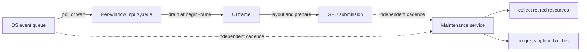

---

## 2. Descriptors, uploads, and shared renderer objects

### Q2 — In exactly what cases can a new window's descriptor bindings differ from the main window's?

They are allowed to differ in identity, descriptor index assignment, applied revision, and visible resource set. They may happen to contain equivalent native image/sampler pairs, but that is not a shared descriptor-set identity.

Each window owns a [`WindowState`](src/Storagesystem/FlowStorageSystem.cpp#L741) with its own `bindingsByTextureIndex`, free descriptor indices, next index, binding revision, and active descriptor bundle. Each renderer also allocates a window-local descriptor pool and per-frame-slot descriptor sets in [`CreateDescriptorObjects`](src/Ui/Vk_UiRenderer.cpp#L1024), then transfers that bundle to storage with [`adoptWindowDescriptorBundle`](src/Storagesystem/FlowStorageSystem.cpp#L4161).

Bindings differ in these cases:

1. **Different first-use order.** Descriptor indices other than zero are assigned lazily by [`resolve`](src/Storagesystem/FlowStorageSystem.cpp#L1407). If window A first uses texture X then Y, while window B first uses Y then X, their numerical indices can be reversed.
2. **A texture is used by only one window.** The unused window never needs to allocate a descriptor index for it.
3. **Window-local resources.** A viewport texture belonging to window A fails the visibility rule in window B; [`visibleToFrame`](src/Storagesystem/FlowStorageSystem.cpp#L1009) permits a window-local resource only in its owner window.
4. **Different replacement/history.** A window's cached binding may have observed a different texture revision at a different time. `bindingRevision` records the descriptor content identity, and each frame slot records which revision it has applied.
5. **Different frame slots.** Even inside one window, slot 0 and slot 1 have separate descriptor sets and separate `appliedBindingRevisions` because one can still be used by the GPU while the other is prepared.
6. **Descriptor-bundle recreation.** Replacing a window's descriptor pool/sets clears that window's applied-revision history ([bundle adoption reset](src/Storagesystem/FlowStorageSystem.cpp#L4198)); other windows are unchanged.
7. **Different window configurations in a future version.** The current shader forces capacity 256, but the compatibility key and per-window description are intentionally capable of distinguishing capacities.

Descriptor slot 0 is the exception: it is the fallback binding in every window. [`registerWindow`](src/Storagesystem/FlowStorageSystem.cpp#L1974) seeds new window tables from the app-shared fallback when one exists.

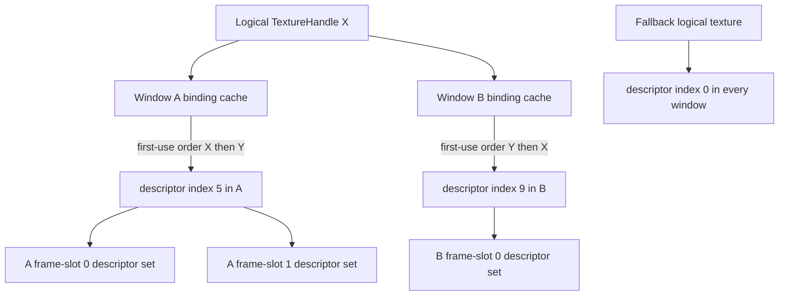

### Q3 — Are shared resources avoiding a GPU upload every frame?

Yes. The shared quad, placeholder font image, placeholder UI image, and sampler are created once during application initialization. Their three byte payloads are enqueued and flushed once in [`initSharedUiByteResources`](src/Ui/Vk_UiRenderer.cpp#L1319). Every renderer stores handles/native identities for those same app-shared objects.

Per frame, FlowUi does **not** re-upload those bytes. It only:

- records use pins for them when the frame actually contains instances/runs ([shared-use tracking](src/Ui/Vk_UiRenderer.cpp#L1865));
- binds the existing quad buffer and descriptor sets while recording;
- writes the current UI **instance buffer**, because positions, colors, glyphs, clip rectangles, and texture indices change per frame.

Do not confuse these operations:

| Operation | Every frame? | Is it texture/vertex data upload? |
|---|---:|---:|
| Track shared-resource lifetime | When frame draws UI | No |
| Bind existing descriptor sets/buffer | When commands are recorded | No |
| Update only dirty descriptor entries | As required per frame slot | No; it updates descriptor metadata |
| Write UI instances | Normally yes | Yes, CPU writes a host-visible GPU buffer |
| Upload image/font/icon pixels | On creation/change | Yes |
| Render a custom viewport target | When referenced | GPU rendering, not a CPU upload |

### Q25 — Why publish/acquire window descriptor bundles, renderer layouts, and pipeline layouts?

They solve sharing and lifetime at the renderer/storage boundary.

There are three different ownership levels:

1. **Renderer layout, app-shared.** Descriptor-set layouts plus the pipeline layout describe the shader interface. Compatible windows can share these immutable objects. The key contains descriptor capacity, shader-interface revision, push-constant size, and feature flags ([`RendererLayoutKey`](include/internal/StorageSystem/StorageTypes.hpp#L780)).
2. **Pipeline bundle, app-shared by compatibility.** Solid, MSDF, and textured pipelines are compatible only with a particular layout, color format, sample count, pipeline-state revision, and shader set ([`RendererPipelineKey`](include/internal/StorageSystem/StorageTypes.hpp#L804)). Windows with the same target format can share them; a window with a different swapchain format needs another bundle.
3. **Descriptor bundle, window-local.** The descriptor pool and two sets per frame slot contain window-specific instance buffers and texture-slot state. They cannot simply be shared across windows.

The renderer knows how to construct Vulkan objects. Storage knows how to share, retain, stamp, retire, and destroy them. Publication joins those responsibilities:

- acquire first asks whether a compatible object already exists ([layout acquire](src/Storagesystem/FlowStorageSystem.cpp#L4085));
- if not, the renderer constructs a complete native candidate;
- publish either takes ownership or returns the already-published compatible handle ([layout publication](src/Storagesystem/FlowStorageSystem.cpp#L4039));
- every using frame tracks the handles ([renderer-use batch](src/Ui/Vk_UiRenderer.cpp#L1788));
- the last CPU owner does not destroy them until their last submission completes.

Without these storage records, two windows would either duplicate all layouts/pipelines or share raw Vulkan handles without a reliable answer to “which window's in-flight frame still uses this?”

### Q29 — Why call `applyTextureBindings()` during every `endFrame()`?

The function is called every frame, but it does not necessarily perform a Vulkan update every frame.

[`prepareTextureBindings`](src/Storagesystem/FlowStorageSystem.cpp#L3162) resolves logical `TextureHandle`s to this window's descriptor indices and produces only entries whose `bindingRevision` has not yet been applied to the current frame slot. [`applyTextureBindings`](src/Ui/Vk_UiRenderer.cpp#L1715) calls `vkUpdateDescriptorSets` only when `dirtyBindings` is non-empty ([conditional update](src/Ui/Vk_UiRenderer.cpp#L1747)). Storage records success afterward through [`acknowledgeTextureBindings`](src/Storagesystem/FlowStorageSystem.cpp#L3250).

It belongs in `endFrame()` because that is when FlowUi finally knows the set of textures used by the Clay command array, yet the current slot's descriptor set is still safe to update before command submission. The renderer's instance builder then writes the resolved descriptor index into each textured `UiInstance`.

Calling the preparation every time asks “is anything dirty for this slot?” It does **not** mean “rewrite all image descriptors” and it does not upload pixels.

---

## 3. Main-window lifetime and device support

### Q4 — Should the main window's close request be ordinary, and can `App` survive without `WindowId == 1`?

The close request is already ordinary: [`shouldClose(WindowId)`](src/FlowUi.cpp#L1199) merely reports the backend flag. FlowUi does not automatically destroy the app because the main window asked to close. User code can continue rendering other windows and leave window 1 unrendered.

What is currently special is **destruction**. [`destroyWindow`](src/FlowUi.cpp#L1078) explicitly rejects `mainWindowId`, and the no-argument convenience methods always resolve to it ([`shouldClose()`](src/FlowUi.cpp#L1194), [`beginFrame()`](src/FlowUi.cpp#L1216), [`endFrame()`](src/FlowUi.cpp#L1229), [`drawFrame()`](src/FlowUi.cpp#L1240)). Initialization also uses its surface to select the Vulkan device and present queue ([main bootstrap](src/FlowUi.cpp#L360)).

The underlying storage system can support a registered-window map without ID 1. The larger `App` can support it too, but not without an API/semantic cleanup. I agree with the direction: application shutdown policy should belong to the user's loop.

A robust design would:

- rename the concept from “indestructible main window” to “bootstrap/default window”;
- allow `destroyWindow(mainWindowId())` after draining it exactly like another window;
- let the Vulkan device, app-shared managers, and storage live with zero windows;
- keep monotonic IDs, so destroying 1 does not make another window become 1;
- have `hasWindow(mainWindowId())` return false afterward;
- make no-argument window methods throw a clear error or deprecate them once the default window is gone;
- keep `createWindow()` available while the app/device remains alive;
- change the main-only swapchain fallback check in [`recreateSwapchainIfNeeded`](src/FlowUi.cpp#L1011), because “main” would no longer be a durable property.

The Vulkan device remains valid after its bootstrap surface/window is destroyed. The important restriction is that any newly created surface still needs support from the queue family selected during bootstrap. That is already checked for secondary windows in [`createWindow`](src/FlowUi.cpp#L518).

### Q5 — What Vulkan device limitations are we actually building for, and how broad is desktop support?

The exact runtime gate is stricter than simply “has Vulkan.” A device/driver must provide:

- a Vulkan 1.3 loader and physical-device API version ([instance check](src/Vulkan/Vk_Context.cpp#L170), [device check](src/Vulkan/Vk_Context.cpp#L304));
- `VK_KHR_swapchain`, a graphics queue, a present queue for the bootstrap surface, and at least one surface format/present mode ([device selection](src/Vulkan/Vk_Context.cpp#L311));
- Vulkan 1.3 dynamic rendering ([feature check](src/Vulkan/Vk_Context.cpp#L325));
- Vulkan 1.2 descriptor-indexing features: descriptor indexing, runtime arrays, non-uniform sampled-image indexing, partially bound descriptors, and sampled-image update-after-bind ([required bits](src/Vulkan/Vk_Context.cpp#L448));
- enough normal and update-after-bind sampled-image descriptor capacity for 256 UI textures plus the font atlas ([limit check](src/Ui/Vk_UiRenderer.cpp#L1444));
- supported swapchain color-attachment usage and an acceptable format for each surface ([swapchain creation](src/Vulkan/Vk_Swapchain.cpp#L128));
- for independent secondary-window retirement, either `VK_EXT_swapchain_maintenance1` present fences or `VK_KHR_present_id` plus `VK_KHR_present_wait` ([extension selection](src/Vulkan/Vk_Context.cpp#L397), [secondary-window rejection](src/FlowUi.cpp#L524)).

Khronos documents descriptor indexing as Vulkan 1.2 functionality and dynamic rendering as Vulkan 1.3 functionality in the [official versions guide](https://docs.vulkan.org/guide/latest/versions.html). The [descriptor-indexing guide](https://docs.vulkan.org/guide/latest/extensions/VK_EXT_descriptor_indexing.html) explains the non-uniform/runtime-array feature split. Present fences exist specifically to know when presentation resources may be recycled, as described by the official [`VK_EXT_swapchain_maintenance1` proposal](https://docs.vulkan.org/features/latest/features/proposals/VK_EXT_swapchain_maintenance1.html).

Practical assessment:

- **Modern Windows and Linux desktops with maintained Intel, AMD, or NVIDIA Vulkan drivers:** this is a reasonable target and likely covers a broad contemporary set.
- **Older GPUs or machines with old vendor drivers:** Vulkan 1.3 and the full descriptor-indexing feature set are the main exclusions.
- **Virtual machines, remote desktops, software Vulkan, and unusual integrated GPUs:** the fixed update-after-bind limit of 257 sampled images is a likely failure point.
- **macOS/MoltenVK:** portability enumeration/subset is handled ([instance portability](src/Vulkan/Vk_Context.cpp#L209), [device subset](src/Vulkan/Vk_Context.cpp#L402)), but feature/limit translation through Metal can still reject a device. It needs explicit CI rather than assumption.
- **Multi-window systems:** the exact-present-completion requirement is stricter than the main-only path. A device may run one window yet reject a second.
- **Mobile/web:** the library is desktop/GLFW/Vulkan-first; this is not currently a broad mobile or WebGPU portability layer.

I would not claim a numerical “major share” without hardware telemetry from real users. The code supports a major share of **modern, actively supported desktop Vulkan configurations**, not a major share of every desktop still in service. Add startup diagnostics that print the failed feature/limit and run CI on representative Intel/AMD/NVIDIA plus MoltenVK if broad compatibility is a release goal.

---

## 4. Memory classes, allocation tags, frame tokens, and leases

### Q6 — What are transient memory classes used for, and why do they exist?

Transient classes describe memory whose individual objects do not need individual destruction. Everything allocated from an arena during one frame-slot use dies together when that slot is safely reused.

The classes are declared in [`MemoryClass`](include/internal/StorageSystem/StorageTypes.hpp#L71):

| Class | Current implementation | Intended use |
|---|---|---|
| `FrameTransient` | `FrameState::transient` | Clay strings, `TextureRef` payloads, gathered texture handles, descriptor-write spans, `UiRun`s, scissor stack |
| `WorkerTransient` | one arena per worker per frame slot | Parallel frame jobs that must not contend on one bump pointer |
| `DecodeTransient` | `FrameState::decode` | Temporary decode/conversion data |
| `UploadStaging` | currently routes to the decode arena through `frameArena` | Temporary upload preparation; the synchronous Vulkan uploader still creates separate VMA staging buffers |

Each storage window constructs these arenas per frame slot in [`registerWindow`](src/Storagesystem/FlowStorageSystem.cpp#L1988). [`beginFrame`](src/Storagesystem/FlowStorageSystem.cpp#L2068) resets their offsets only after the corresponding slot has no outstanding submission.

Why classify them rather than expose “some arena”?

- lifetime mistakes can be rejected;
- per-class statistics and reserve tuning remain possible;
- worker allocation can be isolated;
- durable allocation APIs reject transient tags ([`allocatePersistent` validation](src/Storagesystem/FlowStorageSystem.cpp#L2165));
- the implementation can later route decode/upload memory differently without changing callers.

The initial size is not a permanently fixed range. [`LinearArena::allocate`](src/Storagesystem/FlowStorageSystem.cpp#L283) can add non-moving pages when runtime growth is enabled. Resetting keeps pages for reuse; [`trim`](src/Storagesystem/FlowStorageSystem.cpp#L3853) can later discard overflow pages from inactive slots.

### Q7 — What is `AllocationTag` for?

[`AllocationTag`](include/internal/StorageSystem/StorageTypes.hpp#L288) is metadata attached to a durable CPU allocation:

- `memoryClass`: which pool/lifetime category owns it;
- `resourceKind`: what kind of object the bytes represent;
- `window`: optional owning window;
- `frameSlot`: optional slot attribution;
- `debugName`: stable interned diagnostic name.

It serves three concrete purposes.

First, it routes memory correctly. `StringPool` blocks return to the string pool; other persistent blocks return to the general pool ([`releasePersistent`](src/Storagesystem/FlowStorageSystem.cpp#L2185)).

Second, it validates release. `PersistentPool::release` checks the allocation ID, address, size, and complete tag before returning the range. A stale or cross-pool `free` therefore cannot silently corrupt the pool.

Third, it provides attribution for budgets and diagnostics. Manager record creation, for example, tags its storage with manager kind and window ([manager allocation](src/Storagesystem/FlowStorageSystem.cpp#L2467)).

The tag does not change where GPU memory lives and is not passed to Vulkan. It is a CPU allocator ownership label.

### Q8 — What is the frame lease for?

A [`FrameToken`](include/internal/StorageSystem/StorageTypes.hpp#L341) identifies the active **mutable build session**. A [`FrameReadLease`](include/internal/StorageSystem/StorageTypes.hpp#L358) identifies the later **sealed read/submission session**.

The distinction prevents this sequence:

1. obtain spans into storage tables or frame memory;
2. mutate/reset the frame behind those spans;
3. continue reading them during command recording or submission.

[`sealFrame`](src/Storagesystem/FlowStorageSystem.cpp#L2109) closes arena allocation, checks that all buffer writes were committed, pins the active descriptor bundle, assigns a unique `leaseId`, and returns the lease. [`requireLease`](src/Storagesystem/FlowStorageSystem.cpp#L1067) checks window, slot, frame epoch, sealed state, and lease ID. Development builds additionally share an atomic revocation object so copied views can report invalidity.

The lease authorizes:

- immutable hot-table views such as [`readView`](src/Storagesystem/FlowStorageSystem.cpp#L3393);
- the window binding snapshot through [`windowBindingView`](src/Storagesystem/FlowStorageSystem.cpp#L3408);
- conversion of frame pins into a GPU submission through [`noteSubmission`](src/Storagesystem/FlowStorageSystem.cpp#L3683).

The current renderer mostly prepares its spans before sealing, then uses the lease as the final proof passed to submission. That makes the mechanism look heavier than its present use, but it expresses an important ownership transition: “builders may write” becomes “renderer may only consume.”

### Q9 — Is `FrameToken::frameSlot` the modulo frame-in-flight value?

Yes, with one detail: `FrameToken` does not calculate the modulo itself. The app's [`FrameVk::currentFrame`](include/Vulkan/Vk_Frames.hpp#L20) is already a ring index. [`FrameVk::advance`](include/Vulkan/Vk_Frames.hpp#L27) computes `(current + 1) % frameCount`, and the app passes that slot to storage in [`App::Impl::beginFrame`](src/FlowUi.cpp#L661).

With two frames in flight, `frameSlot` is therefore 0 or 1. Storage validates that the supplied slot is in range ([storage begin check](src/Storagesystem/FlowStorageSystem.cpp#L2071)).

Do not identify the slot with a unique logical frame. Slot 0 is reused for frames 1, 3, 5, and so on in a two-slot ring. `frameNumber` tells the window's logical frame count; `epoch` distinguishes the current active use of the reused slot.

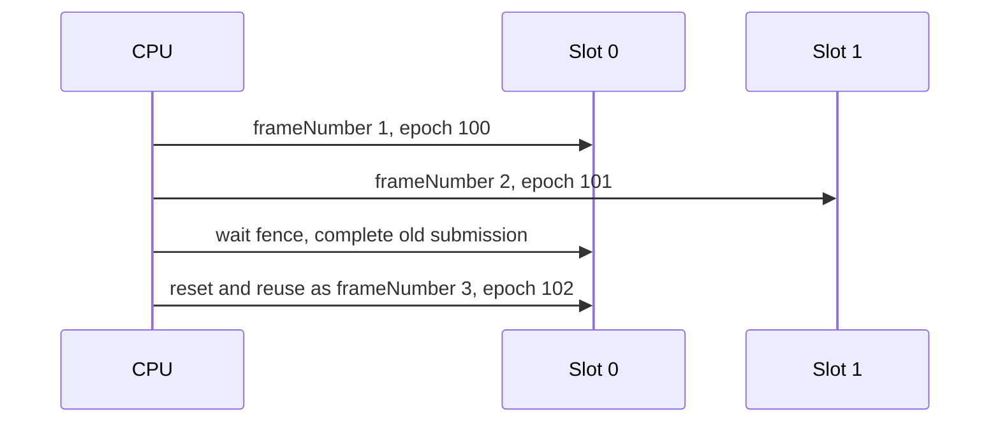


## 5. Resource identity, visibility, revisions, and lifetime

### Q10 — What are all the buffer/image-related types, and why are there so many?

There are several layers because “an image” can mean four different things in Vulkan. Collapsing these into one type would make ownership and state transitions implicit.

| Type | What it represents | Why it exists separately |
|---|---|---|
| [`BufferDesc`](include/internal/StorageSystem/StorageTypes.hpp#L440) | Requested size, Vulkan usage, memory preference, sharing scope, CPU/GPU access, mapping, and ownership attribution | A declarative recipe from which storage creates and validates the native allocation |
| `BufferHandle` from the generic [`Handle<Kind>`](include/internal/StorageSystem/StorageTypes.hpp#L189) | Stable logical reference: table index plus generation | Does not expose a `VkBuffer` or VMA allocation and can detect reuse of a dead slot |
| [`BufferWriteView`](include/internal/StorageSystem/StorageTypes.hpp#L533) | A bounded, temporary CPU write transaction | Couples pointer, capacity, destination offset, frame epoch, and `writeId`, so every opened write must be committed or cancelled |
| [`NativeBufferView`](include/internal/StorageSystem/StorageTypes.hpp#L756) | Read-only bridge to `VkBuffer`, size, and coherence information | Keeps Vulkan interop at the renderer boundary rather than making native handles the ownership API |
| [`ImageDesc`](include/internal/StorageSystem/StorageTypes.hpp#L453) | Dimensions, layers, mips, format, usage, placement, sharing, and access | Describes the storage-bearing `VkImage` allocation |
| `ImageHandle` | Logical ownership reference to the image allocation | Allows deferred destruction and stale-handle validation |
| [`ImageViewDesc`](include/internal/StorageSystem/StorageTypes.hpp#L471) | Which format/aspect/mips/layers of an image shaders or attachments may see | Vulkan image views are real native objects and one image can have multiple views |
| `ImageViewHandle` | Logical reference to that view; the view retains its image | Models the dependency instead of pretending view and allocation have identical lifetime |
| [`SamplerDesc`](include/internal/StorageSystem/StorageTypes.hpp#L482) | Filtering, addressing, LOD, and anisotropy | The same view can be sampled in multiple ways; identical samplers can be shared |
| `SamplerHandle` | Logical reference to a cached native sampler | Keeps sampler sharing/ref-counting independent of images |
| [`TextureViewDesc`](include/internal/StorageSystem/StorageTypes.hpp#L495) | An image-view + sampler + UV/source-size interpretation | This is the UI's sampleable logical texture, not a new block of pixels |
| `TextureHandle` | Public-facing logical texture identity | The descriptor resolver can preserve the logical identity while its backing view, state, or descriptor changes |
| [`TextureHotRecord`](include/internal/StorageSystem/StorageTypes.hpp#L570) | Dense render-time fields for a texture | Avoids walking maps and cold ownership data while converting many UI commands |
| [`ImageViewHotRecord`](include/internal/StorageSystem/StorageTypes.hpp#L585), [`SamplerHotRecord`](include/internal/StorageSystem/StorageTypes.hpp#L593) | Dense generation/native-handle lookup | Makes a sealed read view cheap and contiguous |
| [`NativeImageView`](include/internal/StorageSystem/StorageTypes.hpp#L762) | Native image allocation facts returned by `nativeImage` | The name is slightly misleading: it can describe the image even when `nativeImageView` is zero |
| [`NativeImageViewInfo`](include/internal/StorageSystem/StorageTypes.hpp#L771) | Native `VkImageView` plus its logical backing image | Used where both the descriptor object and dependency identity matter |
| [`ImageRegion`](include/internal/StorageSystem/StorageTypes.hpp#L506) and [`UploadRequest`](include/internal/StorageSystem/StorageTypes.hpp#L522) | A destination subresource and a queued data transfer | Upload scheduling must identify pixels, destination, final state, and source ownership independently of resource creation |

The enums are also descriptions, not separate allocations:

- [`BufferUsage`](include/internal/StorageSystem/StorageTypes.hpp#L139) and [`ImageUsage`](include/internal/StorageSystem/StorageTypes.hpp#L129) become Vulkan usage flags. They are bitmasks because one allocation may have several roles.
- [`MemoryPreference`](include/internal/StorageSystem/StorageTypes.hpp#L106) describes desired placement; `HostVisible` is suitable for CPU-written instance data, while `DeviceLocal` is suitable for sampled images.
- [`AccessMode`](include/internal/StorageSystem/StorageTypes.hpp#L93) says who may mutate the resource.
- [`ResourceSharing`](include/internal/StorageSystem/StorageTypes.hpp#L100) says which frame scopes may legally use it.
- [`ResourceState`](include/internal/StorageSystem/StorageTypes.hpp#L83) says whether bytes are queued, uploading, ready, failed, or retiring.

The generic `Handle<ResourceKind>` template is a good concrete C++ choice here. It implements packing, comparison, and validity once, while `Handle<GpuImage>` and `Handle<GpuBuffer>` remain different compile-time types. A plain `uint64_t` for every API would be smaller-looking code but would permit accidentally passing a sampler ID to `releaseImage`. A class hierarchy with virtual resource objects would make those mistakes harder too, but would introduce pointer lifetime, allocation, indirection, and synchronization into a dense data-oriented path.

### Q11 — What revisions exist, and what exactly does each one mean?

“Revision” is not one global concept. It always means **the contents or publication represented by this particular object changed**.

| Revision | Changed when | Consumer/question answered |
|---|---|---|
| [`TextureHotRecord::revision`](include/internal/StorageSystem/StorageTypes.hpp#L570) | texture backing/state/metadata changes, including [`replaceTexture`](src/Storagesystem/FlowStorageSystem.cpp#L2990) and upload state changes | “Is my cached resolution of this logical texture still current?” |
| [`BindingHotRecord::textureRevision`](include/internal/StorageSystem/StorageTypes.hpp#L600) | copied from the texture when the binding is resolved | “Was this binding derived from the current texture?” |
| [`BindingHotRecord::bindingRevision`](include/internal/StorageSystem/StorageTypes.hpp#L600) | that window's descriptor content changes | “Has this descriptor slot's native image/sampler pair changed?” |
| `WindowState::bindingRevision` in [`WindowState`](src/Storagesystem/FlowStorageSystem.cpp#L741) | monotonically assigns the previous value | Supplies unique per-window binding content versions |
| `FrameState::appliedBindingRevisions` in [`FrameState`](src/Storagesystem/FlowStorageSystem.cpp#L711) | renderer acknowledges a successful descriptor write | “Does this particular frame slot's descriptor set already contain that binding revision?” |
| shared/window manager revisions in [`incrementManagerRevision`](src/Storagesystem/FlowStorageSystem.cpp#L854) | manager record publication, removal, or explicit manager mutation | Lets a frame capture which manager state publication it began against |
| font atlas `bindingRevision` in [`FontCatalogController`](src/managers/FontCatalogController.cpp#L172) | active atlas texture changes | Lets the font-facing facade notice a changed backing texture |
| [`RendererLayoutKey::shaderInterfaceRevision`](include/internal/StorageSystem/StorageTypes.hpp#L780) | manually changed in source when shader descriptor/push-constant compatibility changes | Prevents reusing a cached layout created for an incompatible shader interface |
| [`RendererPipelineKey::pipelineStateRevision`](include/internal/StorageSystem/StorageTypes.hpp#L804) | manually changed when fixed pipeline-state compatibility changes | Invalidates the pipeline-bundle cache even if format/shader fingerprint remain equal |

`shaderInterfaceRevision` is currently the constant returned by the UI renderer's [`uiShaderInterfaceRevision`](src/Ui/Vk_UiRenderer.cpp#L82). It is a schema version, not a per-frame counter and not a SPIR-V compilation number. If the shader suddenly expects another descriptor binding or push-constant layout, bumping it causes a different renderer-layout key.

The alternative would be to hash a complete reflection result for every shader interface. That can be more automatic and is a reasonable long-term design if reflection already exists. Here, a small explicit revision is simpler and deterministic, but it imposes a maintenance rule: incompatible interface changes must bump it. The pipeline-state revision serves the same purpose for fixed configuration not otherwise present in the key.

Most importantly, a revision is **not** a handle generation. Generation asks whether this table slot is still the same object. Revision asks whether the same object's contents changed.

### Q12 — What does `using is_transparent = void` do?

[`StringViewHash`](src/Storagesystem/FlowStorageSystem.cpp#L211) and [`StringViewEqual`](src/Storagesystem/FlowStorageSystem.cpp#L218) declare `is_transparent` as a marker recognized by standard associative containers. The actual alias target, `void`, carries no data. Its presence says: “this hasher/equality function supports compatible lookup types, not only the container's exact key type.”

That enables heterogeneous lookup such as searching a string-keyed table with a `std::string_view` without first allocating a temporary `std::string`. Both call operators accept `std::string_view`, so literals, `std::string`, and views can be compared through that common representation.

An alternative is `map.find(std::string(view))`. It is functionally correct, easier to recognize at first, and could be equally good in a cold path. It is worse in frequently used resource lookup because it may allocate and copy solely to perform a lookup. Another alternative is to make every key a `std::string_view`; that is unsafe unless the pointed-to characters have guaranteed lifetime. Storage instead interns durable names and can use views transiently for lookup.

### Q13 — Do `used*Epochs` grow forever? When are they reset, and are they bounded?

Each [`FrameState`](src/Storagesystem/FlowStorageSystem.cpp#L711) owns one marker vector per tracked resource kind. [`addUse`](src/Storagesystem/FlowStorageSystem.cpp#L1112) indexes a marker vector by handle index and enlarges it only when that frame slot first observes a higher index.

They are deliberately **not cleared every frame**. An entry is current only when both fields match:

```text
marker.epoch == current frame epoch
and
marker.generation == handle generation
```

When the slot is reused, its new epoch makes every old entry logically empty in O(1), without filling every vector with zeroes. The generation check also handles a resource table index being recycled during what would otherwise appear to be the same marker position.

The vectors therefore grow to the highest resource-table index that this particular frame slot has encountered, then normally stabilize. They do not grow once per frame and do not grow once per use. They can shrink only with destruction of the storage window/system; `beginFrame` reuses them.

There is no small hard configuration cap. The hard representational limit is the 32-bit handle index and the practical limit is memory/resource budgets; [`allocateRecordIndex`](src/Storagesystem/FlowStorageSystem.cpp#L824) rejects table exhaustion. A workload that once creates an enormous number of simultaneous handle slots can leave equally large marker capacity behind. That is a deliberate time-versus-memory trade: no full clear and constant-time duplicate detection. A hash set cleared every frame would retain only resources actually used, which can be better for extremely sparse, huge index spaces, but adds hashing, allocations/capacity management, and poorer locality on the normal dense case.

### Q14 — What does `visibleToFrame` protect?

[`visibleToFrame`](src/Storagesystem/FlowStorageSystem.cpp#L1009) enforces ownership scope:

```text
AppShared   -> any window and any slot
WindowLocal -> only a frame belonging to the owning window
FrameLocal  -> only the owning window and the exact reusable frame slot
```

The attribution itself is checked at creation by [`validateSharingAttribution`](src/Storagesystem/FlowStorageSystem.cpp#L979). Buffer and image visibility wrappers then combine scope with handle validity and non-retiring state.

This matters most for resources that are replicated to avoid GPU overlap. The UI instance buffer for window A, slot 0 must never be written or recorded by window B or slot 1. A viewport target for slot 0 cannot be silently substituted for slot 1 while the GPU may still read slot 0.

The alternative is relying on caller discipline. That produces less validation code but turns a wrong-window handle into corruption or a Vulkan synchronization bug far from the caller. Encoding window/slot ownership in every C++ handle type would be stronger at compile time but would cause a combinatorial family of handle types and cannot express runtime window IDs; runtime validation is a reasonable compromise.

### Q15 — What is the exact relationship among `addUse`, `stampUse`, epochs, and serials?

They are the two halves of one handoff, separated because the GPU submission number does not exist while the frame is being built.

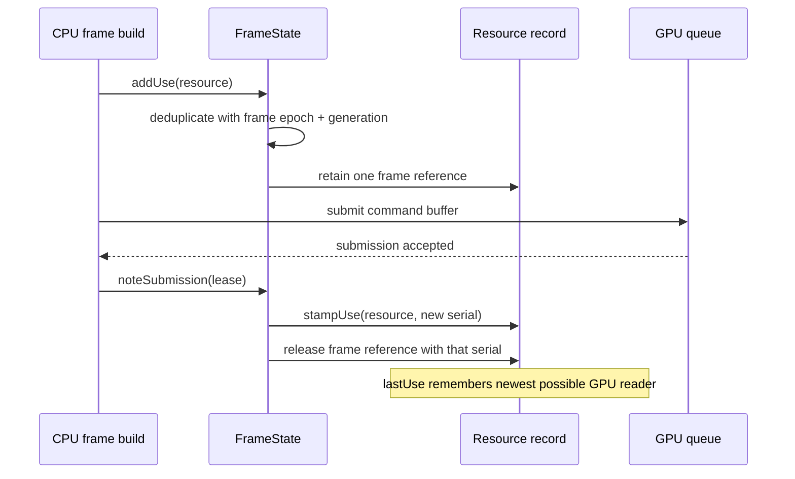

[`addUse`](src/Storagesystem/FlowStorageSystem.cpp#L1112) is called while building a frame. It:

1. decodes the handle's index and generation;
2. checks the per-frame marker to avoid recording the same resource twice;
3. increments the real resource reference count;
4. appends a `{kind, packedHandle}` item to `FrameState::used`.

The epoch lives in the frame marker, not in the durable resource record. It says “already pinned during this build session.”

After `vkQueueSubmit`, [`noteSubmission`](src/Storagesystem/FlowStorageSystem.cpp#L3683) allocates a monotonically increasing `SubmissionSerial`, calls [`stampUse`](src/Storagesystem/FlowStorageSystem.cpp#L1353) for every `used` item, then releases the frame's temporary reference with the same serial. `stampUse` raises the resource's `lastUse`. For a texture it recursively stamps the image view and sampler because the submitted descriptor refers to those native children.

Why not allocate the submission serial in `beginFrame`? A begun frame may be cancelled or fail before submission, and several windows can begin/submit in an order different from logical frame numbering. The serial is intended to model queue work, so it is created only for queue work.

Why not just keep the reference until the fence? That is a valid simpler design. This implementation converts the CPU-side pin into a numeric GPU dependency at submission, allowing the frame's `used` vector to be cleared immediately. Retirement then needs only `lastUse <= completedWatermark`, not a retained object graph per in-flight frame.

### Q16 — Why do release functions handle `referenceCount > 1`; what produces those extra references?

Every freshly published resource begins with an ownership reference. Extra references appear whenever another durable or temporary owner depends on it. Concrete cases include:

- `addUse` pins a buffer, texture, renderer layout, pipeline bundle, or descriptor bundle for the frame;
- an image view retains its backing image;
- a logical texture retains its image view and sampler;
- a pipeline bundle retains its renderer layout;
- a window descriptor bundle retains its renderer layout;
- the fallback binding retains the fallback texture;
- an upload request can retain its source blob and destination;
- an open buffer-write transaction keeps its destination valid;
- shared/cached samplers, layouts, and pipelines can have several owners;
- two frame slots can concurrently pin the same app-shared texture.

For example, [`releaseTextureReference`](src/Storagesystem/FlowStorageSystem.cpp#L1548) first raises `lastUse`, decrements and returns if more than one reference exists, and queues retirement only when the final reference disappears. The corresponding buffer/image/view/sampler functions begin at [`releaseBufferReference`](src/Storagesystem/FlowStorageSystem.cpp#L1503).

This count is not a diagnostic note; it is actual ownership. `lastUse` answers the separate GPU question. Native destruction is allowed only when:

```text
CPU/logical reference count reached zero
AND
completed submission watermark reached lastUse
```

Using `std::shared_ptr` for everything is a possible alternative. It automates CPU reference counting, but the default deleter still would not know when Vulkan has finished. It would also make logical table identity, generations, dependency destruction order, and GPU serial retirement less explicit. The custom count is justified because GPU completion must participate regardless.

### Q17 — Why are there mutex locks if application work is mostly single-threaded?

The central state uses a [`std::recursive_mutex`](src/Storagesystem/FlowStorageSystem.cpp#L763), and public operations take scoped locks. Today the app enforces a platform-thread lifecycle and one global active window-frame triplet, so most renderer calls are serialized. But the storage API also exposes worker arenas, durable resource publication, uploads, and manager access that could be called by jobs or future parallel windows.

There are two more immediate reasons:

1. Some public operations call other lock-taking operations. For example upload flushing needs native access and releases; recursive locking avoids deadlock in the current organization.
2. Buffer commit may temporarily drop/reacquire the lock around a potentially expensive copy, while the pending-write record preserves the transaction. The lock makes table mutation coherent across that interval.

A build flag that replaces the mutex with a no-op lock would be possible, but it would create two behavior modes and could hide races in the mode used most often. It is also premature without profiling: Vulkan submission, uploads, layout, and rendering are much larger costs than uncontended mutex entry in these calls. A better performance evolution is to split public locking wrappers from private `...Unlocked` helpers and then introduce a deliberate single-thread policy or finer-grained locks. The present recursive mutex is safe and simple, but it is not proof that this is the final optimal concurrency design.

## 6. Locking, sealing, and the complete frame-data relationship

### Q18 — Should there be a compile flag for single-threaded versus worker-thread storage?

Not yet, because “workers enabled” is currently an allocation capability, not a complete alternate concurrency model.

`StorageConfig::workerCount` controls how many per-slot worker arenas [`registerWindow`](src/Storagesystem/FlowStorageSystem.cpp#L1960) constructs. [`frameWorkerArena`](src/Storagesystem/FlowStorageSystem.cpp#L2203) gives each worker a distinct bump allocator, so parallel producers do not contend on the same arena offset. This does **not** mean arbitrary storage operations are lock-free or that multiple window frames may currently be active. The app still has the global [`activeWindowFrame`](src/FlowUi.cpp#L276) gate, and the storage tables still use the mutex discussed in Q17.

A compile-time flag is useful when it eliminates substantial code or platform cost. Here it would mostly change synchronization details while creating an untested second semantics. A runtime configuration is better for worker arena count because the same binary can adapt to the host. If profiling later proves table locking important, a policy template such as `Storage<SingleThreadPolicy>` versus `Storage<ConcurrentPolicy>` could be clean—but only after the API's concurrency contract is explicitly written and private unlocked operations are separated.

The honest current status is:

- worker-local transient allocation is implemented;
- the ownership model is shaped to permit more parallel work;
- fully parallel frame orchestration is not implemented;
- the transitional comment at [`beginFrame`](src/FlowUi.cpp#L674) says the global gate is intended to be replaced in a later phase.

### Q19 — Is sealing a frame really more than setting a boolean?

Yes. The boolean is the final state marker, but [`sealFrame`](src/Storagesystem/FlowStorageSystem.cpp#L2109) performs an ownership boundary:

1. validates the token and requires the frame to be unsealed;
2. rejects any uncommitted [`PendingBufferWrite`](src/Storagesystem/FlowStorageSystem.cpp#L696);
3. pins the window's active descriptor bundle into the frame's used-resource list;
4. allocates a new nonzero lease ID and development validation state;
5. invalidates the arena allocation lease so no more frame-temporary objects can be allocated through it;
6. captures shared and window manager publication revisions;
7. sets `sealed = true` and returns the read lease.

Before sealing, callers are **producers**. They can allocate transient memory, open writes, resolve bindings, and prepare render data. After sealing, callers are **consumers**. They may read views already produced and submit them, but mutation APIs that call `requireFrame(token, false)` reject the token.

An immutable `SealedFrame` value containing copied data would be conceptually simpler. It would also copy potentially large command/run/instance data and duplicate ownership information. The lease instead freezes the backing slot in place. The cost is that readers must understand lifetime and validation; that is why the explicit transition is important documentation, not just the `bool`.

### Q20 — What is all frame-related data, where is it nested, and who owns it?

This graph distinguishes **durable objects that have one element per frame slot** from **temporary values for the current logical frame**. An arrow labeled “selects” is not ownership.

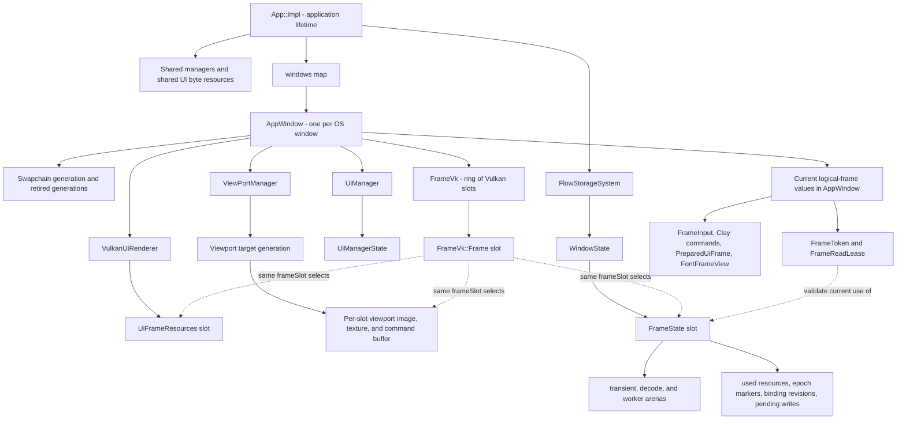

The corresponding concrete structures are:

- [`App::Impl`](src/FlowUi.cpp#L260) owns Vulkan context, storage, shared managers/resources, the windows map, and the global active-frame gate.
- Each [`AppWindow`](src/FlowUi.cpp#L193) owns its surface/swapchain, [`FrameVk`](include/Vulkan/Vk_Frames.hpp#L11), UI and viewport managers, renderer, and the current-frame values.
- Each [`FrameVk::Frame`](include/Vulkan/Vk_Frames.hpp#L12) permanently owns a command pool, command buffer, image-available semaphore, in-flight fence, and current storage `SubmissionToken` for that slot.
- Each renderer [`UiFrameResources`](include/Ui/Vk_UiRenderer.hpp#L143) owns that slot's resizable host-visible instance buffer.
- Each storage [`WindowState`](src/Storagesystem/FlowStorageSystem.cpp#L741) owns descriptor-binding state and a vector of [`FrameState`](src/Storagesystem/FlowStorageSystem.cpp#L711). A `FrameState` owns reusable arenas, use markers, descriptor revision memory, pending writes, and its current epoch/submission state.
- [`UiManagerState`](include/internal/ManagerStorage/UiManagerState.hpp#L20) owns the Clay context and durable interaction history, but its `activeFrame`, `frameArena`, current input, and font view change for each build.
- Each [`ViewportTargetGeneration`](include/internal/ManagerStorage/ViewportStorageController.hpp#L48) owns an image/view/texture and command resources per frame slot. The manager swaps whole generations on resize and keeps the old generation until safe.

The same integer `frameSlot` selects corresponding elements in several owners; it does not make one giant `Frame` object own all of them. That distribution is a major source of reading difficulty.

#### One slot viewed across its owners

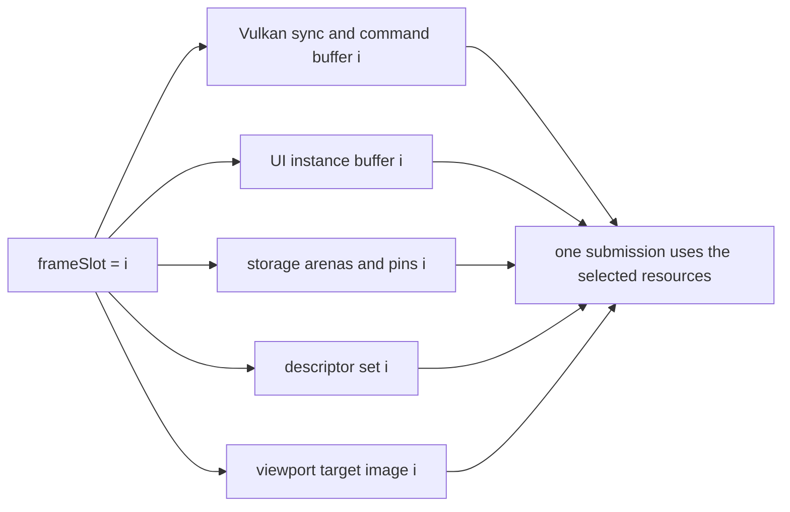

Why distribute the data? The modules have different construction/destruction rules: Vulkan frame synchronization belongs to frame infrastructure, storage validation belongs to storage, UI instance capacity belongs to the renderer, and viewport resize generations belong to the viewport manager. One monolithic struct would make lifetime look local while actually coupling every subsystem and making resize/retirement harder. The current separation is architecturally sound, but a small `FrameSlotContext` passed between them could improve discoverability without moving ownership.

### Q21 — What does `managerCheckpoint()` do?

[`managerCheckpoint`](src/Storagesystem/FlowStorageSystem.cpp#L840) is a development/testing fault-injection point. If `managerFailureCountdown` is nonzero, it decrements it and throws exactly when it reaches zero.

Manager record construction has several steps: reserve/index a record, allocate memory, placement-construct the typed state, and publish the record. Checkpoints placed between those steps let tests force every intermediate failure and verify that rollback destroys constructed objects, releases memory, restores the free list, and does not publish a half-created manager.

It is not a synchronization checkpoint, frame barrier, or revision update. In normal operation the countdown is zero and the function immediately returns. The alternative is writing a special mock allocator that fails at selected allocations. That tests allocation rollback but not failures between non-allocation transaction steps. Explicit checkpoints are slightly intrusive but give deterministic coverage of the whole manager transaction.

## 7. Collection, completion, and frame orchestration

### Q24 — What exactly does `collect()` do?

[`FlowStorageSystem::collect`](src/Storagesystem/FlowStorageSystem.cpp#L3788) performs deferred physical destruction. It is the garbage collector for objects that have already lost their final logical/CPU owner but might still be named by submitted GPU work.

Its eligibility test is:

```cpp
retirement.retireAfter <= completedWatermark
```

The full process is deliberately transactional:

1. require a shared-mutation phase—collection cannot run while a frame is actively publishing/using shared state;
2. scan the retirement queue for eligible records and count how many free-list insertions each resource kind will require;
3. reserve all relevant free-list capacity before destroying anything, so an allocation exception cannot leave half a batch destroyed;
4. move eligible records out of the retirement queue;
5. call the kind-specific [`destroyRetired`](src/Storagesystem/FlowStorageSystem.cpp#L1603), which destroys Vulkan/VMA/native objects, releases dependent handles, increments the slot generation, and returns the index to its free list;
6. repeat until no eligible records remain.

The loop is necessary because destroying one logical object can make another object retire immediately. Destroying a texture releases its image view and sampler; destroying a pipeline bundle releases its layout. A single pass could leave those newly queued zero-serial objects waiting unnecessarily until the next app tick.

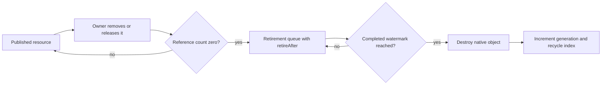

Why not destroy in `release`? CPU execution reaching `release` does not prove a previous command buffer has stopped reading the native object. Why not call `vkDeviceWaitIdle` on every release? That would be correct but would serialize the application and GPU, defeating frames in flight. Deferred destruction is the standard shape because it separates logical unpublication from safe native reclamation.

### Q26 — What is `activeWindowFrame` actually for?

[`App::Impl::activeWindowFrame`](src/FlowUi.cpp#L276) is a temporary global lifecycle guard. It stores either `InvalidWindowId` or the ID of the one window whose `beginFrame` → `endFrame` → `drawFrame` triplet currently owns the application-level mutable frame phase.

It is set after storage begins in [`beginFrame`](src/FlowUi.cpp#L668), checked in [`endFrame`](src/FlowUi.cpp#L720) and [`drawFrame`](src/FlowUi.cpp#L799), and cleared on normal/exceptional exit by [`WindowFrameExitGuard`](src/FlowUi.cpp#L235) or [`cancelStorageFrame`](src/FlowUi.cpp#L580). Quiescent operations such as polling, shared manager mutation, creating, or destroying windows reject execution while it is set.

It is not:

- the current frame number;
- a frame-slot index;
- a GPU ownership token;
- proof that the associated Vulkan submission is complete.

It prevents interleaving this sequence today:

```text
begin window A
mutate shared manager or begin window B
finish window A against changed/shared intermediate state
```

The source labels it transitional because a future design can replace the global exclusion with one independent job/ownership epoch per window plus a shared-publication barrier. That would allow A and B to build concurrently while still preventing shared managers from changing underneath either snapshot. Removing it now without that replacement would make the storage's window-scoped capability look more concurrent than the surrounding managers really are.

### Q27 — Why call `completeSubmission()` immediately after waiting for the frame fence?

Because the Vulkan fence and the storage completion watermark are two different records of the same fact.

At the start of a slot reuse, [`beginFrame`](src/FlowUi.cpp#L651) waits for `FrameVk::Frame::inFlight`. A successful wait is Vulkan's proof that the prior queue submission associated with that fence finished. [`completeSubmission`](src/FlowUi.cpp#L589) then forwards the stored `SubmissionToken` to [`noteCompleted`](src/Storagesystem/FlowStorageSystem.cpp#L3709) and clears the token.

`noteCompleted`:

- verifies the token belongs to the exact window and frame slot;
- clears that slot's `inFlightSerial`;
- advances the contiguous `completedWatermark` when possible;
- remembers an out-of-order completed serial until earlier serials arrive;
- finishes closing storage windows when all their submissions are done.

Only then can `collect` safely reclaim objects whose `lastUse` is covered. Without this call, Vulkan would be finished but storage would never learn it: the slot would appear in flight and retirement memory would accumulate. Calling it before the fence wait would be a use-after-free risk.

Why maintain an out-of-order set? Submission serials are global across windows, but the application may next wait on a newer submission's fence before it revisits an older window. Serial 12 can be known complete while 11 has not yet been observed. The safe global frontier must remain 10 until 11 arrives; then it can jump through 12.

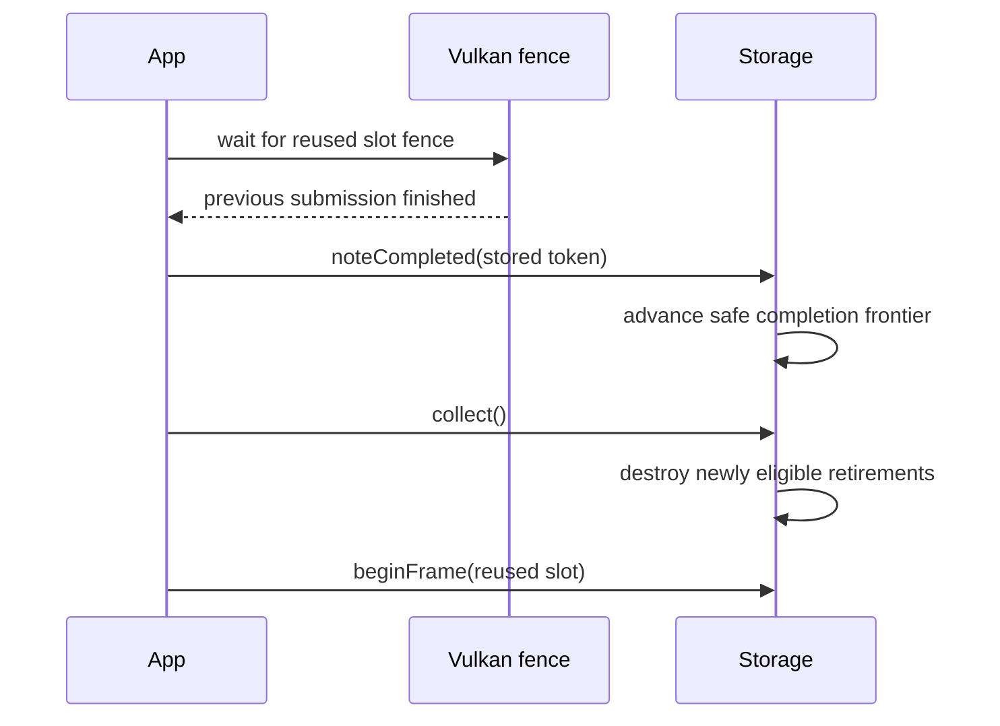


## 8. Viewport preparation, descriptor application, deduplication, and direct writes

### Q28 — Why do viewports need both `prepareFrameTargets()` and `remapRenderCommandsForFrame()`?

They solve two different late-binding problems after Clay has produced commands.

[`prepareFrameTargets`](src/managers/ViewPortManager.cpp#L269) scans image commands, recognizes which texture handles belong to viewports, derives the largest pixel size requested by their rendered bounding boxes, and calls `ensureRenderTargetSize` for every referenced viewport. Resize is transactional: build a complete new generation first, publish it, and retire the old generation.

[`remapRenderCommandsForFrame`](src/managers/ViewPortManager.cpp#L295) then rewrites each copied `TextureRef` inside the Clay command array to the active generation's texture for the current frame slot and updates its source dimensions.

The ordering matters:

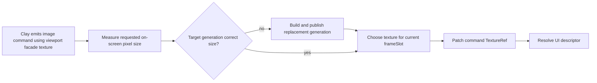

The facade handle present when UI code built the element can be from the previous size/generation or merely the facade's currently selected slot. Clay copies that pointer payload before the manager knows the final rendered size. Viewport images are also duplicated per frame slot so slot 0 can be sampled while slot 1 is being rendered. The late patch makes the already-emitted command point to the right generation **and** right slot.

An alternative is to size and select the render target before UI layout. That works if the caller already knows the exact pixel size and if layout cannot change it; in a declarative UI, Clay's final bounding box is the authoritative size. Another alternative is a permanent descriptor indirection whose content is switched per slot, but this merely moves the remapping into descriptor state and complicates simultaneous frames. Patching frame-local command payloads is direct and safe because the payload lives in the frame arena.

### Q30 — Did the old main branch explicitly deduplicate repeated `imageData` commands?

No separate per-frame “gather unique image handles” pass existed on `main` at commit `ac0d1d1`. Reuse came from the older architecture:

- [`UiTextureRegistry` on main](https://github.com/Manwe314/FlowUi/blob/ac0d1d1a28bd1a17f6c6ffc32684ff9638f548e4/src/FlowUi.cpp#L116-L340) mapped a logical texture key to one stable registry slot, so repeated commands already carried the same integer ID;
- the old renderer converted each image command's texture reference while building instances ([main renderer conversion](https://github.com/Manwe314/FlowUi/blob/ac0d1d1a28bd1a17f6c6ffc32684ff9638f548e4/src/Ui/Vk_UiRenderer.cpp#L1548-L1623));
- when the registry was dirty, it rebuilt descriptor content from the registry rather than from unique commands ([main descriptor update](https://github.com/Manwe314/FlowUi/blob/ac0d1d1a28bd1a17f6c6ffc32684ff9638f548e4/src/Ui/Vk_UiRenderer.cpp#L1212-L1255)).

The current explicit gather in [`App::Impl::endFrame`](src/FlowUi.cpp#L745) is needed because `prepareTextureBindings` accepts the textures referenced by this frame and pins/resolves them. It performs a small linear duplicate check before passing that span. Storage also has its own batch-level and epoch-level deduplication, but those protect different effects:

```text
App gather dedup       -> do not ask resolver about the same command handle repeatedly
binding batch marker   -> do not emit the same descriptor write twice in one prepare call
addUse epoch marker    -> do not increment a resource reference twice in one frame
```

For typical UI image-command counts, the O(n²) linear gather is allocation-free and probably fine. If image-heavy frames become large, a frame-arena hash set or sorting the gathered handles would scale better. Removing the app dedup would still be made safe by lower layers, but it would do avoidable resolution work.

### Q31 — Is `prepareFrame()` writing directly into mapped GPU memory or copying from local frame memory?

For UI instances it writes directly into persistently mapped host-visible buffer memory.

[`EnsureInstanceBufferCapacity`](src/Ui/Vk_UiRenderer.cpp#L1148) creates one `FrameLocal`, `HostVisible`, `CpuWrite`, `persistentlyMapped` storage buffer per frame slot. [`prepareFrame`](src/Ui/Vk_UiRenderer.cpp#L1753) requests [`BufferWriteMode::DirectMapped`](src/Ui/Vk_UiRenderer.cpp#L1836), casts the returned mapped pointer to `std::span<UiInstance>`, and `BuildInstancesAndRunsFromClay` constructs instances in that span. `commitBufferWrite` therefore does not copy those instances; it only validates/finishes the transaction and flushes the allocation when the memory is not host-coherent.

`UiRun` and scissor-stack data are different: they are CPU-only arrays allocated from the frame transient arena ([arena allocations](src/Ui/Vk_UiRenderer.cpp#L1833)) and are consumed while recording draw calls. They never need to become a GPU buffer.

Storage still supports [`HostScratchThenCopy`](src/Storagesystem/FlowStorageSystem.cpp#L2260). In that mode, `beginBufferWrite` returns transient arena memory and [`commitBufferWriteInternal`](src/Storagesystem/FlowStorageSystem.cpp#L2305) copies it to the mapped allocation. The default mode is configurable, but this renderer explicitly requests direct mapping, so changing the default does not change the UI path.

Why use `std::span` over `{pointer, count}` pairs? It gives bounds and element type as one non-owning value, works naturally with `first()` and range iteration, and does not imply allocation or ownership. A `std::vector<UiInstance>` would be convenient but would allocate CPU memory, then require another copy into the GPU buffer. A raw pointer plus capacity would perform equally well but would make bounds easy to separate accidentally from the pointer. `span` exactly represents “this already-owned contiguous range is writable for this call.”

The direct-mapped choice is excellent for relatively small, rewritten-every-frame UI data. A device-local buffer plus staging transfer can be better for very large or mostly static geometry, but it adds a copy command, synchronization, and staging lifetime. This renderer rebuilds instances every frame, making the simpler direct path a good trade.

### Q32 — Why is there a full resource-use `if` after `commitBufferWrite()`?

The condition in [`prepareFrame`](src/Ui/Vk_UiRenderer.cpp#L1865) says:

```cpp
if (built.instanceCount > 0 && built.runCount > 0)
```

Only a frame that will record real UI draw runs needs to pin the shared quad buffer, placeholder font/UI images and views, and linear sampler. An empty prepared frame returns an epoch but records no draw that can reference those objects.

The instance buffer is not missing from that list. [`commitBufferWrite`](src/Storagesystem/FlowStorageSystem.cpp#L2298) calls storage use tracking for the written destination as part of completing the write transaction. Renderer layout, pipeline bundle, and descriptor bundle were already tracked before building at [`prepareFrame` renderer uses](src/Ui/Vk_UiRenderer.cpp#L1788). Textures were tracked during binding resolution. The `if` therefore covers only shared draw dependencies that have not otherwise been pinned.

Why require both counts? A valid draw needs instance data and at least one run describing pipeline/scissor/range. `BuildInstancesAndRunsFromClay` should normally produce them together; testing both makes the dependency condition match what recording actually requires and avoids pinning on an internally empty result. Tracking shared objects unconditionally would be correct but would add references and `lastUse` stamps to submissions that cannot use them, delaying retirement and adding work.

## 9. Swapchain transitions and how the managers changed

### Q33 — Why does `drawFrame()` need `transitionSwapchainImageLayout()`?

A Vulkan image layout describes how an image's memory is organized and accessed for a particular class of operation. Acquiring a swapchain image gives ownership of an image for rendering, but it does not automatically place it in the color-attachment layout required by dynamic rendering. Presenting requires it back in `VK_IMAGE_LAYOUT_PRESENT_SRC_KHR`.

[`transitionSwapchainImageLayout`](src/FlowUi.cpp#L58) records an image memory barrier with the correct old/new layout, pipeline stages, and access masks for the two supported directions:

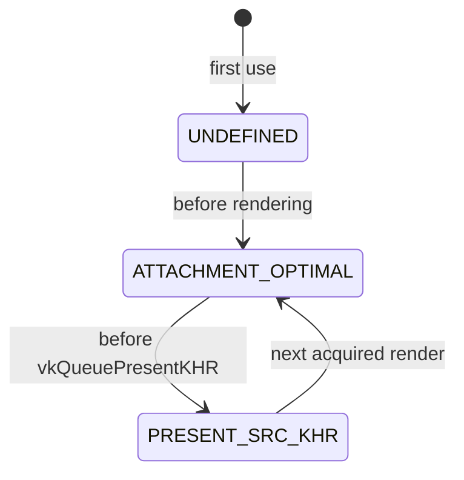

The first call in [`drawFrame`](src/FlowUi.cpp#L874) makes color-attachment reads/writes legal and orders them after the prior state. Viewport passes and the main UI dynamic-rendering pass then write the image. The second call at [`drawFrame`](src/FlowUi.cpp#L904) makes those writes visible to presentation and changes to the presentation layout. `SwapchainGeneration::layouts[swapchainImageIndex]` tracks the state independently for each acquired image.

The barrier is needed even though the submit waits on `imageAvailable`. A semaphore orders work between queue/acquire operations; the image barrier states the memory access/layout transition inside the command stream. They solve complementary synchronization requirements.

Alternatives include using render-pass initial/final layouts, which can make transitions implicit. This code uses Vulkan dynamic rendering, so explicit barriers are the natural form. Vulkan's newer synchronization2 API (`vkCmdPipelineBarrier2`) could express the same transition more cleanly, but it would not remove the transition itself. A transition to `UNDEFINED` every frame could discard prior contents, but the present-to-attachment dependency and correct synchronization still have to be expressed.

### Q34 — How do the new managers work compared with `main`: what stayed the same and what changed?

The public roles mostly stayed the same. The major change is **where ownership lives and how frame-facing data is borrowed**. Previously, managers frequently owned native Vulkan objects or long-lived C++ containers directly. Now durable manager state is published through typed storage manager records, GPU resources are storage handles, and each begun frame receives validated snapshots/facades.

#### Shared pattern used by the migrated managers

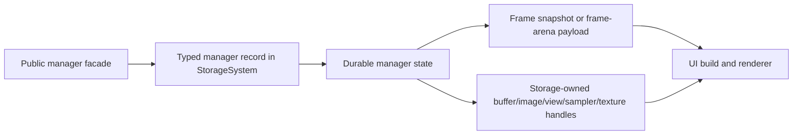

[`ManagerStateAccess`](include/internal/ManagerStorage/ManagerStateAccess.hpp#L13) is the small common bridge that retrieves a typed state record. Storage's handle still carries index+generation; the templated state access checks the expected `ResourceKind`. Templating is useful here because `UiManagerState`, `ShortcutManagerState`, and `InputFieldManagerState` have unrelated layouts but need the same validated lookup mechanism. A `void*` API would require casts and could associate the wrong kind. A virtual `ManagerBase` hierarchy would add indirection and force unrelated managers into one runtime interface. The enum template makes type/kind association compile-time visible without virtual allocation.

#### Manager-by-manager comparison

| Manager | What stayed the same | What changed in the upgrade |
|---|---|---|
| **ImageManager** | Register a file under a logical key, decode it, return a `TextureRef`, support contains/remove | It is now a thin facade over storage. [`registerImage`](src/managers/ImageManager.cpp#L64) creates a blob, storage image, image view, cached sampler, upload request, and published texture transactionally. The manager no longer owns VMA image allocations or a private descriptor registry. Replacing/removing a key uses deferred storage retirement. |
| **FontManager** | Families/faces, font resolution, glyph baking, atlas layers, and Clay measurement behavior remain | Atlas GPU ownership moved into [`FontCatalogController`](src/managers/FontCatalogController.cpp#L29) using storage image/view/sampler handles. [`FontManager::frameView`](src/managers/FontManager.cpp#L858) produces a frame-scoped view with the current atlas binding revision instead of letting rendering freely reach mutable catalog/native state. Atlas replacement can retire old native resources safely. |
| **IconManager** | Register SVG/file, rasterize requested sizes, cache variants, atlas pack, LRU evict | Atlas pages are now storage-owned images/views/textures ([`createAtlasPage`](src/managers/IconManager.cpp#L121)). Eviction releases an anonymous logical texture and defers reuse of its region until retirement completes ([`evictLeastRecentlyUsedVariant`](src/managers/IconManager.cpp#L439)). [`prepareFrameTextures`](src/managers/IconManager.cpp#L596) patches requested facade textures to size-specific cached atlas variants after layout. App-tick work advances age/retirement independently of a window frame. |
| **ViewPortManager** | Create named offscreen targets, give UI a texture, invoke user render callbacks, resize to rendered size | Each target generation now owns one storage image/view/texture and command resource per frame slot ([`ViewportTargetGeneration`](include/internal/ManagerStorage/ViewportStorageController.hpp#L48)). Resize builds a complete replacement generation and retires the old one. Commands are remapped to the current slot as explained in Q28. Native Vulkan command buffers remain in the viewport controller because storage owns resources, not arbitrary command recording. |
| **UiManager** | Own a Clay context, accept frame input, begin/end Clay layout, manage cursor/interactions and submanagers | Durable state is a typed [`UiManagerState`](include/internal/ManagerStorage/UiManagerState.hpp#L20) record. Its Clay arena is durable window memory; per-frame strings/payloads use `frameArena`. [`UiManager::beginFrame`](src/managers/UiManager.cpp#L273) binds the current token/snapshots, and [`endFrame`](src/managers/UiManager.cpp#L331) closes manager frame work. The facade is no longer itself the ultimate state owner. |
| **InputFieldManager** | Text editing, carets, selection, repeats, clipboard and UTF-8 behavior remain substantially the same | Field maps/history are in a storage-backed durable state; frame overrides and temporary render payloads are generated for the active frame. Font access is a captured `FontFrameView`, avoiding mutable/global atlas reach-through during the frame. The dense editing algorithm remains ordinary C++; storage does not replace it. |
| **ShortcutManager** | Register/unregister shortcuts, focus rules, chord matching, per-frame dispatch | Registrations/focus live in a typed state, logical changes notify manager publication, and [`beginFrame`](src/managers/ShortcutManager.cpp#L204) evaluates the current/previous input snapshot rather than depending on hidden global timing. |

#### What “storage-backed manager” does not mean

It does not mean every `std::unordered_map`, string, glyph record, or input edit is stored in a GPU-style handle table. The manager record is a stable, typed owner for a normal C++ state object. That object can still contain vectors/maps and manager-specific algorithms. Storage supplies:

- controlled construction/destruction and allocation attribution;
- window/shared scope validation;
- publication revisions and frame snapshots;
- centralized GPU resource ownership;
- rollback and deferred retirement where applicable.

This is an important boundary. Treating storage as a universal replacement for all containers would make the design much harder with little benefit. The upgrade centralizes **lifetime authority**, while keeping manager-specific behavior in manager code.

#### The largest behavioral changes to watch while reviewing

1. Resource removal is now logical first and physical later. A manager's `remove` can return while Vulkan objects remain in the retirement queue.
2. A frame sees captured manager/texture state. Mid-frame shared mutation is rejected rather than becoming visible unpredictably.
3. Recreated images/atlases/viewports preserve safe old generations for in-flight submissions.
4. Public `TextureRef` is a handle-and-metadata facade, not direct ownership of the underlying pixels.
5. Failure paths are transactional: construct candidates, publish only after all steps succeed, and roll back candidates on exception.

Those changes are why familiar manager functions now lead into more infrastructure even though their product-level jobs are unchanged.

## 10. Correction of the proposed architectural model (Q35–Q45)

Your model has the right outer shape: reusable per-slot scratch space, centralized durable resources, a prepare/freeze/submit sequence, and delayed cleanup. The part that makes the rest feel contradictory is one specific assumption: **the frame epoch is not the GPU lifetime clock**. Four different mechanisms have been mentally compressed into “epoch.” Once separated, the code becomes much less arbitrary.

The request in [notes line 35](notes.txt#L35) is handled by preserving your level of description below, then correcting each following statement rather than replacing it with unrelated terminology.

### Statement-by-statement correction

| Notes line | Your statement | Verdict and precise correction |
|---|---|---|
| [36](notes.txt#L36) | “a set range of memory preallocated for each frame slot…for each window” | Mostly correct. Each registered window has reusable `FrameState`s, one per in-flight slot, and each has transient/decode/worker arenas. It begins with configured page capacity but is not necessarily one fixed range: non-moving extra pages can be added when runtime growth is enabled. Vulkan/renderer/viewport per-slot resources are separate allocations coordinated by the same slot index. |
| [37](notes.txt#L37) | “reset the offset each frame to save allocations” | Correct, with the critical precondition that the exact slot's prior fence and storage submission have completed. [`beginFrame`](src/Storagesystem/FlowStorageSystem.cpp#L2068) then resets arena offsets, retaining pages for reuse. Resetting sooner would overwrite data still read by the GPU or command recording. |
| [38](notes.txt#L38) | “mostly UI instances and runs…consume images/viewports” | Half correct. `UiRun`s, scissor data, strings, `TextureRef` payloads, and temporary batches live in CPU frame arenas. UI **instances** are built directly in that slot's persistently mapped GPU buffer, not primarily in the arena. Images/viewports do not live inside those objects; instances contain small indices/parameters that cause commands to refer to separately owned resources. |
| [39](notes.txt#L39) | “central storage keeps one image and lets windows/slots reference it repeatedly” | Correct for `AppShared` assets. Repeated references use the same logical texture/image and `addUse` deduplicates the frame pin. It is intentionally not universal: `WindowLocal` and `FrameLocal` resources are duplicated when isolation prevents overlapping writes/read hazards. Viewport targets and UI instance buffers are important examples. |
| [40](notes.txt#L40) | “frame epoch keeps textures/buffers alive” | Incorrect. A frame epoch identifies one CPU build session and cheaply deduplicates pins/stale views. A real reference count keeps a resource logically alive while preparing. A submission serial plus completion watermark keeps its native object alive while the GPU may use it. |
| [41](notes.txt#L41) | “epoch increments after each completed frame for any window” | Incorrect timing. A global epoch is assigned at **begin**, before work is built ([`frame.epoch = nextFrameEpoch++`](src/Storagesystem/FlowStorageSystem.cpp#L2088)). It increments for begun frames, including ones later cancelled. Submission serials are assigned after successful queue submit; completion advances separately as fences are observed. |
| [42](notes.txt#L42) | “find resources, fully prepare, seal so nothing can alter it” | Mostly correct if “it” means the frame's preparation interface. Sealing forbids new arena allocations, buffer writes, and binding mutation through that token, and turns it into a read lease. It does not make every application object physically `const`, and it does not submit or present anything. The app's global gate prevents shared manager mutation during this interval. |
| [43](notes.txt#L43) | “we do not yet know which frame epoch it will be” | This is the identity mix-up. The epoch has been known since `beginFrame`. What is not known is the **submission serial**, because the build might fail/cancel and never reach `vkQueueSubmit`. Resources are pinned now without needing the future serial. |
| [44](notes.txt#L44) | “reference count is just a note; why epochs?” | The reference count is an actual integer ownership count and prevents final logical release. The epoch marker is a separate optimization/correctness tag saying “this exact generation was already counted once in this build.” Without it, 100 commands using one image could add 100 pins and require 100 balanced releases. A temporary hash set could replace epoch markers, but not reference counting or GPU serial tracking. |
| [45](notes.txt#L45) | “when frame epochs advance enough resources become untagged and can be removed” | Incorrect. Old epoch markers become irrelevant immediately when the slot begins with a new epoch, but that does not destroy anything. A resource is physically collectable after its reference count reaches zero **and** its recorded last submission serial is no newer than the contiguous completed serial. |

### The four labels that must remain separate

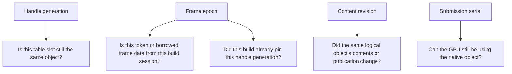

They are all integers because integers are compact, comparable, serializable in small tokens, and do not require pointer stability. Their meanings are not interchangeable:

#### 1. Handle index + generation: “which occupant?”

Resource tables are like numbered lockers. The index is the locker number. When an object is destroyed, that locker can be reused. The generation is the new occupant's identity card.

```text
TextureHandle { index: 17, generation: 4 }  -> old occupant
TextureHandle { index: 17, generation: 5 }  -> new occupant
```

Without the generation, an old UI command containing index 17 could silently resolve to an unrelated new texture. A raw pointer avoids the numeric lookup but creates worse problems: table/vector movement invalidates it, lifetime is invisible, it leaks implementation/native ownership into public APIs, and safely checking a dangling pointer is impossible. A 64-bit packed handle gives cheap value semantics and deterministic validation.

The [`Handle<ResourceKind>` template](include/internal/StorageSystem/StorageTypes.hpp#L189) also makes IDs type-safe. The enum template argument is a compile-time label; it does not add bytes to each handle. `BufferHandle` and `ImageHandle` have the same representation but cannot be mixed accidentally.

#### 2. Frame epoch: “which visit to this reusable room?”

A frame slot is a hotel room reused by many guests. `frameSlot = 0` names the room; `epoch = 102` names this particular stay. Arena pointers and tokens from stay 100 must not be accepted during stay 102.

The epoch also turns an old marker array into a reusable blank sheet without erasing it:

```cpp
if (marker.epoch == frame.epoch && marker.generation == handle.generation)
    return; // already pinned in this build
```

An epoch is assigned at begin precisely because it identifies CPU work. Cancellation consumes an epoch and that is fine; uniqueness matters, not a gap-free history.

#### 3. Revision: “same object, new contents”

The same texture handle can remain published while its backing native view or readiness changes. Its generation must not change because callers still refer to the same logical texture. Its revision changes so caches/descriptors know to refresh. Likewise, a frame slot remembers the binding revision it actually wrote; if equal, `vkUpdateDescriptorSets` is unnecessary.

#### 4. Submission serial: “how far has the GPU finished?”

This is the lifetime clock. Serial 57 is created only after queue submission. Every pinned resource records `lastUse >= 57`. When the fence proves 57 finished, storage can advance its safe frontier. A requested removal becomes physical only behind that frontier.

### The complete construction-to-presentation lifecycle

This graph shows both resources created once and data created or selected for one frame. Solid lines are execution; dotted lines are lifetime relationships.

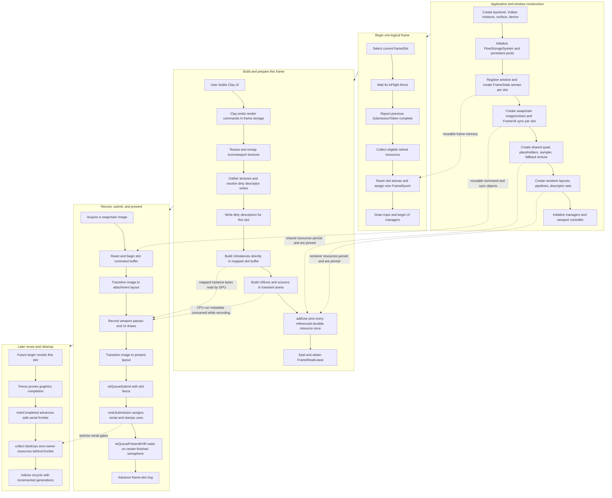

Concrete entry points for that graph are [`App::Impl::init`](src/FlowUi.cpp#L360), [`registerWindow`](src/Storagesystem/FlowStorageSystem.cpp#L1957), shared UI initialization at [`initSharedUiByteResources`](src/Ui/Vk_UiRenderer.cpp#L1319), app [`beginFrame`](src/FlowUi.cpp#L622), app [`endFrame`](src/FlowUi.cpp#L720), and app [`drawFrame`](src/FlowUi.cpp#L799). The final present call is [`vkQueuePresentKHR`](src/FlowUi.cpp#L974); completion is intentionally not reported there, because successful presentation enqueue does not mean the graphics fence has completed.

### A concrete image example from registration to destruction

Suppose `ImageManager` registers `logo.png`:

1. Decode pixels on the CPU.
2. Create a storage blob containing those bytes.
3. Create one device-local image, one image view, acquire a sampler, and publish one logical texture.
4. Flush the upload; the pixel blob can be released after the transfer. The durable image remains.
5. Window A frame-slot 0 emits five image commands and window B emits two. Both resolve the same `TextureHandle` because it is `AppShared`.
6. Each active frame calls `addUse` once for that handle despite repeated commands. There can be one pin from A and another from B because both submissions may overlap.
7. A's submit becomes serial 40 and B's becomes serial 41. The texture/view/sampler dependencies remember their newest use.
8. The app removes `logo`. Its public key disappears immediately; future lookup fails. Existing submitted commands remain valid.
9. If B/41 is the final use, native destruction waits until the contiguous completion frontier reaches 41.
10. `collect` destroys the texture record, releases its view/sampler dependencies, eventually destroys the native view/image if no other owner exists, and increments reused slot generations.

At no step does advancing a frame epoch make the image safe to destroy. Epoch helped each CPU frame count the image once. Submission completion proved the GPU stopped using it.

### What sealing does and does not freeze

```text
Frozen by the frame contract:
  arena allocation through this token
  outstanding buffer writes
  texture-binding preparation for this slot
  validity of the captured manager/frame views

Not implied by sealing alone:
  GPU submission has happened
  presentation has happened
  every C++ object in the application is immutable
  the frame slot is reusable
  resources used by the frame may be destroyed
```

The lease exists so the submit path cannot accidentally accept a still-mutable or stale build token. It is a capability: possession plus successful validation proves that preparation crossed the boundary.

### Why there are so many IDs instead of pointers

The system crosses boundaries where pointers are a poor shared language:

- vectors/tables may grow;
- records are logically removed before native destruction;
- frame slots are reused;
- multiple windows share resources;
- Vulkan work outlives the CPU call that submitted it;
- descriptor caches must compare “same identity” versus “same contents.”

A separate small integer answers each boundary's question. The design would be simpler to read if names consistently carried the noun—`buildEpoch`, `resourceGeneration`, `bindingRevision`, `gpuSubmissionSerial`—but merging them would lose safety. The right mental move is not “remember many counters”; it is “ask which question this counter answers.”

## 11. The recurring source of confusion: why this implementation feels beyond you

The pattern in the questions is not that you are missing a C++ feature. You repeatedly understand each local operation, then lose the whole model when a value crosses into another subsystem. That points to a missing **ownership-over-time map**, not a lack of programming ability.

### The central concept you have been reaching for

For any value, ask two questions independently:

1. **Where are its bytes owned right now?**
2. **What evidence says those bytes may be reused or destroyed?**

Most questions came from applying the answer for one kind of data to another:

| Data | Where its bytes live | Reuse/destruction proof |
|---|---|---|
| frame string, `TextureRef` payload, `UiRun`, scissor stack | CPU linear arena inside storage `FrameState` | exact slot's previous submission complete; next `beginFrame` resets offset |
| `UiInstance` | persistently mapped host-visible Vulkan buffer for one window/slot | same slot fence before rewriting; storage handle retirement before resizing old buffer |
| decoded image pixels | persistent CPU blob, then temporary upload staging | synchronous upload completion currently; blob references released |
| sampled image pixels | device-local `VkImage` owned by storage | CPU references zero and `lastUse` submission completed |
| texture descriptor | one descriptor set per window/frame slot | slot completion before update plus applied binding revision check |
| swapchain image | swapchain implementation, acquired by image index | acquire/present protocol, per-image fence/semaphore/layout tracking |
| manager state | durable typed storage record containing ordinary C++ data | manager record ownership and quiescent publication rules |

You were trying to use “frame epoch advanced” as the reuse proof for most rows. It is only the identity/dedup proof for the first row's current build session.

### Five pairs that the code makes easy to conflate

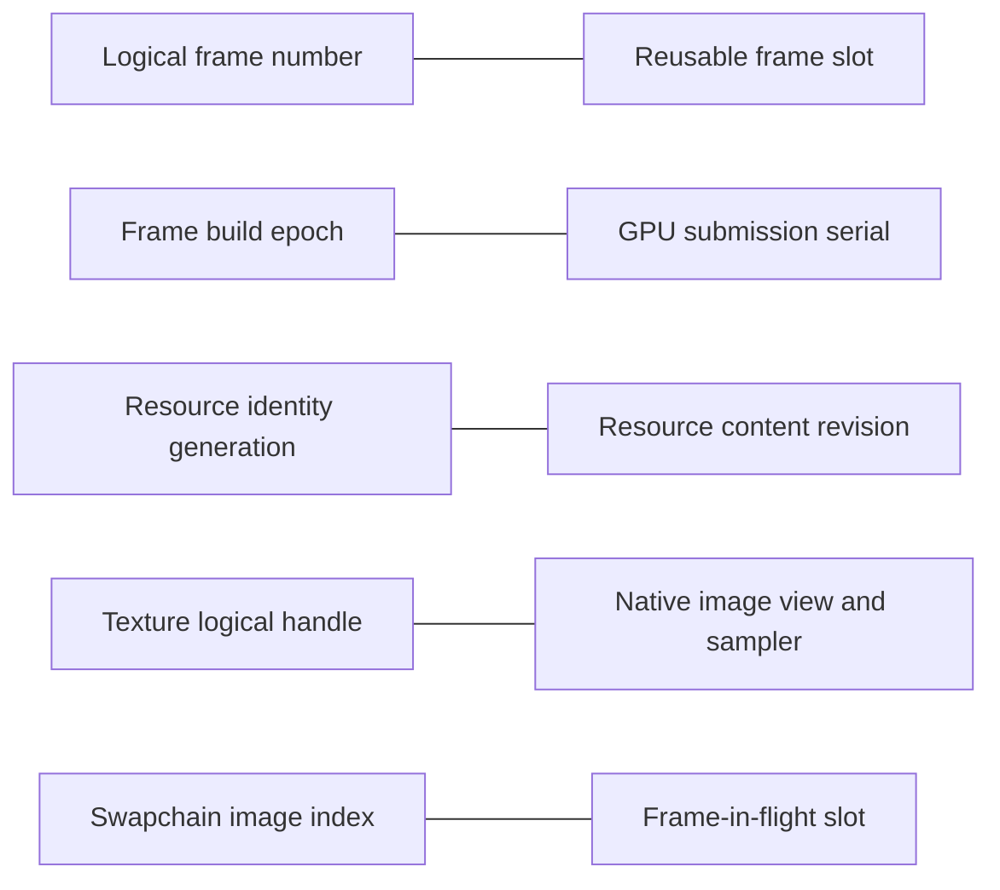

The line between each pair means “related but not equal.” In particular, a swapchain with three images and two frames in flight can acquire image 2 while using frame slot 0. Neither number predicts the other.

### The complexity is partly genuine, not merely perceived

The latest implementation combines several concerns that a simpler renderer might postpone:

- multi-window ownership;
- frames in flight;
- resource sharing scopes;
- stale-handle detection;
- exception-safe transactions;
- descriptor caching;
- GPU-safe deferred destruction;
- manager publication snapshots;
- development validation and telemetry;
- future worker/parallel-frame preparation.

Each mechanism is locally defensible. Their composition produces a cross-product of states. A texture can be published but uploading, usable but not visible to this window, ready but resolved to a stale descriptor revision, logically removed but still referenced, or reference-free but waiting on GPU completion. That is sophisticated engine infrastructure, not ordinary application-level C++.

There are also transitional mechanisms whose full benefit is not visible yet:

- worker arenas exist, while the app still permits only one active window-frame triplet;
- read leases establish a broad sealed-read contract, while the current renderer uses only a small part of that surface before submission;
- uploads have queued request/ID/state machinery, while [`flushUploads`](src/Storagesystem/FlowStorageSystem.cpp#L3539) still synchronously waits on the graphics queue;
- descriptor update-after-bind features are required, while safe per-frame-set updates remain the primary current pattern;
- manager publication revisions are captured in tokens/leases, although many current call paths are already serialized by the global gate.

This does not make those mechanisms wrong. It does mean the code carries **present behavior plus planned concurrency architecture at the same time**. When you search for the current reason for every field, sometimes the honest answer is “it enforces a boundary whose larger payoff arrives in the next concurrency phase.” That is real cognitive overhead.

### Naming and organization amplify the difficulty

Several names are accurate only from one subsystem's perspective:

- `Frame` can mean `FrameVk::Frame`, storage `FrameState`, the `FrameToken` build, or a user-visible logical frame;
- `NativeImageView` is returned from `nativeImage` even though its `nativeImageView` member is zero;
- `ResourceKind` contains both GPU resources and manager/application record kinds;
- `revision`, `generation`, `epoch`, `frameNumber`, `frameSlot`, `serial`, `writeId`, and `leaseId` all look like counters until their invariants are known;
- corresponding slot-owned objects are spread across `AppWindow`, `FrameVk`, `VulkanUiRenderer`, storage, and viewport storage.

A codebase-internal architecture note and a `FrameSlotContext`/more specific aliases would reduce this burden. The absence of one is exactly why reading the files in isolation did not give you a stable mental picture.

### A better way to review this code

Do not start by following every function call. Follow one piece of data through one full lifecycle and write the ownership proof beside each handoff:

1. **UI instance:** Clay command → mapped buffer write → draw → fence → overwrite.
2. **Image:** file pixels → blob → upload → image/view/sampler → texture binding → submit serial → remove → collect.
3. **Viewport:** facade texture → measured size → generation replacement → slot remap → offscreen pass → sample in UI.
4. **Descriptor:** texture revision → binding revision → slot's applied revision → `vkUpdateDescriptorSets` or no-op.

For every unfamiliar integer, annotate it with one of these verbs:

```text
generation -> identifies
epoch      -> scopes/deduplicates a CPU build
revision   -> invalidates cached content
serial     -> orders GPU lifetime
slot       -> selects reusable storage
ID         -> identifies a transaction/lease/window/name
```

Then review invariants, not merely operations:

- no slot reset before its exact fence completion;
- no frame mutation after sealing;
- no native destruction before final CPU release and GPU completion;
- no stale handle accepted after index reuse;
- no frame-local resource visible to another slot/window;
- no descriptor update repeated when the slot already contains the current revision.

Once those six rules are visible, much of the “extra code” becomes the checks that preserve them.

### What I would improve in the code for comprehension

This is a documentation/design review, not a request to change source, so no implementation was altered. The highest-value clarity improvements would be:

1. Rename conceptual types/fields in documentation or aliases: `FrameEpoch` → `FrameBuildEpoch`, `SubmissionSerial` → `GpuSubmissionSerial`, and `NativeImageView` → `NativeImageInfo`.
2. Add the four-label diagram and one lifecycle diagram beside `IStorageSystem`, not only in this Q&A.
3. Document current versus planned concurrency guarantees next to `workerCount` and `activeWindowFrame`.
4. Group per-slot references into a non-owning `FrameSlotContext` so navigation shows the cross-module relationship.
5. State on every `std::span` return whether storage owns the backing range and exactly which token/lease invalidates it.
6. Distinguish “logical removal,” “retirement queued,” and “native destroyed” in function comments and diagnostics.
7. Rename or split `ResourceKind` if manager records continue growing independently of GPU resource kinds.

The core conclusion is: **the implementation is not beyond you; its invariants are distributed and its future-facing scaffolding obscures which mechanisms are currently essential.** Your questions consistently found the real seams. The missing piece was a single model that separates memory location, logical ownership, build-session validity, cached-content validity, and GPU completion.

## 12. Compact glossary

| Term | One-sentence meaning | Never confuse with |
|---|---|---|
| App tick | One application-chosen opportunity to poll events and advance shared maintenance | rendered frame or fixed FPS interval |
| Logical frame number | Per-window human/diagnostic count of begun frames | ring slot or GPU serial |
| Frame slot | Reusable index selecting per-frame-in-flight storage | unique frame identity |
| Frame epoch | Globally unique identity of one begun CPU build session | GPU completion/lifetime |
| Frame token | Mutable-build capability naming window, slot, frame number, epoch, and manager revisions | sealed lease |
| Frame read lease | Proof the matching build was sealed and may be consumed/submitted | resource ownership |
| Submission serial | Global order number assigned after a queue submission | present ID or frame epoch |
| Completed watermark | Highest contiguous serial storage has proof is finished | largest completed token seen out of order |
| Handle index | Slot in a resource table | native Vulkan handle |
| Handle generation | Occupant identity for a recycled table slot | content revision |
| Revision | Version of the same logical object's contents/publication | lifetime proof |
| Reference count | Number of actual logical/temporary owners | number of render commands |
| `lastUse` | Newest GPU submission serial that may reference a resource | last CPU frame epoch |
| Retirement | Logically dead and queued until GPU-safe destruction | immediate free |
| Arena | Reusable page-backed bump allocator for temporary CPU data | Vulkan GPU allocation |
| `std::span<T>` | Non-owning typed view of contiguous `T` values | owning vector or lifetime extension |
| Image | Pixel-storage allocation (`VkImage`) | view or logical texture |
| Image view | Vulkan interpretation of image subresources | sampler |
| Sampler | Filtering/addressing policy | pixel storage |
| Texture | UI logical pairing of view, sampler, UVs, and metadata | necessarily a unique image allocation |
| Binding revision | Version of native descriptor content for a logical texture/window | texture generation |
| Descriptor bundle | Window-owned pool and per-frame descriptor sets tied to a renderer layout | layout itself |
| Manager record | Typed storage-owned lifetime root for ordinary manager state | GPU resource record |
| `activeWindowFrame` | Transitional app-wide guard identifying the one active frame triplet | current Vulkan frame slot |

---

Every line in [`notes.txt`](notes.txt#L1) is covered: Q1–Q34 have individual headings, and lines 35–45 are corrected individually in Section 10.
