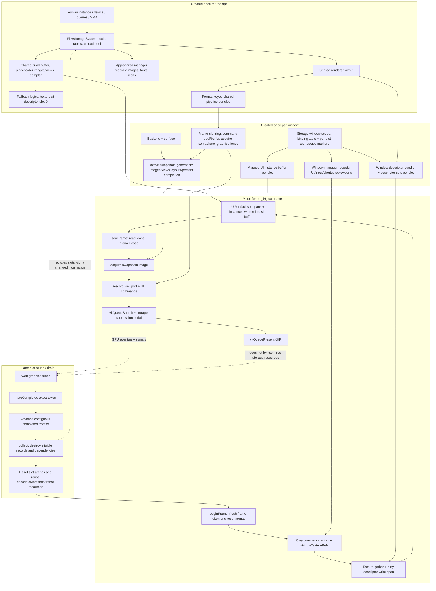

# Storage System Upgrade: Complete Code Review and Mental Model

This guide reviews the finalized storage-system upgrade in commits `05d1120` through `53b5d95`, using `d7d8dcb` as the pre-upgrade baseline. It deliberately does not re-explain unchanged legacy rendering or manager algorithms. It does cover every named helper and every storage/frame function introduced by the upgrade, plus the manager functions whose ownership or frame behavior changed because of it.

All function names below are links to the current implementation line. Paths are relative to this document, so they work in GitHub and editors that understand `file#Lline` links.

## Table of contents

1. [Review result and scope](#1-review-result-and-scope)
2. [Frequently used helpers and general utilities](#2-frequently-used-helpers-and-general-utilities)
3. [Storage-system-specific functions](#3-storage-system-specific-functions)
4. [Frame-lifecycle functions in execution order](#4-frame-lifecycle-functions-in-execution-order)
5. [Code-review findings](#5-code-review-findings)
6. [Frame resource lifecycle graph](#6-frame-resource-lifecycle-graph)
7. [Architecture: the big-picture explanation](#7-architecture-the-big-picture-explanation)
8. [Concrete C++ design choices](#8-concrete-c-design-choices)
9. [Data and ownership reference](#9-data-and-ownership-reference)
10. [Verification and review checklist](#10-verification-and-review-checklist)

---

## 1. Review result and scope

The upgrade establishes one application-owned storage authority for CPU memory, Vulkan buffers/images/views/samplers, logical textures, renderer bundles, manager roots, window scopes, per-frame scratch, submission tracking, and deferred destruction. Public managers remain facades; they no longer privately own parallel Vulkan allocation systems.

The review build was configured from the current tree with `FLOW_UI_DEV_MODE=ON`. All six tests passed:

- `flowui.storage.types`
- `flowui.ui.renderer_conversion`
- `flowui.phase4.api`
- `flowui.phase5.manager_storage`
- `flowui.phase4.two_window`
- `flowui.storage.system`

One high-severity exception-safety gap remains at the boundary between `vkQueueSubmit` and storage submission registration. It is explained in [Finding F1](#f1-high-submission-is-visible-to-vulkan-before-storage-bookkeeping-is-guaranteed).

### What is in scope

- New storage headers and the complete `FlowStorageSystem` implementation.
- New manager-storage state/controllers and all manager ownership migrations.
- Modified app, window, Vulkan frame/context/swapchain, renderer, texture, font, icon, image, viewport, input, shortcut, and UI frame paths.
- Construction, normal frames, cancellation, resize, presentation, completion, retirement, window destruction, and shutdown.

### What is intentionally not re-reviewed

- Unchanged Clay layout policy, UTF-8 editing semantics, rectangle packing policy, glyph shaping behavior, shader math, and old public convenience APIs—except where their resource access or frame ownership changed.
- Tests are used as evidence, but individual test helper functions are not production internals and are not included in the function catalog.

---

## 2. Frequently used helpers and general utilities

Every row answers three questions: **why it exists**, **how the implementation uses it**, and **what alternative was available**.

### 2.1 Typed IDs, flags, borrowed views, and hashes

| Function | Why and how | Alternative and tradeoff |
|---|---|---|
| [`operator\|`](../../include/internal/StorageSystem/StorageTypes.hpp#L151), [`hasFlag`](../../include/internal/StorageSystem/StorageTypes.hpp#L159) | **Why:** storage descriptions need readable combinations such as sampled + transfer-destination. **How:** buffer/image creation translates these enum flags into Vulkan flags. | Raw integers or Vulkan flags would be equally cheap but would leak the backend and permit unrelated bits. A per-enum overload would be safer than the generic enum template but much more repetitive. |
| [`Handle::operator bool`](../../include/internal/StorageSystem/StorageTypes.hpp#L196), [`packed`](../../include/internal/StorageSystem/StorageTypes.hpp#L200), [`fromPacked`](../../include/internal/StorageSystem/StorageTypes.hpp#L204) | **Why:** every resource needs a cheap nullable identity, a compact transport form, and a way back to its typed form. **How:** the low 32 bits select a table slot and the high 32 bits identify the incarnation occupying that slot. | A pointer is simpler, but becomes dangling after destruction and exposes table storage. A 64-bit untyped integer is compact but allows passing an image where a buffer is required. |
| [`ManagerRecordHandle::operator bool`](../../include/internal/StorageSystem/StorageTypes.hpp#L236), [`packed`](../../include/internal/StorageSystem/StorageTypes.hpp#L239), [`fromPacked`](../../include/internal/StorageSystem/StorageTypes.hpp#L242) | **Why:** manager records are type-erased only at the storage boundary, so they need the same stale-reference defense while carrying `ResourceKind` separately. **How:** facades hold this identity and request a typed pointer through `managerRecordData`. | One handle template per manager state would improve compile-time typing but explode the virtual interface. A plain pointer would make removal and fault-injection validation unsafe. |
| [`ManagerFrameView::operator bool`](../../include/internal/StorageSystem/StorageTypes.hpp#L287), [`MemoryBlock::operator bool`](../../include/internal/StorageSystem/StorageTypes.hpp#L306), [`FrameToken::operator bool`](../../include/internal/StorageSystem/StorageTypes.hpp#L353), [`UploadTicket::operator bool`](../../include/internal/StorageSystem/StorageTypes.hpp#L385), [`SubmissionToken::operator bool`](../../include/internal/StorageSystem/StorageTypes.hpp#L392), [`BufferWriteView::operator bool`](../../include/internal/StorageSystem/StorageTypes.hpp#L553) | **Why:** all small transport structs need an unambiguous default/empty state. **How:** each checks the minimum identity/pointer fields required for its operation; callers can guard cleanup and reject empty work without knowing representation details. | `std::optional<T>` makes absence explicit but increases nesting/size and still needs validation of partially filled aggregates. Repeating field checks at every call site invites inconsistent definitions. |
| [`TextureHandle::operator bool`](../../include/FlowUi/TextureHandle.hpp#L13), [`packed`](../../include/FlowUi/TextureHandle.hpp#L17), [`fromPacked`](../../include/FlowUi/TextureHandle.hpp#L21) | **Why:** logical textures cross the public/internal boundary, so this one typed handle is public. **How:** `TextureRef`, icon variants, images, and viewports carry it without exposing Vulkan descriptors. | A public descriptor index would be window/frame dependent and immediately stale after rebinding. A public `VkImageView` would expose ownership and cannot represent queued/failed resources. |
| [`ResourceKeyHash::operator()`](../../include/internal/StorageSystem/StorageTypes.hpp#L259), [`RendererLayoutKeyHash::operator()`](../../include/internal/StorageSystem/StorageTypes.hpp#L793), [`RendererPipelineKeyHash::operator()`](../../include/internal/StorageSystem/StorageTypes.hpp#L818) | **Why:** logical resources and shared renderer objects need fast keyed lookup. **How:** keys combine domain/name/window or layout/format/shader identity into hash-map keys; equality still resolves collisions. | Ordered maps avoid a custom hash but add tree nodes and logarithmic lookups. String keys everywhere are readable but duplicate allocations and comparisons. |
| [`ArenaView::allocate`](../../include/internal/StorageSystem/StorageTypes.hpp#L325), [`allocateArray`](../../include/internal/StorageSystem/StorageTypes.hpp#L333) | **Why:** callers need temporary memory without knowing the concrete arena type. **How:** a context pointer plus function pointer forms a non-owning allocation capability; `allocateArray<T>` checks multiplication overflow and returns a counted view. | Exposing `LinearArena&` couples every caller to the implementation. `std::vector` is easier but performs general-heap allocation and owns memory beyond the frame. |
| [`FrameReadLease::operator bool`](../../include/internal/StorageSystem/StorageTypes.hpp#L369), [`valid`](../../include/internal/StorageSystem/StorageTypes.hpp#L373) | **Why:** a sealed frame must advertise whether borrowed storage snapshots are still legal. **How:** production uses token fields; development builds additionally share an atomic revocation flag. | Copying every snapshot would avoid borrowing but add frame allocations/copies. A raw boolean cannot invalidate copies already held elsewhere. |
| [`PreparedTextureBindings::binding`](../../include/internal/StorageSystem/StorageTypes.hpp#L620), [`StorageReadView::valid`](../../include/internal/StorageSystem/StorageTypes.hpp#L636), [`texture`](../../include/internal/StorageSystem/StorageTypes.hpp#L644), [`imageView`](../../include/internal/StorageSystem/StorageTypes.hpp#L653), [`sampler`](../../include/internal/StorageSystem/StorageTypes.hpp#L660), [`WindowBindingView::valid`](../../include/internal/StorageSystem/StorageTypes.hpp#L675), [`binding`](../../include/internal/StorageSystem/StorageTypes.hpp#L683) | **Why:** hot render data needs bounds and incarnation checks at one shared access point. **How:** a handle indexes a `std::span`, then its incarnation field must match before the pointer is returned. | Call-site indexing is shorter but duplicates safety logic and makes stale-table reads easy. `unordered_map<Handle, Record>` is safer by default but much slower in inner conversion loops. |
| [`useOf`](../../include/internal/StorageSystem/StorageTypes.hpp#L866) | **Why:** batch resource tracking needs one erased record type while callers retain typed handles. **How:** the handle’s enum template argument supplies `ResourceKind`, and `packed()` supplies the payload. | Many `trackUse` overloads preserve typing but make heterogeneous batches awkward; a raw `{kind,id}` pair is more error-prone. |

### 2.2 Resource-key and typed manager-state helpers

| Function | Why and how | Alternative and tradeoff |
|---|---|---|
| [`internalDomain`](../../include/internal/ManagerStorage/ResourceKeyNormalization.hpp#L16) | **Why:** public and internal domain enums intentionally differ. **How:** it makes the translation exhaustive and rejects unresolved `Auto`. | `static_cast` is shorter but silently depends on matching enum values forever. |
| [`normalizeResourceKey`](../../include/internal/ManagerStorage/ResourceKeyNormalization.hpp#L31) | **Why:** every manager must apply identical name/domain/window rules. **How:** it validates scope, interns the name, and creates the compact internal key. | Each manager could normalize locally, but drift between image/icon/font/window rules already becomes likely. Keeping public strings as keys costs allocations and repeated hashing. |
| [`createState<State>`](../../include/internal/ManagerStorage/ManagerStateAccess.hpp#L13) | **Why:** storage records are byte allocations but manager state is real C++ with constructors/destructors. **How:** it captures decayed constructor arguments in a tuple, installs placement-construction and typed-destruction callbacks, then asks storage to publish transactionally. | A virtual `ManagerStateBase` adds an allocation and inheritance to every state. `std::any` hides alignment and makes allocation control/accounting weaker. |
| [`state<State>`](../../include/internal/ManagerStorage/ManagerStateAccess.hpp#L39), [`state<const State>`](../../include/internal/ManagerStorage/ManagerStateAccess.hpp#L49) | **Why:** facades need a single typed retrieval path. **How:** storage validates slot, incarnation, state, and `ResourceKind` before the cast. | Caching only a raw pointer is faster but cannot recover safely after removal. Repeating casts in each manager would scatter boundary logic. Current facades commonly cache the stable pointer after this checked lookup. |

### 2.3 Storage implementation primitives

| Function or family | Why and how | Alternative and tradeoff |
|---|---|---|
| [`storageError`](../../src/Storagesystem/FlowStorageSystem.cpp#L49), [`checkVk`](../../src/Storagesystem/FlowStorageSystem.cpp#L53) | **Why:** all contract and Vulkan failures need consistent exceptions. **How:** storage errors get a subsystem prefix; Vulkan calls are converted to that path. | Error codes avoid exceptions but would make every transactional create path much more verbose. `VK_CHECK` macros lose type/scope hygiene. |
| [`alignUp`](../../src/Storagesystem/FlowStorageSystem.cpp#L59), [`checkedSize`](../../src/Storagesystem/FlowStorageSystem.cpp#L69), [`checkedMultiply`](../../src/Storagesystem/FlowStorageSystem.cpp#L74), [`checkedAdd`](../../src/Storagesystem/FlowStorageSystem.cpp#L79) | **Why:** allocators and image byte calculations cannot tolerate wraparound. **How:** they validate power-of-two alignment and arithmetic before allocation or pointer math. | Relying on unsigned wrap is fast but turns large inputs into undersized allocations. Compiler overflow builtins are equally good but less portable/readable here. |
| [`nextGeneration`](../../src/Storagesystem/FlowStorageSystem.cpp#L84), [`nextCapacity`](../../src/Storagesystem/FlowStorageSystem.cpp#L89) | **Why:** reused slots must change identity, and arenas/pools need bounded geometric growth. **How:** zero is skipped; capacity grows by at least 1.1× until sufficient with overflow fallback. | Never reusing slots avoids incarnation counters but grows tables forever. Exact-size growth saves memory momentarily but causes repeated allocations and copying. |
| [`toVkFormat`](../../src/Storagesystem/FlowStorageSystem.cpp#L104), [`toVkImageUsage`](../../src/Storagesystem/FlowStorageSystem.cpp#L117), [`toVkBufferUsage`](../../src/Storagesystem/FlowStorageSystem.cpp#L128), [`toVmaMemoryUsage`](../../src/Storagesystem/FlowStorageSystem.cpp#L140), [`toVkFilter`](../../src/Storagesystem/FlowStorageSystem.cpp#L149), [`toVkAddressMode`](../../src/Storagesystem/FlowStorageSystem.cpp#L153) | **Why:** the storage API must remain backend-shaped but not backend-exposed. **How:** descriptions are translated only at native creation. | Storing Vulkan enums directly is less code but makes the storage abstraction unusable without Vulkan headers and leaks backend choices into managers. |
| [`bytesPerPixel`](../../src/Storagesystem/FlowStorageSystem.cpp#L162), [`estimateImageBytes`](../../src/Storagesystem/FlowStorageSystem.cpp#L175) | **Why:** budgets and upload validation need conservative byte counts before/after native allocation. **How:** each mip extent is accumulated with checked arithmetic; VMA’s actual size replaces the estimate later. | Trusting only VMA reports means budget rejection happens after an expensive allocation. A full format database is more general but unnecessary for supported formats. |
| [`nativeHandle`](../../src/Storagesystem/FlowStorageSystem.cpp#L194), [`fromNativeHandle`](../../src/Storagesystem/FlowStorageSystem.cpp#L203) | **Why:** interface types cannot depend on whether Vulkan handles are pointers or integers on a platform. **How:** templates convert both representations to/from fixed 64-bit transport fields. | `reinterpret_cast<uint64_t>` is not legal for non-pointer handles. Exposing Vulkan types would erase the interface boundary. |
| [`StringViewHash::operator()`](../../src/Storagesystem/FlowStorageSystem.cpp#L213), [`StringViewEqual::operator()`](../../src/Storagesystem/FlowStorageSystem.cpp#L220) | **Why:** string interning should find an existing entry using the caller’s view without allocating. **How:** transparent hash/equality operate on `std::string_view`. | `unordered_map<std::string,...>` often constructs a temporary string for lookup. A sorted vector can be more compact but makes insertion and lookup logarithmic/linear. |
| [`AlignedByteDelete::operator()`](../../src/Storagesystem/FlowStorageSystem.cpp#L225) | **Why:** aligned `operator new[]` must be paired with the same alignment at deletion. **How:** the alignment travels in the `unique_ptr` deleter. | Manual raw pointers are workable but make page/slab exception cleanup fragile. |
| [`SamplerKeyHash::operator()`](../../src/Storagesystem/FlowStorageSystem.cpp#L246), [`makeSamplerKey`](../../src/Storagesystem/FlowStorageSystem.cpp#L259) | **Why:** identical samplers should share one Vulkan object. **How:** exact float bit patterns and enum settings form an immutable cache key. | Approximate float equality could merge near-identical samplers but makes hashing surprising. Creating one sampler per texture is simpler but wastes objects and references. |
| [`DiagnosticKeyHash::operator()`](../../src/Storagesystem/FlowStorageSystem.cpp#L572), [`Impl` constructor](../../src/Storagesystem/FlowStorageSystem.cpp#L578) | **Why:** warn-once marks need a compound hash, and every implementation must be permanently tied to its Vulkan context. **How:** resource-key and diagnostic code hashes are combined; the constructor stores a non-owning context reference that outlives storage. | A nested ordered map avoids the compound hash but adds nodes/lookups. Passing the context into every operation is explicit but noisy and permits accidental cross-device calls. |

### 2.4 `LinearArena`: temporary frame/worker/decode memory

| Function | Why and how | Alternative and tradeoff |
|---|---|---|
| [`LinearArena::initialize`](../../src/Storagesystem/FlowStorageSystem.cpp#L275) | **Why:** every window/frame slot needs reusable scratch capacity. **How:** it stores growth policy and creates the initial aligned page once. | Lazily creating the first page saves startup memory but moves allocation into the first frame. |
| [`allocate`](../../src/Storagesystem/FlowStorageSystem.cpp#L283) | **Why:** frame work needs very cheap monotonic allocation. **How:** it aligns a bump offset, tries later pages, and grows only if permitted. | General `new` supports independent frees but adds metadata, fragmentation, and steady-frame allocation traffic. |
| [`reset`](../../src/Storagesystem/FlowStorageSystem.cpp#L317) | **Why:** all allocations from a completed/reused frame die together. **How:** offsets return to zero; pages remain cached. | Freeing each object requires ownership bookkeeping. Recreating the arena each frame loses reuse and causes churn. |
| [`trimOverflow`](../../src/Storagesystem/FlowStorageSystem.cpp#L327) | **Why:** one unusually large frame should not permanently retain every growth page. **How:** idle slots can keep the base page and discard overflow pages. | Never trimming is faster but retains peak memory forever; trimming every frame thrashes bursty workloads. |
| [`capacity`](../../src/Storagesystem/FlowStorageSystem.cpp#L334), [`highWater`](../../src/Storagesystem/FlowStorageSystem.cpp#L339), [`growthCount`](../../src/Storagesystem/FlowStorageSystem.cpp#L346) | **Why:** budgets/tuning need evidence about reserve sizes. **How:** capacity is always available; detailed counters compile to zero outside development mode. | Always-on counters improve observability but add hot-path writes and binary state. |
| [`arenaAllocate`](../../src/Storagesystem/FlowStorageSystem.cpp#L354) | **Why:** `ArenaView` requires a plain function pointer. **How:** it casts the erased context back and forwards to `allocate`. | `std::function` can capture the arena but may allocate and is larger. |
| [`addPage`](../../src/Storagesystem/FlowStorageSystem.cpp#L366) | **Why:** page construction must be centralized and exception-safe. **How:** aligned storage enters a `unique_ptr` before the page is published. | Reallocating one contiguous buffer invalidates every earlier pointer; pages preserve all outstanding addresses. |

### 2.5 `PersistentPool`: durable non-moving CPU memory

| Function | Why and how | Alternative and tradeoff |
|---|---|---|
| [`PersistentPool::initialize`](../../src/Storagesystem/FlowStorageSystem.cpp#L389) | **Why:** manager records, blobs, and strings need durable backing. **How:** it stores growth policy and creates a base slab. | `std::pmr::unsynchronized_pool_resource` is a good alternative but gives less domain-specific tagging/validation and implementation control. |
| [`allocate`](../../src/Storagesystem/FlowStorageSystem.cpp#L395) | **Why:** durable objects need aligned, non-relocating allocation with identity and tags. **How:** it splits a free block, publishes metadata transactionally, and returns `MemoryBlock{id,tag}`. | A bump allocator cannot reclaim individual records. `malloc` is simpler but cannot validate a release against the original tag and pool. |
| [`release`](../../src/Storagesystem/FlowStorageSystem.cpp#L443) | **Why:** a wrong or stale block must not corrupt the pool. **How:** it matches ID, address, size, and full tag, returns the range, then coalesces neighbors. | Trusting only the pointer is faster but turns double/wrong frees into allocator corruption. |
| [`reservedBytes`](../../src/Storagesystem/FlowStorageSystem.cpp#L466), [`liveBytes`](../../src/Storagesystem/FlowStorageSystem.cpp#L471), [`peakLiveBytes`](../../src/Storagesystem/FlowStorageSystem.cpp#L472), [`allocationCount`](../../src/Storagesystem/FlowStorageSystem.cpp#L479), [`growthCount`](../../src/Storagesystem/FlowStorageSystem.cpp#L480) | **Why:** storage statistics and budget checks need pool-level accounting. **How:** live/reserved are functional; peak/growth are development telemetry. | Relying only on system allocator statistics cannot attribute memory to FlowUi classes. |
| [`addSlab`](../../src/Storagesystem/FlowStorageSystem.cpp#L504) | **Why:** growth must preserve every prior object address. **How:** it adds a separately aligned slab with one initial free block. | Growing one vector invalidates cached manager pointers. |
| [`clear`](../../src/Storagesystem/FlowStorageSystem.cpp#L517) | **Why:** final shutdown should release all slabs and reset counters in one place. **How:** containers and IDs return to initial state after objects have been destructed. | Per-allocation release is safer during normal operation but unnecessary and slower after device idle at final teardown. |
| [`merge`](../../src/Storagesystem/FlowStorageSystem.cpp#L530) | **Why:** repeated allocate/free would fragment a slab. **How:** sorted adjacent ranges are combined in place. | Buddy allocation makes merging cheaper but rounds sizes aggressively; segregated free lists are faster but more complex. |

### 2.6 Repeated internal table/safety helpers

| Function family | Why and how | Alternative and tradeoff |
|---|---|---|
| [`Impl::acquireIndex`](../../src/Storagesystem/FlowStorageSystem.cpp#L832), [`acquireImageViewIndex`](../../src/Storagesystem/FlowStorageSystem.cpp#L889), [`acquireSamplerIndex`](../../src/Storagesystem/FlowStorageSystem.cpp#L900), [`acquireTextureIndex`](../../src/Storagesystem/FlowStorageSystem.cpp#L911) | **Why:** all resources use slot tables with reusable indices; hot/cold parallel tables must grow transactionally. **How:** free slots are preferred, otherwise vectors grow with a rollback slot reserved first. | A map from ever-growing IDs never reuses identity but costs more memory/cache misses. One monolithic record table would mix unrelated resources and lose typed locality. |
| [`managerCheckpoint`](../../src/Storagesystem/FlowStorageSystem.cpp#L846), [`usableManagerRecord`](../../src/Storagesystem/FlowStorageSystem.cpp#L852), [`incrementManagerRevision`](../../src/Storagesystem/FlowStorageSystem.cpp#L860), [`destroyManagerRecord`](../../src/Storagesystem/FlowStorageSystem.cpp#L869), [`destroyAllManagerRecords`](../../src/Storagesystem/FlowStorageSystem.cpp#L880) | **Why:** manager publication needs tested rollback, type/state validation, visible change counters, and real destructors. **How:** injected checkpoints exercise every transaction edge; removal invokes the stored destructor before returning memory. | Untested rollback is shorter but failure bugs remain latent. Virtual manager objects would own destruction naturally but undermine centralized allocation. |
| [`requireInitialized`](../../src/Storagesystem/FlowStorageSystem.cpp#L928), [`requireCpuBudget`](../../src/Storagesystem/FlowStorageSystem.cpp#L932), [`hasActiveFrames`](../../src/Storagesystem/FlowStorageSystem.cpp#L939), [`hasSealedFrames`](../../src/Storagesystem/FlowStorageSystem.cpp#L948), [`requireSharedMutationPhase`](../../src/Storagesystem/FlowStorageSystem.cpp#L957), [`requireWindowBindingMutationPhase`](../../src/Storagesystem/FlowStorageSystem.cpp#L963) | **Why:** lifecycle and mutation rules must be enforced centrally. **How:** every public operation calls the smallest applicable guard before mutation. | Relying on caller discipline is faster in microbenchmarks but makes cross-window snapshot corruption possible. A reader/writer lock could allow more overlap, but the current phase deliberately serializes publication. |
| [`requireWindow`](../../src/Storagesystem/FlowStorageSystem.cpp#L973), [`requireWindow const`](../../src/Storagesystem/FlowStorageSystem.cpp#L979), [`requireFrame`](../../src/Storagesystem/FlowStorageSystem.cpp#L1064), [`requireFrame const`](../../src/Storagesystem/FlowStorageSystem.cpp#L1110), [`requireLease`](../../src/Storagesystem/FlowStorageSystem.cpp#L1073), [`requireLease const`](../../src/Storagesystem/FlowStorageSystem.cpp#L1083) | **Why:** every borrowed scope must prove it still names the currently active window/slot/frame/lease. **How:** identity fields are checked before returning internal state. | Storing pointers in tokens avoids lookup but pointers survive reuse/closure and are forgeable. |
| [`invalidateLease`](../../src/Storagesystem/FlowStorageSystem.cpp#L1093), [`invalidateArena`](../../src/Storagesystem/FlowStorageSystem.cpp#L1101) | **Why:** copied development views must stop working when the owner moves on. **How:** an atomic flag is revoked and the owner’s shared pointer is reset. | Poisoning memory catches some misuse but is expensive and unreliable; copying frame data avoids invalidation but costs much more. |
| [`validateSharingAttribution`](../../src/Storagesystem/FlowStorageSystem.cpp#L985), [`visibleToFrame`](../../src/Storagesystem/FlowStorageSystem.cpp#L1015), [`bufferVisibleToFrame`](../../src/Storagesystem/FlowStorageSystem.cpp#L1029), [`imageVisibleToFrame`](../../src/Storagesystem/FlowStorageSystem.cpp#L1035), [`textureBackingImage`](../../src/Storagesystem/FlowStorageSystem.cpp#L1041), [`textureVisibleToFrame`](../../src/Storagesystem/FlowStorageSystem.cpp#L1047), [`validateTextureOwnership`](../../src/Storagesystem/FlowStorageSystem.cpp#L1052) | **Why:** app-, window-, and frame-local objects must never leak across scopes. **How:** creation validates attribution and every frame use rechecks visibility, including through a texture’s backing image. | Separate C++ resource types per scope would provide more compile-time safety but multiply API types and make dynamic manager resources awkward. |
| [`addUse`](../../src/Storagesystem/FlowStorageSystem.cpp#L1118), [`noteInvalidHandle`](../../src/Storagesystem/FlowStorageSystem.cpp#L1165), [`updateGpuPeak`](../../src/Storagesystem/FlowStorageSystem.cpp#L1171), [`enqueueRetirement`](../../src/Storagesystem/FlowStorageSystem.cpp#L1179), [`reserveRetirements`](../../src/Storagesystem/FlowStorageSystem.cpp#L1189) | **Why:** frame uses need one strong pin each and retirement needs allocation-safe bookkeeping. **How:** per-kind marker arrays deduplicate by slot/incarnation/frame stamp; queue capacity is reserved before no-fail transitions. | An `unordered_set` of handles is simpler but allocates and hashes during frame preparation. Retiring immediately is invalid while the GPU may still read. |
| [`retainBlob`](../../src/Storagesystem/FlowStorageSystem.cpp#L1201), [`retainBuffer`](../../src/Storagesystem/FlowStorageSystem.cpp#L1207), [`retainImage`](../../src/Storagesystem/FlowStorageSystem.cpp#L1196), [`retainImageView`](../../src/Storagesystem/FlowStorageSystem.cpp#L1212), [`retainSampler`](../../src/Storagesystem/FlowStorageSystem.cpp#L1217), [`retainTexture`](../../src/Storagesystem/FlowStorageSystem.cpp#L1309), [`retainRendererLayout`](../../src/Storagesystem/FlowStorageSystem.cpp#L1313), [`retainRendererPipelineBundle`](../../src/Storagesystem/FlowStorageSystem.cpp#L1317), [`retainWindowDescriptorBundle`](../../src/Storagesystem/FlowStorageSystem.cpp#L1321), [`incrementReference`](../../src/Storagesystem/FlowStorageSystem.cpp#L1289) | **Why:** owners, dependencies, uploads, and frames can all keep the same object alive. **How:** validated reference counts are incremented with overflow rejection. | `shared_ptr` automates counting for CPU objects but cannot encode GPU completion, table identity, or Vulkan dependency teardown order. |
| [`validBlob`](../../src/Storagesystem/FlowStorageSystem.cpp#L1237), [`validBuffer`](../../src/Storagesystem/FlowStorageSystem.cpp#L1241), [`validImage`](../../src/Storagesystem/FlowStorageSystem.cpp#L1245), [`validImageView`](../../src/Storagesystem/FlowStorageSystem.cpp#L1249), [`validSampler`](../../src/Storagesystem/FlowStorageSystem.cpp#L1253), [`validTexture`](../../src/Storagesystem/FlowStorageSystem.cpp#L1257), [`validRendererLayout`](../../src/Storagesystem/FlowStorageSystem.cpp#L1293), [`validRendererPipelineBundle`](../../src/Storagesystem/FlowStorageSystem.cpp#L1298), [`validWindowDescriptorBundle`](../../src/Storagesystem/FlowStorageSystem.cpp#L1303) | **Why:** “this slot/incarnation exists” is distinct from “new work may use it.” **How:** these accept retiring records so cleanup and last-use stamping can still find them. | One validation predicate is shorter but either permits new use of retiring resources or prevents cleanup from locating them. |
| [`usableBuffer`](../../src/Storagesystem/FlowStorageSystem.cpp#L1261), [`usableImage`](../../src/Storagesystem/FlowStorageSystem.cpp#L1264), [`usableImageView`](../../src/Storagesystem/FlowStorageSystem.cpp#L1267), [`usableSampler`](../../src/Storagesystem/FlowStorageSystem.cpp#L1270), [`usableTexture`](../../src/Storagesystem/FlowStorageSystem.cpp#L1273), [`usableRendererLayout`](../../src/Storagesystem/FlowStorageSystem.cpp#L1277), [`usableRendererPipelineBundle`](../../src/Storagesystem/FlowStorageSystem.cpp#L1280), [`usableWindowDescriptorBundle`](../../src/Storagesystem/FlowStorageSystem.cpp#L1284) | **Why:** new reads/retains must reject objects already leaving the system. **How:** they layer a non-retiring/publication check on `valid*`. | Encoding every lifecycle state in the handle type would be stronger but impractical across asynchronous transitions. |
| [`refreshTexturesForImage`](../../src/Storagesystem/FlowStorageSystem.cpp#L1222), [`resolve`](../../src/Storagesystem/FlowStorageSystem.cpp#L1413) | **Why:** logical textures must follow upload state and become window descriptor bindings. **How:** image state changes bump texture revision; resolution caches or allocates a window slot and substitutes the fallback when needed. | Managers could update descriptors directly, but then every manager would duplicate window state, fallback, and retirement logic. |
| [`stampUse`](../../src/Storagesystem/FlowStorageSystem.cpp#L1359), [`releaseRendererLayoutReference`](../../src/Storagesystem/FlowStorageSystem.cpp#L1326), [`releaseRendererPipelineBundleReference`](../../src/Storagesystem/FlowStorageSystem.cpp#L1337), [`releaseWindowDescriptorBundleReference`](../../src/Storagesystem/FlowStorageSystem.cpp#L1348), [`releaseBufferReference`](../../src/Storagesystem/FlowStorageSystem.cpp#L1509), [`releaseImageReference`](../../src/Storagesystem/FlowStorageSystem.cpp#L1520), [`releaseImageViewReference`](../../src/Storagesystem/FlowStorageSystem.cpp#L1531), [`releaseSamplerReference`](../../src/Storagesystem/FlowStorageSystem.cpp#L1542), [`releaseTextureReference`](../../src/Storagesystem/FlowStorageSystem.cpp#L1554), and [`releaseUsed`](../../src/Storagesystem/FlowStorageSystem.cpp#L1576) | **Why:** the last owner can disappear before the GPU finishes. **How:** submission stamps each dependency with the serial; dropping the last count queues it rather than destroying it. Texture stamping recursively reaches view/sampler. | A device-wide idle before every destroy is simpler but stalls all windows and defeats frames in flight. Per-resource fences would be precise but far more numerous. |
| [`destroyRetired`](../../src/Storagesystem/FlowStorageSystem.cpp#L1609), [`immediateDestroyAll`](../../src/Storagesystem/FlowStorageSystem.cpp#L1754) | **Why:** normal collection and final shutdown have different preconditions. **How:** normal destruction validates the old incarnation and releases dependency references in order; final shutdown occurs after device idle and destroys all survivors defensively. | One shutdown path could force everything through serial collection, but abandoned/failed records and final-device teardown make that brittle. |

### 2.7 Renderer conversion and app helpers changed by the upgrade

| Function family | Why and how | Alternative and tradeoff |
|---|---|---|
| [`NativeHandleFromBits`](../../src/Ui/Vk_UiRenderer.cpp#L63), [`NativeHandleBits`](../../src/Ui/Vk_UiRenderer.cpp#L72) | **Why:** renderer caches storage’s backend-neutral native views. **How:** the same pointer/integer-safe conversion is used at the integration boundary. | Requerying storage inside every draw is safer-looking but adds locks/validation in the render loop; raw casts are non-portable. |
| [`ByteRangesIntersect`](../../src/Ui/Vk_UiRenderer.cpp#L210), [`CheckedSizeAdd`](../../src/Ui/Vk_UiRenderer.cpp#L325), [`ComputeBuildUpperBound`](../../src/Ui/Vk_UiRenderer.cpp#L330) | **Why:** direct instance emission needs exact non-overlapping override handling and safe upper bounds before acquiring memory. **How:** a dry count determines run/instance/scissor storage, then the real builder writes directly. | Push-growing vectors are simpler but allocate/reallocate and can invalidate spans. Two-pass conversion spends extra CPU counting but guarantees one allocation/write pass. |
| [`measureUiConversionCapacity`](../../src/Ui/Vk_UiRenderer.cpp#L1248), [`buildUiInstancesDirect`](../../src/Ui/Vk_UiRenderer.cpp#L1259), [`growUiInstanceCapacity`](../../src/Ui/Vk_UiRenderer.cpp#L1291) | **Why:** tests and renderer share capacity policy and direct-to-mapped-buffer conversion. **How:** `std::span` makes caller-provided capacity explicit; buffers grow 1.5×. | Returning vectors is easier to call but duplicates CPU storage before the GPU buffer copy. Exact growth creates more replacement generations. |
| [`makeWindowConfig`](../../src/FlowUi.cpp#L147), [`makeMainWindowConfig`](../../src/FlowUi.cpp#L157), [`makeStorageConfig`](../../src/FlowUi.cpp#L161), [`makeWindowStorageDesc`](../../src/FlowUi.cpp#L170), [`makeUiManagerConfig`](../../src/FlowUi.cpp#L185) | **Why:** public config, app-global storage config, and per-window storage config have different scopes. **How:** these are the only translation points and clamp frames-in-flight/expected capacity. | Passing `AppConfig` into storage couples layers and makes per-window differences ambiguous. Repeating field assignment in main/secondary creation invites drift. |
| [`App::Impl::requireWindow`](../../src/FlowUi.cpp#L287), [`mainWindow`](../../src/FlowUi.cpp#L303), [`requireQuiescent`](../../src/FlowUi.cpp#L442), [`requirePlatformThread`](../../src/FlowUi.cpp#L449), [`reserveWindowId`](../../src/FlowUi.cpp#L492) | **Why:** multi-window storage needs stable, non-reused identities and serialized public lifecycle calls. **How:** all APIs validate registry presence, thread, current frame gate, and monotonic ID space. | Reusing IDs reduces growth but makes stale public IDs refer to a different window. Per-window locks enable overlap but require the not-yet-implemented worker/publication model. |
| [`FrameVk::getCurrentFrame`](../../include/Vulkan/Vk_Frames.hpp#L26), [`advance`](../../include/Vulkan/Vk_Frames.hpp#L27) | **Why:** Vulkan and storage must select the same reusable frame slot. **How:** the ring index chooses fences, command pool, instance buffer, descriptors, and storage frame state together. | Separate indices per subsystem permit more flexibility but require complicated synchronization and mapping. |

### 2.8 Complete modified renderer-helper catalog

These helpers existed or were rewritten around the direct storage-backed conversion path. They are grouped by one purpose, but every named helper is linked.

| Function family | Why and how | Alternative and tradeoff |
|---|---|---|
| [`Intersect`](../../src/Ui/Vk_UiRenderer.cpp#L152), [`RectEqual`](../../src/Ui/Vk_UiRenderer.cpp#L165), [`ScaleBoundingBox`](../../src/Ui/Vk_UiRenderer.cpp#L169), [`UniformScale`](../../src/Ui/Vk_UiRenderer.cpp#L178), [`ToVkRect2D`](../../src/Ui/Vk_UiRenderer.cpp#L182) | **Why:** Clay coordinates/scissors are logical floats while Vulkan needs framebuffer-space integer rectangles. **How:** nested clips intersect, scaling happens once, and the final rectangle is clamped/converted for dynamic scissor state. | Passing logical coordinates into shaders avoids CPU conversion but cannot set Vulkan’s fixed scissor and makes clipping more expensive. |
| [`PackRGBA8`](../../src/Ui/Vk_UiRenderer.cpp#L202), [`ResolveTextureRef`](../../src/Ui/Vk_UiRenderer.cpp#L224), [`HasValidSourceDimensions`](../../src/Ui/Vk_UiRenderer.cpp#L230), [`ResolveTexturedImagePlacement`](../../src/Ui/Vk_UiRenderer.cpp#L234), [`PickType`](../../src/Ui/Vk_UiRenderer.cpp#L368) | **Why:** render commands need compact instance fields, safe logical texture access, image-fit placement, and pipeline classification. **How:** colors pack to one word, image data is treated as `TextureRef`, dimensions/UVs are normalized, and command kind selects solid/MSDF/textured output. | Larger float color/type structs are easier to debug but increase instance bandwidth. Native-image pointers in Clay commands would bypass logical storage identity and fallback. |
| [`FixedBuffer::push`](../../src/Ui/Vk_UiRenderer.cpp#L309), [`empty`](../../src/Ui/Vk_UiRenderer.cpp#L314), [`back`](../../src/Ui/Vk_UiRenderer.cpp#L315), [`pop`](../../src/Ui/Vk_UiRenderer.cpp#L316) | **Why:** the converter needs bounded write-only stacks/buffers over caller-owned spans. **How:** these tiny methods track a count without allocation and reject capacity overflow through the enclosing build logic. | `std::vector` is more familiar but owns/grows memory. Raw pointer arithmetic is equally fast but obscures bounds and count invariants. |
| [`EmitSolidRect`](../../src/Ui/Vk_UiRenderer.cpp#L383), [`EmitSolidRectOverride`](../../src/Ui/Vk_UiRenderer.cpp#L405), [`EmitSolidBorder`](../../src/Ui/Vk_UiRenderer.cpp#L418), [`EmitTextMsdf`](../../src/Ui/Vk_UiRenderer.cpp#L444), [`EmitTexturedImage`](../../src/Ui/Vk_UiRenderer.cpp#L535) | **Why:** each Clay command/override must become one or more uniform `UiInstance` records. **How:** helpers write directly into the pre-sized mapped span and update glyph/image counters; texture emission consumes the storage binding table. | Polymorphic render-command objects are extensible but allocate and add virtual dispatch. Separate vertex buffers per primitive cause more uploads/draws. |
| [`BuildInstancesAndRunsFromClay`](../../src/Ui/Vk_UiRenderer.cpp#L585) | **Why:** command traversal, clipping, override insertion, and run coalescing need one deterministic conversion pass. **How:** it uses fixed spans/stacks, emits instances, and opens/closes runs only when type or scissor changes. | One draw per Clay command is simpler but creates excessive pipeline/scissor binds. A retained render tree could cache work but changes the immediate-mode model. |
| [`IsSrgbColorFormat`](../../src/Ui/Vk_UiRenderer.cpp#L741), [`createGraphicsPipeline`](../../src/Ui/Vk_UiRenderer.cpp#L751), [`CreatePipelines`](../../src/Ui/Vk_UiRenderer.cpp#L912), [`PipelineForType`](../../src/Ui/Vk_UiRenderer.cpp#L1207), [`FlushRun`](../../src/Ui/Vk_UiRenderer.cpp#L1220) | **Why:** format-compatible pipelines and minimal run draws are the renderer’s native execution unit. **How:** creation configures dynamic rendering/blending for the target format; recording binds the pipeline selected by `UiType`, pushes base index, and issues an instanced quad draw. | One uber-pipeline reduces objects but adds shader branching and can complicate blend/state differences. One pipeline per command shape explodes pipeline count. |
| [`DestroyPipelines`](../../src/Ui/Vk_UiRenderer.cpp#L897), [`DestroyPipelineObjects`](../../src/Ui/Vk_UiRenderer.cpp#L936), [`DestroyDescriptorObjects`](../../src/Ui/Vk_UiRenderer.cpp#L944), [`CreateLayoutObjects`](../../src/Ui/Vk_UiRenderer.cpp#L962), [`CreateDescriptorObjects`](../../src/Ui/Vk_UiRenderer.cpp#L1024), [`CreatePipelineObjects`](../../src/Ui/Vk_UiRenderer.cpp#L1068) | **Why:** candidate creation and rollback require granular ownership helpers before storage accepts native ownership. **How:** candidates are built in renderer fields, published/adopted, nulled on transfer, or locally destroyed on duplicate/failure. | Storage constructing all objects removes transfer choreography but hard-codes renderer descriptor/shader policy into the generic system. Ad-hoc cleanup in each catch block is leak-prone. |
| [`UpdateInstanceBufferDescriptorForFrame`](../../src/Ui/Vk_UiRenderer.cpp#L1075), [`UpdateFontDescriptorForFrame`](../../src/Ui/Vk_UiRenderer.cpp#L1103), [`InitializeDescriptorBindings`](../../src/Ui/Vk_UiRenderer.cpp#L1137), [`EnsureInstanceBufferCapacity`](../../src/Ui/Vk_UiRenderer.cpp#L1148) | **Why:** each frame slot owns a different instance buffer/set and the captured font atlas may change. **How:** descriptor writes are slot-local; buffer replacement publishes the new storage generation then updates the set before releasing the old handle. | One shared mapped buffer/set needs dynamic offsets and synchronization. Rewriting all descriptors every frame is simpler but wastes driver work. |

### 2.9 Modified Vulkan/WSI helper catalog

| Function family | Why and how | Alternative and tradeoff |
|---|---|---|
| App/Vulkan [`vkCheck`](../../src/FlowUi.cpp#L41), [`transitionSwapchainImageLayout`](../../src/FlowUi.cpp#L58), [`validateSecondarySurface`](../../src/FlowUi.cpp#L117) | **Why:** frame code needs consistent failure conversion, explicit dynamic-rendering layouts, and proof that a new surface matches selected device/queues. **How:** errors throw; barriers track each swapchain image’s stored layout; support is queried before publishing a secondary window. | Render passes can own implicit transitions but are less flexible than dynamic rendering. Recreating/reselecting a device per secondary surface destroys sharing. |
| Context [`hasExtension`](../../src/Vulkan/Vk_Context.cpp#L23), [`hasLayer`](../../src/Vulkan/Vk_Context.cpp#L32), [`findQueueFamilies`](../../src/Vulkan/Vk_Context.cpp#L101), [`deviceHasExtension`](../../src/Vulkan/Vk_Context.cpp#L128), [`querySwapchainSupport`](../../src/Vulkan/Vk_Context.cpp#L142), [`waitForPresent`](../../src/Vulkan/Vk_Context.cpp#L519) | **Why:** exact multi-window WSI capability must be discovered rather than assumed. **How:** instance/device features and queues are selected once; present wait dispatches the enabled exact mechanism. | Always device-idling works broadly but stalls unrelated windows. Re-probing on every frame is redundant. |
| Swapchain [`chooseSurfaceFormat`](../../src/Vulkan/Vk_Swapchain.cpp#L17), [`choosePresentMode`](../../src/Vulkan/Vk_Swapchain.cpp#L48), [`chooseExtent`](../../src/Vulkan/Vk_Swapchain.cpp#L75), [`chooseCompositeAlpha`](../../src/Vulkan/Vk_Swapchain.cpp#L94) | **Why:** WSI exposes choice sets/capability constraints. **How:** deterministic preferences select format/present mode/extent/alpha before transactional generation construction. | Taking the first option is shorter but can choose wrong color space, latency policy, or unsupported alpha. |
| [`Swapchain` move constructor](../../src/Vulkan/Vk_Swapchain.cpp#L113), [move assignment](../../src/Vulkan/Vk_Swapchain.cpp#L117), [`SwapchainGeneration` move constructor](../../src/Vulkan/Vk_Swapchain.cpp#L267), [move assignment](../../src/Vulkan/Vk_Swapchain.cpp#L271) | **Why:** resize transfers ownership from active to retired vectors without copying/double-destroy. **How:** all Vulkan handles/vectors move and the source is cleared. | Raw copying is invalid for unique Vulkan ownership. `unique_ptr<Generation>` avoids move code but adds allocations/indirection. |

---

## 3. Storage-system-specific functions

This section is the complete production `IStorageSystem`/`FlowStorageSystem` function catalog. The interface declarations are in [`IStorageSystem.hpp`](../../include/internal/StorageSystem/IStorageSystem.hpp#L14); links below point to behavior in the implementation.

### 3.1 System and window lifetime

| Function | Why and how | Alternative and tradeoff |
|---|---|---|
| [`FlowStorageSystem` constructor](../../src/Storagesystem/FlowStorageSystem.cpp#L1812), [`~FlowStorageSystem`](../../src/Storagesystem/FlowStorageSystem.cpp#L1815) | **Why:** storage needs a Vulkan/VMA authority but hides implementation data. **How:** PIMPL stores a reference to the already-created context; destruction is idempotent via `shutdown`. | Storing everything in the header removes one allocation but exposes Vulkan-heavy internals and forces recompilation. Owning `VulkanContext` would invert app teardown order. |
| [`initialize`](../../src/Storagesystem/FlowStorageSystem.cpp#L1819) | **Why:** native device/allocator and policy must exist before resource creation. **How:** validates config, pre-reserves tables, initializes CPU pools, creates one upload command pool, and installs budgets. | Constructor initialization is simpler but cannot report partial initialization cleanly and makes interface substitution/configuration harder. |
| [`shutdown`](../../src/Storagesystem/FlowStorageSystem.cpp#L1881) | **Why:** all GPU/manager/CPU objects need deterministic teardown before the Vulkan context. **How:** waits active commits, device-idles once at whole-system shutdown, invalidates views, runs manager destructors, destroys native objects, and resets tables. | Relying only on destructors obscures teardown ordering. Serial-only cleanup at process end can leave abandoned resources if not all tokens were completed. |
| [`interfaceVersion`](../../src/Storagesystem/FlowStorageSystem.cpp#L1960), [`capabilities`](../../src/Storagesystem/FlowStorageSystem.cpp#L1961) | **Why:** integration code/tests can verify contract shape and optional features. **How:** return fixed version and bit mask. | RTTI/dynamic casts are less explicit and cannot describe features within one implementation. |
| [`registerWindow`](../../src/Storagesystem/FlowStorageSystem.cpp#L1963) | **Why:** every window needs independent frame arenas, binding cache, descriptors, and ownership scope. **How:** creates all frame-slot arenas/marker tables up front and tombstones the ID against reuse. | Allocate state lazily per frame lowers startup cost but moves failures into rendering. One global window cache cannot safely isolate descriptors/scopes. |
| [`unregisterWindow`](../../src/Storagesystem/FlowStorageSystem.cpp#L2047) | **Why:** window CPU state may disappear before its last GPU submission reaches the completion frontier. **How:** rejects active frames, retires the active descriptor bundle, and either erases immediately or leaves a closing scope until exact completion. | `vkDeviceWaitIdle` before removal is simpler but blocks unrelated windows. Immediate erase loses the frame-slot tokens needed for completion. |

### 3.2 Storage frame state

| Function | Why and how | Alternative and tradeoff |
|---|---|---|
| [`beginFrame`](../../src/Storagesystem/FlowStorageSystem.cpp#L2076) | **Why:** a reused slot needs fresh temporary memory and a new identity. **How:** requires its prior exact submission complete, resets arenas/use/write lists, captures manager revisions, and returns a new token. | A monotonically allocated frame object avoids reuse checks but grows forever. Resetting at `endFrame` is too early because rendering still borrows frame data. |
| [`sealFrame`](../../src/Storagesystem/FlowStorageSystem.cpp#L2117) | **Why:** mutation/allocation must stop before read-only rendering/submission state is handed off. **How:** requires all writes committed, implicitly tracks the window descriptor bundle, revokes arena access, refreshes manager revisions, and returns a read lease. | Copying a complete immutable snapshot removes the seal rule but duplicates large hot tables. Keeping mutation legal after preparation risks descriptor/span reallocation. |
| [`cancelFrame`](../../src/Storagesystem/FlowStorageSystem.cpp#L2147) | **Why:** exceptions, resize, or out-of-date acquisition must unwind an unsubmitted frame. **How:** waits any active commits, drops pending-write/frame-use pins with serial zero, revokes views, and marks the slot inactive. | RAII inside storage could automate it, but the app must coordinate renderer/UI state too. Leaking the frame until slot reuse retains resources and blocks progress. |

### 3.3 CPU memory and mapped-buffer writing

| Function | Why and how | Alternative and tradeoff |
|---|---|---|
| [`allocatePersistent` class overload](../../src/Storagesystem/FlowStorageSystem.cpp#L2168), [`tag overload`](../../src/Storagesystem/FlowStorageSystem.cpp#L2174) | **Why:** durable bytes need budget, class, scope, and diagnostic attribution. **How:** shorthand builds a tag; full form validates class/window and selects string or general pool. | Direct allocator access is faster to type but bypasses budget/tag policy. PMR resources are a reasonable future adapter over this implementation. |
| [`releasePersistent`](../../src/Storagesystem/FlowStorageSystem.cpp#L2195) | **Why:** only the owning pool may reclaim a validated block. **How:** routes by stored memory class and relies on full block validation. | A universal `free(void*)` is simpler but cannot detect pool/tag mismatches. |
| [`frameArena`](../../src/Storagesystem/FlowStorageSystem.cpp#L2201), [`workerArena`](../../src/Storagesystem/FlowStorageSystem.cpp#L2215) | **Why:** temporary allocations must be tied to one active frame and optionally one worker lane. **How:** returns an erased view with the frame’s identity/revocation state. | Thread-local global arenas hide ownership and are difficult to cancel. A mutexed shared arena would serialize workers. |
| [`beginBufferWrite`](../../src/Storagesystem/FlowStorageSystem.cpp#L2230) | **Why:** producers need either direct mapped memory or frame scratch while storage prevents overlap/reallocation. **How:** validates scope/access/range, scans active writes for overlap, pins the buffer, and records a unique write. | Returning the persistent mapped pointer directly is fastest but cannot prove write completion or track frame use. Always staging doubles copies. |
| [`commitBufferWrite`](../../src/Storagesystem/FlowStorageSystem.cpp#L2308), [`commitBufferWriteInternal`](../../src/Storagesystem/FlowStorageSystem.cpp#L2315) | **Why:** commit must flush non-coherent memory and convert the producer pin into a frame-use pin. **How:** validates the exact write, temporarily pins while unlocked, copies at most once, flushes, records use, and removes the pending write. | Holding the global mutex during memcpy is simpler but blocks unrelated storage work. A Vulkan transfer command is useful for device-local buffers, not the persistently mapped UI instance path. |
| [`writeBuffer`](../../src/Storagesystem/FlowStorageSystem.cpp#L2397) | **Why:** callers with an existing byte span should not manually manage a lease. **How:** uses the common direct-write commit path for one copy and identical tracking. | `memcpy` at the call site bypasses non-coherent flush and lifecycle checks. |

### 3.4 Strings, diagnostics, and manager records

| Function | Why and how | Alternative and tradeoff |
|---|---|---|
| [`intern`](../../src/Storagesystem/FlowStorageSystem.cpp#L2411), [`string`](../../src/Storagesystem/FlowStorageSystem.cpp#L2441) | **Why:** resource keys/debug names need stable compact identity. **How:** one permanent string-pool allocation is indexed by `StringId`; lookup is allocation-free. | Owning `std::string` in every record is simpler but duplicates memory and hashes bytes repeatedly. Reclaimable interning adds reference accounting for little current benefit. |
| [`markDiagnosticOnce`](../../src/Storagesystem/FlowStorageSystem.cpp#L2446), [`clearDiagnosticMark`](../../src/Storagesystem/FlowStorageSystem.cpp#L2452) | **Why:** managers need warn-once behavior without private maps. **How:** a resource key + code enters/leaves a centralized set. | Static/global warning sets cross-contaminate app instances. Logging every miss can flood output. |
| [`createManagerRecord`](../../src/Storagesystem/FlowStorageSystem.cpp#L2457) | **Why:** complex manager state needs constructors/destructors but central non-moving storage. **How:** allocates, constructs, publishes key/slot only after success, increments the appropriate revision, and rolls back each checkpoint. | Store managers directly in `App` is simpler but recreates fragmented ownership. A byte blob without destructor callbacks is invalid for STL members. |
| [`findManagerRecord`](../../src/Storagesystem/FlowStorageSystem.cpp#L2519), mutable [`managerRecordData`](../../src/Storagesystem/FlowStorageSystem.cpp#L2527), const [`managerRecordData`](../../src/Storagesystem/FlowStorageSystem.cpp#L2535) | **Why:** facades need keyed discovery and checked typed access. **How:** key lookup returns a handle; data lookup also verifies expected kind/incarnation/readiness. | A map directly to `void*` skips one lookup but loses stale-handle detection and lifecycle state. |
| [`removeManagerRecord`](../../src/Storagesystem/FlowStorageSystem.cpp#L2543), [`releaseWindowManagerRecords`](../../src/Storagesystem/FlowStorageSystem.cpp#L2557) | **Why:** explicit records and whole window scopes need deterministic destructor execution. **How:** unpublishes first, runs destructor, releases memory, and recycles the slot. | Letting each facade own/destruct state scatters ordering and can outlive storage dependencies. |
| [`noteManagerMutation`](../../src/Storagesystem/FlowStorageSystem.cpp#L2574), [`managerFrameView`](../../src/Storagesystem/FlowStorageSystem.cpp#L2581), [`managerSharedRevision`](../../src/Storagesystem/FlowStorageSystem.cpp#L2595), [`managerWindowRevision`](../../src/Storagesystem/FlowStorageSystem.cpp#L2600) | **Why:** a frame must know which published manager state it observed. **How:** mutations advance shared/window counters; begin/seal capture them into a small view. | Deep-copying manager state guarantees isolation but is prohibitive. No counter is safe only while all work is strictly immediate and single-threaded. |
| [`setManagerFailureCountdown`](../../src/Storagesystem/FlowStorageSystem.cpp#L2606) | **Why:** transaction rollback needs deterministic tests at every throw point. **How:** test code arms the Nth checkpoint. | Allocator-failure testing alone is nondeterministic and misses post-construction publication edges. This method is intentionally internal/test-facing. |

### 3.5 Blobs and native resources

| Function | Why and how | Alternative and tradeoff |
|---|---|---|
| [`createBlob`](../../src/Storagesystem/FlowStorageSystem.cpp#L2611), [`readBlob`](../../src/Storagesystem/FlowStorageSystem.cpp#L2639), [`releaseBlob`](../../src/Storagesystem/FlowStorageSystem.cpp#L2646) | **Why:** upload/source bytes need stable owned lifetime independent of caller buffers. **How:** copies into persistent storage, returns a borrowed span while retained, and retires after last use. | Passing caller spans to an async queue risks dangling data. `shared_ptr<vector<byte>>` works but bypasses budgets/tags and adds allocations. |
| [`createBuffer`](../../src/Storagesystem/FlowStorageSystem.cpp#L2661) | **Why:** buffer creation must enforce scope/access/budget and central ownership. **How:** validates the description, creates via VMA, records actual allocation size/memory properties, then publishes the slot. | Managers creating VMA buffers directly duplicate budget and retirement logic. Raw Vulkan allocation gives more control but much more memory-type code. |
| [`createImage`](../../src/Storagesystem/FlowStorageSystem.cpp#L2714) | **Why:** images need the same ownership plus layout/upload state. **How:** validates format/usage/scope, prechecks estimate, creates via VMA, accounts actual size, and starts queued or ready. | Direct manager images caused the ownership split this upgrade removes. |
| [`createImageView`](../../src/Storagesystem/FlowStorageSystem.cpp#L2770) | **Why:** views are separately reference-counted dependencies of logical textures. **How:** validates subresource bounds, retains the image, creates the native view, and publishes a hot native record. | Baking one view into every image is simpler but cannot represent array layers/mips or independent view lifetimes. |
| [`acquireSampler`](../../src/Storagesystem/FlowStorageSystem.cpp#L2827) | **Why:** sampler state is immutable and shareable. **How:** normalized key lookup retains an existing sampler or transactionally creates/caches one. | One global sampler is insufficient for nearest/repeat choices; one per texture wastes objects. |
| [`releaseBuffer`](../../src/Storagesystem/FlowStorageSystem.cpp#L2879), [`releaseImage`](../../src/Storagesystem/FlowStorageSystem.cpp#L2884), [`releaseImageView`](../../src/Storagesystem/FlowStorageSystem.cpp#L2889), [`releaseSampler`](../../src/Storagesystem/FlowStorageSystem.cpp#L2894) | **Why:** callers release ownership without deciding physical destruction timing. **How:** thin locked entry points delegate to dependency-aware release/retirement. | Public `destroy*` APIs invite destruction while frames still use resources. |

### 3.6 Logical textures and descriptor bindings

| Function | Why and how | Alternative and tradeoff |
|---|---|---|
| [`publishTexture`](../../src/Storagesystem/FlowStorageSystem.cpp#L2899) | **Why:** a stable logical name must point to image-view/sampler resources and survive replacement. **How:** validates ownership, retains dependencies, fills hot/cold records, and publishes the key last. | Publishing a native descriptor index ties identity to one window/frame. A manager-owned wrapper repeats reference and state tracking. |
| [`createAnonymousTexture`](../../src/Storagesystem/FlowStorageSystem.cpp#L2959), [`releaseAnonymousTexture`](../../src/Storagesystem/FlowStorageSystem.cpp#L3000) | **Why:** icon variants and per-frame viewport targets need logical textures without global names. **How:** identical table records are created but omitted from `textureByKey`; the matching explicit release is enforced. | Synthetic string keys add interning/map overhead and collision policy. Raw view/sampler pairs bypass descriptor caches and retirement. |
| [`replaceTexture`](../../src/Storagesystem/FlowStorageSystem.cpp#L3010) | **Why:** callers should keep one logical handle while its backing resources change. **How:** retains new dependencies first, increments content revision, swaps hot/cold data, then releases old dependencies; fallback slot zero is refreshed specially. | Remove then republish changes the handle and creates a missing-resource window. In-place native mutation without a revision leaves descriptor caches stale. |
| [`removeTexture`](../../src/Storagesystem/FlowStorageSystem.cpp#L3082), [`findTexture`](../../src/Storagesystem/FlowStorageSystem.cpp#L3102), [`textureMetadata`](../../src/Storagesystem/FlowStorageSystem.cpp#L3108), [`textureRetirementComplete`](../../src/Storagesystem/FlowStorageSystem.cpp#L3115) | **Why:** managers need logical invalidation, lookup/status, and proof that an atlas region/viewport generation is physically reusable. **How:** removal unpublishes immediately; completion becomes true only after collection advances the slot incarnation. | Returning a fence from every removal is more precise-looking but storage already has a shared completion frontier. A boolean “removed” is too early for physical reuse. |
| [`setFallbackTexture`](../../src/Storagesystem/FlowStorageSystem.cpp#L3120) | **Why:** invalid, queued, and failed textures must still produce a legal descriptor. **How:** retains one app-shared ready texture and installs its native pair at descriptor slot 0 in every window. | Partially bound descriptors could skip invalid images, but shader access still needs a defined index and behavior. Per-window fallbacks duplicate immutable resources. |
| [`prepareTextureBindings`](../../src/Storagesystem/FlowStorageSystem.cpp#L3178) | **Why:** renderer descriptor updates should contain only bindings used by this frame and changed for this frame slot. **How:** preflights capacity transactionally, resolves/deduplicates textures, creates dirty write records in frame memory, and returns a hot binding span. | Calling `resolveTexture` per command repeats locking/work. Rebuilding all 256 descriptors every frame is simpler but wastes CPU/driver work. |
| [`acknowledgeTextureBindings`](../../src/Storagesystem/FlowStorageSystem.cpp#L3269) | **Why:** storage must mark a revision applied only after `vkUpdateDescriptorSets` succeeded. **How:** validates the exact prepared batch/native pair then records applied revision per descriptor slot. | Marking during preparation loses retry correctness when the driver update throws/fails. Letting renderer own the cache duplicates storage state. |
| [`resetTextureBindings`](../../src/Storagesystem/FlowStorageSystem.cpp#L3305) | **Why:** descriptor-bundle recreation invalidates what a frame slot has applied. **How:** only an idle/non-in-flight slot may clear its revision arrays. | Recreating storage window state is excessive; blindly clearing while in flight can race descriptor use. |
| [`resolveTexture`](../../src/Storagesystem/FlowStorageSystem.cpp#L3317) | **Why:** focused callers/tests sometimes need one binding. **How:** validates active mutable frame and delegates to the same cache/fallback resolver. | Only exposing batches keeps the API smaller, but single resolution is useful for integration and tests. |
| [`trackUse` buffer](../../src/Storagesystem/FlowStorageSystem.cpp#L3325), [`trackUse` image](../../src/Storagesystem/FlowStorageSystem.cpp#L3333), [`trackUses`](../../src/Storagesystem/FlowStorageSystem.cpp#L3341) | **Why:** resources referenced by command buffers must survive the submission even if their owner releases them. **How:** validates visibility/type for the whole batch, then adds deduplicated frame pins. | Renderer/manual last-use bookkeeping is easy to forget and repeats dependency logic. Implicitly scanning command buffers is impossible in Vulkan. |
| [`invalidateWindowBindings`](../../src/Storagesystem/FlowStorageSystem.cpp#L3397) | **Why:** an external policy change may require a descriptor rewrite without replacing the logical texture. **How:** clears its source revision and bumps the binding revision. | Replacing the texture solely to force dirtiness changes resource identity unnecessarily. |
| [`readView`](../../src/Storagesystem/FlowStorageSystem.cpp#L3412), [`windowBindingView`](../../src/Storagesystem/FlowStorageSystem.cpp#L3427) | **Why:** sealed consumers need lock-free, contiguous hot data. **How:** validated lease returns spans over immutable-for-the-lease tables plus revocation state. | Per-record virtual queries add locks/branches in conversion. Copying snapshots is safer across mutation but expensive. |
| [`windowSnapshot`](../../src/Storagesystem/FlowStorageSystem.cpp#L3441) | **Why:** development diagnostics need per-window binding/arena data. **How:** aggregates capacity/high-water counters only in development builds. | Always-on detailed tracking has runtime cost; no snapshot makes tuning guesses permanent. |

### 3.7 Upload, submission, completion, and retirement

| Function | Why and how | Alternative and tradeoff |
|---|---|---|
| [`enqueueUpload`](../../src/Storagesystem/FlowStorageSystem.cpp#L3466) | **Why:** source/destination lifetimes and validation belong to one central upload path. **How:** validates exact ranges/usage/byte counts, retains blob and destination, and publishes a ticket/queued record transactionally. | Manager-specific upload pools duplicate code. A raw callback queue is flexible but hides resource dependencies. |
| [`uploadState`](../../src/Storagesystem/FlowStorageSystem.cpp#L3552) | **Why:** callers/tests need ticket status. **How:** returns queued/uploading/ready/failed from a compact map. | Returning a future supports waiting but adds synchronization/ownership machinery not needed by the synchronous current backend. |
| [`flushUploads`](../../src/Storagesystem/FlowStorageSystem.cpp#L3558) | **Why:** queued uploads must transition resources and layouts before publication/use. **How:** creates a temporary mapped staging buffer and command buffer per request, submits, queue-idles, updates state, and releases retained dependencies. | A persistent ring plus transfer timeline is substantially faster and is the clear future alternative, but much more complex. Current synchronous behavior is correct and deterministic but stalls. |
| [`noteSubmission`](../../src/Storagesystem/FlowStorageSystem.cpp#L3702) | **Why:** a sealed frame’s resource pins must be converted into a GPU completion obligation. **How:** allocates a serial, stamps every use, drops frame pins into serial-retirement state, marks the slot in flight, and revokes CPU views. | One fence per resource is too costly. Using only the Vulkan frame fence without serials cannot order resources shared across windows/slots. See Finding F1 for the call-order exception gap. |
| [`noteCompleted`](../../src/Storagesystem/FlowStorageSystem.cpp#L3730), [`completedSerial`](../../src/Storagesystem/FlowStorageSystem.cpp#L3772) | **Why:** windows may finish out of submission order, while destruction needs a conservative “everything through N is done” frontier. **How:** exact frame tokens clear slots; contiguous completions advance the frontier and gaps enter a set. | `max(completed)` is incorrect because an older submission may still run. Waiting submissions in strict order is simpler but blocks independently completed windows. |
| [`retire`](../../src/Storagesystem/FlowStorageSystem.cpp#L3777) | **Why:** generic callers may carry erased retirement requests. **How:** dispatches to the same type-specific release paths and handles keyed texture unpublication. | A virtual retirement object can carry callbacks but allocates and makes teardown control harder. |
| [`collect`](../../src/Storagesystem/FlowStorageSystem.cpp#L3811) | **Why:** records whose last required serial is complete can finally be destroyed. **How:** pre-counts/reserves every free-list dependency, removes ready records, destroys them, and repeats because destruction may enqueue dependencies. | Destroying inline during `noteCompleted` makes completion unexpectedly heavy/throwing and complicates recursion. A background collector needs stricter thread ownership. |
| [`trim`](../../src/Storagesystem/FlowStorageSystem.cpp#L3876) | **Why:** cached arena overflow can be returned under memory pressure. **How:** trims only inactive, non-in-flight slots until the target is met. | Trimming active frames invalidates pointers. Shrinking persistent slabs would require relocating or per-slab liveness policy. |

### 3.8 Statistics, handle checks, budgets, and renderer bundles

| Function | Why and how | Alternative and tradeoff |
|---|---|---|
| [`stats`](../../src/Storagesystem/FlowStorageSystem.cpp#L3896), [`resourceStats`](../../src/Storagesystem/FlowStorageSystem.cpp#L3926) | **Why:** memory/resource behavior must be observable. **How:** development builds aggregate pools, GPU bytes, queues, cache counters, slots, and states; release returns minimal data. | Full always-on per-allocation telemetry is more useful but adds memory and synchronization cost. |
| [`validateHandle`](../../src/Storagesystem/FlowStorageSystem.cpp#L4013) | **Why:** tests/debug integration need one erased validation entry point. **How:** dispatches `ResourceKind` to the corresponding usable predicate, including manager kinds. | Exposing only typed methods is cleaner for production but awkward for generic tooling. |
| [`setBudget`](../../src/Storagesystem/FlowStorageSystem.cpp#L4047) | **Why:** runtime policy may tighten/expand budgets. **How:** rejects zero or a limit already below committed/live+retired bytes, then updates telemetry. | Immutable startup budgets simplify behavior but cannot adapt to host pressure. Hard eviction inside this setter would introduce surprising destructive work. |
| [`publishRendererLayout`](../../src/Storagesystem/FlowStorageSystem.cpp#L4062), [`acquireRendererLayout`](../../src/Storagesystem/FlowStorageSystem.cpp#L4108) | **Why:** compatible windows should share descriptor-set/pipeline-layout objects. **How:** key lookup retains existing objects; publication transfers native ownership only for a new record. | One layout per window is simpler but duplicates immutable Vulkan objects. A global static cache breaks per-device ownership. |
| [`publishRendererPipelineBundle`](../../src/Storagesystem/FlowStorageSystem.cpp#L4117), [`acquireRendererPipelineBundle`](../../src/Storagesystem/FlowStorageSystem.cpp#L4174) | **Why:** solid/MSDF/textured pipelines share layout/format/shader compatibility and lifetime. **How:** a keyed bundle retains its layout and owns the three pipelines. | Independent pipeline handles multiply lookup/retirement and can mix incompatible generations. |
| [`adoptWindowDescriptorBundle`](../../src/Storagesystem/FlowStorageSystem.cpp#L4184) | **Why:** descriptor pools/sets are window-local but storage must own and track the active generation. **How:** validates complete spans/layout/capacity, copies set identities, transfers pool ownership, activates the new bundle, resets applied revisions, and retires the old bundle. | Storage constructing descriptors itself would couple it tightly to renderer bindings. Renderer-only ownership would bypass frame-use retirement. |
| [`nativeRendererLayout`](../../src/Storagesystem/FlowStorageSystem.cpp#L4236), [`nativeRendererPipelineBundle`](../../src/Storagesystem/FlowStorageSystem.cpp#L4241), [`nativeWindowDescriptorBundle`](../../src/Storagesystem/FlowStorageSystem.cpp#L4249) | **Why:** renderer needs native objects after storage validates ownership. **How:** returns immutable borrowed values/spans while the strong storage handle lives. | Querying on every draw adds locking. Returning mutable references would let renderer corrupt storage records. |
| [`releaseRendererLayout`](../../src/Storagesystem/FlowStorageSystem.cpp#L4262), [`releaseRendererPipelineBundle`](../../src/Storagesystem/FlowStorageSystem.cpp#L4267), [`releaseWindowDescriptorBundle`](../../src/Storagesystem/FlowStorageSystem.cpp#L4274) | **Why:** shared/window renderer generations follow the same exact retirement as textures. **How:** drop strong references with last-use serial; descriptor release also deactivates the window’s current bundle. | Direct Vulkan destruction is unsafe with submitted frames. A renderer-specific garbage collector duplicates the storage collector. |
| [`nativeBuffer`](../../src/Storagesystem/FlowStorageSystem.cpp#L4288), [`nativeImage`](../../src/Storagesystem/FlowStorageSystem.cpp#L4299), [`nativeImageView`](../../src/Storagesystem/FlowStorageSystem.cpp#L4313), [`nativeSampler`](../../src/Storagesystem/FlowStorageSystem.cpp#L4323) | **Why:** focused Vulkan code (renderer/viewport/font controller) needs borrowed native identities without ownership transfer. **How:** only usable typed handles return values; the caller caches them while retaining the strong handle. | Eliminating interop would require storage to record all renderer/viewport commands. Exposing raw handles publicly loses ownership boundaries. |

### 3.9 Manager-storage controllers and migrated facade entry points

These functions are storage-specific even though they live under managers: they are the adapters that removed manager-private Vulkan ownership.

#### Common/controller helpers

| Function group | Why and how | Alternative and tradeoff |
|---|---|---|
| [`FontFrameView::font`](../../include/internal/ManagerStorage/FontCatalogController.hpp#L39), [`resolve` by ID](../../include/internal/ManagerStorage/FontCatalogController.hpp#L47), [`resolve` by name](../../include/internal/ManagerStorage/FontCatalogController.hpp#L60) | **Why:** frame consumers must use the captured font publication, not query mutable `FontManager`. **How:** counts bound visible deque entries and resolution to the view. | Copying all font data per frame is isolated but expensive; borrowing the live manager reintroduces mid-frame mutation ambiguity. |
| [`FontCatalogController` constructor](../../src/managers/FontCatalogController.cpp#L29), [destructor](../../src/managers/FontCatalogController.cpp#L44), [`refreshBorrowedAtlas`](../../src/managers/FontCatalogController.cpp#L51), [`uploadLayerTransactional`](../../src/managers/FontCatalogController.cpp#L68) | **Why:** font policy/state stays typed while images/views/sampler/uploads belong to storage. **How:** creates shared sampler, publishes complete atlas replacements, refreshes cached native views, and rolls back candidates on failure. | Keeping Vulkan resources in `FontManager` is simpler locally but revives split ownership. Mutating an undersized array image in place is impossible; allocating exact layers every time causes more churn. |
| [`IconSurfaceOwner::operator=`](../../src/managers/IconCacheController.cpp#L10), [destructor](../../src/managers/IconCacheController.cpp#L17), [`IconVariantKeyHash`](../../src/managers/IconCacheController.cpp#L19), [`IconCacheController` constructor](../../src/managers/IconCacheController.cpp#L26), [destructor](../../src/managers/IconCacheController.cpp#L40) | **Why:** SVG/raster CPU objects need RAII while GPU objects use storage. **How:** move-only surface ownership prevents double destroy; controller cleanup releases logical textures, pages, blobs, documents, and sampler in dependency order. | Raw surface pointers require every exception path to remember cleanup. Putting Pluto objects into generic storage methods would bloat the storage interface. |
| [`ViewportStorageController` constructor](../../src/managers/ViewportStorageController.cpp#L30), [destructor](../../src/managers/ViewportStorageController.cpp#L51), [`createCommands`](../../src/managers/ViewportStorageController.cpp#L67), [`destroyCommands`](../../src/managers/ViewportStorageController.cpp#L90), [`createImage`](../../src/managers/ViewportStorageController.cpp#L97), [`destroyImages`](../../src/managers/ViewportStorageController.cpp#L127) | **Why:** viewport is a focused typed capability with storage-owned images and controller-owned command pools. **How:** builds one target/secondary command buffer per frame slot and caches native views behind strong handles. | Putting viewport-specific command APIs on `IStorageSystem` makes the generic interface enormous. Direct manager images again split lifetime tracking. |
| [`buildTargets`](../../src/managers/ViewportStorageController.cpp#L135), [`discardUnpublished`](../../src/managers/ViewportStorageController.cpp#L166), [`reserveRetirement`](../../src/managers/ViewportStorageController.cpp#L174), [`retireTargets`](../../src/managers/ViewportStorageController.cpp#L176), [`collectRetired`](../../src/managers/ViewportStorageController.cpp#L184) | **Why:** resize must be all-or-nothing and old command/image resources cannot disappear while old logical textures are submitted. **How:** complete candidate generations publish atomically; retired generations wait for every texture incarnation to be physically collected. | In-place resize has partial-failure problems. Device-idle destruction is simpler but stalls all windows. |

#### Manager-local migration helpers

These are the smaller functions introduced or materially changed at the manager/storage seam. They are easy to miss because they are not methods on `IStorageSystem`, but they enforce the same key, transaction, and lifetime rules.

| Function family | Why and how | Alternative and tradeoff |
|---|---|---|
| Font [`nextLayerCapacity`](../../src/managers/FontCatalogController.cpp#L16), [`listData`](../../src/managers/FontManager.cpp#L51), [`toStdString`](../../src/managers/FontManager.cpp#L55), [`toLowerAscii`](../../src/managers/FontManager.cpp#L60), [`isArfontPath`](../../src/managers/FontManager.cpp#L65), [`supportsImageEncoding`](../../src/managers/FontManager.cpp#L69), [`pickAtlasImageIndex`](../../src/managers/FontManager.cpp#L73), [`decodeImageToRgba8`](../../src/managers/FontManager.cpp#L98), [`copyAtlasIntoPage`](../../src/managers/FontManager.cpp#L211), [`makeUniqueFontName`](../../src/managers/FontManager.cpp#L239) | **Why:** baked/runtime font inputs need deterministic normalization into a storage-uploadable RGBA atlas and unique catalog identity. **How:** helpers select/convert the artery image, copy it into a geometrically grown layer array, and normalize names without exposing storage internals to artery-font code. | Letting every registration branch decode/copy independently would duplicate validation and rollback rules. Reallocating exactly one layer at a time uses less temporary capacity but repeatedly republishes and copies the entire atlas. |
| Image [`imageKey`](../../src/managers/ImageManager.cpp#L21), [`CandidateImage` destructor](../../src/managers/ImageManager.cpp#L42) | **Why:** image keys need one app-shared domain rule and multi-object creation needs automatic rollback. **How:** normalization interns the public name; the candidate releases blob/image/view/sampler according to whether upload ownership transferred. | A sequence of manual `catch` cleanups is possible but each new acquisition adds another partial-failure combination. Publishing pieces as they are made exposes incomplete images. |
| Icon [`iconKey`](../../src/managers/IconManager.cpp#L30), [`convertArgbPremultipliedToRgbaStraight`](../../src/managers/IconManager.cpp#L36), [`frameAge`](../../src/managers/IconManager.cpp#L80), [`makeVariantKey`](../../src/managers/IconManager.cpp#L86), [`touchVariant`](../../src/managers/IconManager.cpp#L110), [`resetVariantFrameMarks`](../../src/managers/IconManager.cpp#L115) | **Why:** cache identity, pixel encoding, and wrap-safe recency must be uniform before storage publication. **How:** public keys normalize to the icon domain, Pluto pixels become upload-ready RGBA, and one monotonically wrapping counter drives LRU without confusing “used this frame” with old age. | Wall-clock timestamps are larger/slower and nondeterministic in tests. Keeping premultiplied ARGB would require a different shader/format contract. |
| Icon atlas [`tryAllocateInPage`](../../src/managers/IconManager.cpp#L191), [`releasePageRegion`](../../src/managers/IconManager.cpp#L272), [`mergeFreeRects`](../../src/managers/IconManager.cpp#L281), [`recalcAtlasUvs`](../../src/managers/IconManager.cpp#L314), [`findRequestedKeyByTextureHandle`](../../src/managers/IconManager.cpp#L323), [`tryAllocateAtlasRegion`](../../src/managers/IconManager.cpp#L379), [`findBestCachedVariant`](../../src/managers/IconManager.cpp#L467) | **Why:** CPU atlas placement must remain paired with the anonymous logical texture incarnation that protects those pixels. **How:** free rectangles split/merge, UVs derive from the chosen page, and handle-to-request lookup plus best-fit/LRU policy decides reuse. | A dedicated image per icon removes packing logic but greatly increases Vulkan objects/descriptors. Reusing a freed rectangle immediately is unsafe until the removed texture’s submissions complete. |
| Icon surface RAII [`IconSurfaceOwner` constructor](../../include/internal/ManagerStorage/IconCacheController.hpp#L28), [move constructor](../../include/internal/ManagerStorage/IconCacheController.hpp#L31), [move assignment](../../src/managers/IconCacheController.cpp#L10), [destructor](../../src/managers/IconCacheController.cpp#L17) | **Why:** Pluto raster surfaces are CPU library objects rather than generic storage resources, but still need exception-safe unique ownership. **How:** the move-only wrapper transfers the raw pointer and destroys it exactly once. | `unique_ptr` with a custom deleter is equally sound and slightly more generic; this wrapper is as good here because it also gives the controller structs a concise named type. |
| Viewport [`vkCheck`](../../src/managers/ViewPortManager.cpp#L21), [`transitionViewportImageLayout`](../../src/managers/ViewPortManager.cpp#L25), [`viewportKey`](../../src/managers/ViewPortManager.cpp#L73), [`ensureRenderTargetSize`](../../src/managers/ViewPortManager.cpp#L323), controller [`storageFormat`](../../src/managers/ViewportStorageController.cpp#L17) | **Why:** viewport rendering is the one manager path that records native Vulkan commands while storage owns the target identities. **How:** helpers translate format/key policy, perform the only supported layout transitions, and transactionally replace all per-slot targets before retiring the previous generation. | Moving command recording into generic storage would erase the renderer/manager boundary. Ad-hoc barriers or in-place target replacement are shorter but make state and partial failure ambiguous. |
| Shortcut [`modsMaskFromChord`](../../src/managers/ShortcutManager.cpp#L20), [`modsMaskFromInput`](../../src/managers/ShortcutManager.cpp#L29), [`keyDown`](../../src/managers/ShortcutManager.cpp#L38), [`packChord`](../../src/managers/ShortcutManager.cpp#L43), [`unpackKey`](../../src/managers/ShortcutManager.cpp#L50), [`executableOrderLess`](../../src/managers/ShortcutManager.cpp#L52), [`scopeIsActive`](../../src/managers/ShortcutManager.cpp#L60) | **Why:** the storage-backed shortcut catalog needs a compact immutable bucket key and deterministic callback order. **How:** key/modifier/trigger bits select a published bucket; scope, priority, and registration order filter/order its snapshot. | A tuple/map key is clearer but larger and more expensive to hash. Iterating every registration per input event is simpler but scales with the whole registry and is harder to snapshot safely. |
| Input-field geometry/UTF-8 helpers [`boundsContains`](../../src/managers/InputFieldManager.cpp#L23), [`boundsContainsPoint`](../../src/managers/InputFieldManager.cpp#L30), [`appendUtf8Codepoint`](../../src/managers/InputFieldManager.cpp#L35), [`measureTextSlice`](../../src/managers/InputFieldManager.cpp#L1362) | **Why:** persistent editing records and frame-only render overrides meet at hit testing, UTF-8 boundaries, and captured-font measurement. **How:** these helpers keep byte offsets valid and measure against the frame’s `FontFrameView`, so the emitted caret/selection agrees with rendered text. | Storing UTF-32 simplifies cursor movement but requires conversion and more memory. Querying the live font manager is shorter but can disagree with the frame snapshot after publication changes. |

#### Facade functions whose storage behavior changed

The following groups retain their existing user-facing purpose; their upgrade-specific change is that state/resources now come from storage records, keys pass through `normalizeResourceKey`, mutations call `noteManagerMutation`, and GPU ownership routes through storage:

- **Image manager:** [`destroy`](../../src/managers/ImageManager.cpp#L60), [`registerImage`](../../src/managers/ImageManager.cpp#L64), [`removeImage`](../../src/managers/ImageManager.cpp#L148), [`contains`](../../src/managers/ImageManager.cpp#L153), [`getTexture`](../../src/managers/ImageManager.cpp#L157). Alternative manager-owned VMA images were removed because they could not participate in common frame-use retirement.
- **Font manager:** [`createFamily`](../../src/managers/FontManager.cpp#L278), [`createFamily(ResourceKey)`](../../src/managers/FontManager.cpp#L318), [`getFamilyId`](../../src/managers/FontManager.cpp#L326), [`addFamilyFace`](../../src/managers/FontManager.cpp#L337), [`addFamilyFace(ResourceKey)`](../../src/managers/FontManager.cpp#L361), [`resolveFont`](../../src/managers/FontManager.cpp#L367), [`resolveFont(ResourceKey)`](../../src/managers/FontManager.cpp#L401), [`loadFont`](../../src/managers/FontManager.cpp#L421), [`registerRuntimeFont`](../../src/managers/FontManager.cpp#L445), [`registerBakedFont`](../../src/managers/FontManager.cpp#L681), [`getFontById`](../../src/managers/FontManager.cpp#L844), [`getAtlasResource`](../../src/managers/FontManager.cpp#L853), [`frameView`](../../src/managers/FontManager.cpp#L858), [`destroy`](../../src/managers/FontManager.cpp#L879). The controller/deque design preserves old borrowed `FontFaceData*`; replacing that compatibility with value handles would be cleaner but is a larger API break.
- **Icon manager:** [`advanceFrameCounter`](../../src/managers/IconManager.cpp#L95), [`createAtlasPage`](../../src/managers/IconManager.cpp#L121), [`destroyAtlasPage`](../../src/managers/IconManager.cpp#L172), [`uploadRasterToAtlasPage`](../../src/managers/IconManager.cpp#L332), [`evictLeastRecentlyUsedVariant`](../../src/managers/IconManager.cpp#L439), [`ensureVariantForRequest`](../../src/managers/IconManager.cpp#L541), [`prepareFrameTextures`](../../src/managers/IconManager.cpp#L596), [`beginAppTick`](../../src/managers/IconManager.cpp#L645), [`registerSvg`](../../src/managers/IconManager.cpp#L686), [`registerFromFile`](../../src/managers/IconManager.cpp#L750), [`remove`](../../src/managers/IconManager.cpp#L772), [`contains`](../../src/managers/IconManager.cpp#L811), [`textureRef`](../../src/managers/IconManager.cpp#L819), [`rasterizeForAtlas`](../../src/managers/IconManager.cpp#L856), [`destroy`](../../src/managers/IconManager.cpp#L936). Anonymous variant textures delay rectangle reuse; immediate reuse is faster but can make an in-flight frame sample newly uploaded pixels through an old handle.
- **Viewport manager:** [`ViewPort::textureRef`](../../src/managers/ViewPortManager.cpp#L87), [`create`](../../src/managers/ViewPortManager.cpp#L142), [`remove`](../../src/managers/ViewPortManager.cpp#L189), [`contains`](../../src/managers/ViewPortManager.cpp#L205), [`getViewPort`](../../src/managers/ViewPortManager.cpp#L211), [`getTexture`](../../src/managers/ViewPortManager.cpp#L229), [`onFrameStart`](../../src/managers/ViewPortManager.cpp#L248), [`resetFrameTracking`](../../src/managers/ViewPortManager.cpp#L261), [`prepareFrameTargets`](../../src/managers/ViewPortManager.cpp#L269), [`remapRenderCommandsForFrame`](../../src/managers/ViewPortManager.cpp#L295), [`recordFramePasses`](../../src/managers/ViewPortManager.cpp#L348), [`destroyDrained`](../../src/managers/ViewPortManager.cpp#L428). A single target shared across in-flight slots would use less memory but needs extra synchronization and can overwrite an image still being sampled.
- **UI manager:** [`UiManagerState` constructor](../../src/managers/UiManager.cpp#L44), [destructor](../../src/managers/UiManager.cpp#L91), [`destroyStorage`](../../src/managers/UiManager.cpp#L154), [`beginFrame`](../../src/managers/UiManager.cpp#L273), [`endFrame`](../../src/managers/UiManager.cpp#L331), [`allocBytes`](../../src/managers/UiManager.cpp#L395), [`toClayString`](../../src/managers/UiManager.cpp#L405), [`storeTexture`](../../src/managers/UiManager.cpp#L437), [`normalizeUiResourceName`](../../src/managers/UiManager.cpp#L419), [`advanceFrameInteractionSnapshots`](../../src/managers/UiManager.cpp#L591). Frame strings/textures now come from the active storage arena; heap-owned strings would survive longer but require per-element cleanup and copies.
- **Input fields:** [`destroy`](../../src/managers/InputFieldManager.cpp#L97), [`setFontFrameView`](../../src/managers/InputFieldManager.cpp#L122), [`beginFrame`](../../src/managers/InputFieldManager.cpp#L185), [`endFrame`](../../src/managers/InputFieldManager.cpp#L199), [`requestField(ResourceKey)`](../../src/managers/InputFieldManager.cpp#L762), [`requestCaret(ResourceKey)`](../../src/managers/InputFieldManager.cpp#L800), [`removeField(ResourceKey)`](../../src/managers/InputFieldManager.cpp#L976), [`replaceText(ResourceKey)`](../../src/managers/InputFieldManager.cpp#L1018), [`clear`](../../src/managers/InputFieldManager.cpp#L1025). Durable editing state is window-local while render overrides are frame products; borrowing live `FontManager` would make measurement disagree with the captured render font generation.
- **Shortcuts:** [`init`](../../src/managers/ShortcutManager.cpp#L79), [`destroy`](../../src/managers/ShortcutManager.cpp#L90), [`state`](../../src/managers/ShortcutManager.cpp#L104), [`state const`](../../src/managers/ShortcutManager.cpp#L112), [`registerShortcut`](../../src/managers/ShortcutManager.cpp#L120), [`unregisterShortcut`](../../src/managers/ShortcutManager.cpp#L157), [`clear`](../../src/managers/ShortcutManager.cpp#L180), [`setFocusedElement`](../../src/managers/ShortcutManager.cpp#L193), [`clearFocusedElement`](../../src/managers/ShortcutManager.cpp#L200), [`focusedElement`](../../src/managers/ShortcutManager.cpp#L202), [`beginFrame`](../../src/managers/ShortcutManager.cpp#L204). Immutable shared bucket snapshots let callbacks mutate registration safely; copying every `std::function` per dispatch is simpler but allocates/copies captures.

---

## 4. Frame-lifecycle functions in execution order

This is the actual normal execution order, not just the public `begin/end/draw` names.

### 4.1 Construction: resources that exist before any frame

1. [`App::Impl::init`](../../src/FlowUi.cpp#L360) creates the main backend/window and calls Vulkan setup.
2. [`VulkanContext::createInstance`](../../src/Vulkan/Vk_Context.cpp#L165), [`createSurface`](../../src/Vulkan/Vk_Context.cpp#L270), [`pickPhysicalDevice`](../../src/Vulkan/Vk_Context.cpp#L281), and [`createDevice`](../../src/Vulkan/Vk_Context.cpp#L370) create app-wide Vulkan identity, queues, device, VMA allocator, and exact-present-completion capability. **Alternative:** per-window devices isolate ownership but cannot cheaply share images/pipelines and complicate presentation.
3. [`FlowStorageSystem::initialize`](../../src/Storagesystem/FlowStorageSystem.cpp#L1819) creates pools/tables/upload command pool. [`registerWindow`](../../src/Storagesystem/FlowStorageSystem.cpp#L1963) creates window/frame-slot arenas and binding caches. **Alternative:** lazy initialization pushes allocation failure into frame execution.
4. [`UiManagerState::UiManagerState`](../../src/managers/UiManager.cpp#L44) creates the persistent Clay context in a window manager record.
5. [`initSharedUiByteResources`](../../src/Ui/Vk_UiRenderer.cpp#L1319) creates the app-shared quad buffer, placeholder font/UI images/views, and linear sampler; it uploads their initial bytes through [`enqueueUpload`](../../src/Storagesystem/FlowStorageSystem.cpp#L3466) + [`flushUploads`](../../src/Storagesystem/FlowStorageSystem.cpp#L3558).
6. [`publishTexture`](../../src/Storagesystem/FlowStorageSystem.cpp#L2899) and [`setFallbackTexture`](../../src/Storagesystem/FlowStorageSystem.cpp#L3120) make the 1×1 UI placeholder the root logical fallback at descriptor slot 0.
7. [`SwapchainGeneration::create`](../../src/Vulkan/Vk_Swapchain.cpp#L284) owns the swapchain plus image views, per-image render-finished semaphores, layouts, image fences, and exact presentation completion state.
8. [`FrameVk::create`](../../src/Vulkan/Vk_Frames.cpp#L16) creates one primary command pool/buffer, acquire semaphore, signaled graphics fence, and storage-submission slot per frame in flight.
9. [`VulkanUiRenderer::init`](../../src/Ui/Vk_UiRenderer.cpp#L1416) calls [`EnsureInstanceBufferCapacity`](../../src/Ui/Vk_UiRenderer.cpp#L1148) for one frame-local mapped instance buffer per slot; acquires/publishes shared layout and format-compatible pipeline bundle; creates and adopts the window descriptor pool/sets; then [`InitializeDescriptorBindings`](../../src/Ui/Vk_UiRenderer.cpp#L1137) installs instance/fallback font bindings.
10. Image/font/icon/viewport managers create storage-owned roots/controllers and long-lived resources. Viewport targets are created lazily by [`ViewportStorageController::buildTargets`](../../src/managers/ViewportStorageController.cpp#L135).

### 4.2 App tick safe point

1. Public [`App::pollEvents`](../../src/FlowUi.cpp#L1195) calls [`pollEventsAndAdvanceSharedManagers`](../../src/FlowUi.cpp#L566).
2. Platform events are polled once.
3. [`FlowStorageSystem::collect`](../../src/Storagesystem/FlowStorageSystem.cpp#L3811) destroys serial-safe retirements while no sealed frame exists.
4. [`IconManager::beginAppTick`](../../src/managers/IconManager.cpp#L645) advances/collects shared icon cache state once per app tick.

This is a mutation safe point. The current implementation permits only one begun window frame triplet at a time, so shared manager publication cannot overlap a sealed frame.

### 4.3 `beginFrame(window)` — `Idle → Building`

1. Public [`App::beginFrame()`](../../src/FlowUi.cpp#L1221) optionally polls for legacy single-window behavior; [`App::beginFrame(WindowId)`](../../src/FlowUi.cpp#L1229) directly calls [`App::Impl::beginFrame`](../../src/FlowUi.cpp#L622).
2. Phase/thread/window guards prove the window is idle and globally owns the temporary frame gate.
3. The backend input snapshot is refreshed and frame delta time calculated.
4. [`vkWaitForFences`](../../src/FlowUi.cpp#L652) waits the graphics fence of the ring slot being reused.
5. [`completeSubmission`](../../src/FlowUi.cpp#L589) calls [`noteCompleted`](../../src/Storagesystem/FlowStorageSystem.cpp#L3730) for that exact slot token, then [`collect`](../../src/FlowUi.cpp#L659) reclaims newly safe resources.
6. [`ViewPortManager::onFrameStart`](../../src/managers/ViewPortManager.cpp#L248) collects retired viewport target generations and selects the current slot.
7. [`FlowStorageSystem::beginFrame`](../../src/Storagesystem/FlowStorageSystem.cpp#L2076) resets this slot’s scratch arenas/use records, assigns a fresh frame stamp, and captures manager publication counters.
8. [`FontManager::frameView`](../../src/managers/FontManager.cpp#L858) captures visible font/family counts and atlas handles/native binding for this frame.
9. [`UiManager::beginFrame`](../../src/managers/UiManager.cpp#L273) installs the frame token/arena, captured font view, input snapshots, Clay dimensions, and starts layout. [`InputFieldManager::beginFrame`](../../src/managers/InputFieldManager.cpp#L185) and [`ShortcutManager::beginFrame`](../../src/managers/ShortcutManager.cpp#L204) consume the same frame input/state.

**Why this order:** the slot fence must finish before storage resets its scratch or mapped buffer; completion must be reported before collection; viewport/font snapshots must be selected before UI emits commands. **Alternative:** allocate unique resources per frame and never wait for a slot, which grows memory without bound.

### 4.4 User UI build — still `Building`

User code creates Clay elements. [`UiManager::allocBytes`](../../src/managers/UiManager.cpp#L395), [`toClayString`](../../src/managers/UiManager.cpp#L405), and [`storeTexture`](../../src/managers/UiManager.cpp#L437) place frame-only bytes/`TextureRef` objects in the storage frame arena. Durable input/shortcut/UI state remains in window manager records.

### 4.5 `endFrame(window)` — `Building → Prepared`

1. Public [`App::endFrame`](../../src/FlowUi.cpp#L1234) / [`App::endFrame(WindowId)`](../../src/FlowUi.cpp#L1240) call [`App::Impl::endFrame`](../../src/FlowUi.cpp#L720).
2. [`UiManager::endFrame`](../../src/managers/UiManager.cpp#L331) finishes input overrides and Clay layout, producing `Clay_RenderCommandArray`.
3. [`ViewPortManager::prepareFrameTargets`](../../src/managers/ViewPortManager.cpp#L269) performs transactional resize/create decisions. [`IconManager::prepareFrameTextures`](../../src/managers/IconManager.cpp#L596) resolves/rasterizes requested icon variants. [`remapRenderCommandsForFrame`](../../src/managers/ViewPortManager.cpp#L295) selects the viewport texture belonging to the current frame slot.
4. [`frameArena`](../../src/Storagesystem/FlowStorageSystem.cpp#L2201) supplies a temporary `TextureHandle` array. The app gathers unique image-command handles.
5. [`prepareTextureBindings`](../../src/Storagesystem/FlowStorageSystem.cpp#L3178) validates visibility/capacity, assigns/caches descriptor indices, pins textures/fallback for the frame, and returns only dirty descriptor writes plus the complete hot binding span.
6. [`VulkanUiRenderer::applyTextureBindings`](../../src/Ui/Vk_UiRenderer.cpp#L1715) calls `vkUpdateDescriptorSets` for this frame slot. [`acknowledgeTextureBindings`](../../src/Storagesystem/FlowStorageSystem.cpp#L3269) records success.
7. [`VulkanUiRenderer::prepareFrame`](../../src/Ui/Vk_UiRenderer.cpp#L1753):
   - tracks layout, pipeline, and descriptor-bundle handles;
   - updates the font atlas descriptor if its captured binding revision changed;
   - computes direct-build capacity;
   - grows this slot’s instance buffer with [`EnsureInstanceBufferCapacity`](../../src/Ui/Vk_UiRenderer.cpp#L1148) if necessary;
   - allocates `UiRun[]` and scissor stack in frame memory;
   - obtains mapped instance bytes with [`beginBufferWrite`](../../src/Storagesystem/FlowStorageSystem.cpp#L2230);
   - writes instances directly through [`BuildInstancesAndRunsFromClay`](../../src/Ui/Vk_UiRenderer.cpp#L585);
   - [`commitBufferWrite`](../../src/Storagesystem/FlowStorageSystem.cpp#L2308) flushes and pins the instance buffer;
   - [`trackUses`](../../src/Storagesystem/FlowStorageSystem.cpp#L3341) pins shared quad/placeholders/sampler and manager resources.
8. [`sealFrame`](../../src/Storagesystem/FlowStorageSystem.cpp#L2117) rejects unfinished writes, pins the active descriptor bundle, revokes allocation, and returns the read lease.

`PreparedUiFrame.runs` is a `std::span` into frame-arena memory. It remains valid only until submission/cancellation revokes that frame. It is not an owning container.

### 4.6 `drawFrame(window)` — `Prepared → submitted/presented → Idle`

1. Public [`App::drawFrame`](../../src/FlowUi.cpp#L1245) / [`App::drawFrame(WindowId)`](../../src/FlowUi.cpp#L1251) call [`App::Impl::drawFrame`](../../src/FlowUi.cpp#L800). [`WindowFrameExitGuard`](../../src/FlowUi.cpp#L237) guarantees cleanup/cancellation on every exit.
2. Frame stamp in `PreparedUiFrame` must match the sealed lease. Resize detected before acquire cancels this unsubmitted storage frame.
3. `vkAcquireNextImageKHR` acquires a swapchain image using this ring slot’s image-available semaphore. Out-of-date acquisition cancels and recreates without submitting.
4. Any fence previously associated with that swapchain image is waited; the current frame fence becomes its new graphics owner.
5. The primary command pool resets; the swapchain image transitions to attachment layout.
6. [`ViewPortManager::recordFramePasses`](../../src/managers/ViewPortManager.cpp#L348) records/executes viewport work for the same slot and tracks its storage resources.
7. [`VulkanUiRenderer::recordPreparedFrame`](../../src/Ui/Vk_UiRenderer.cpp#L1893) begins dynamic rendering, binds shared quad buffer, per-slot descriptor sets, then [`FlushRun`](../../src/Ui/Vk_UiRenderer.cpp#L1220) selects a pipeline/scissor and emits one instanced draw per run.
8. Swapchain image transitions to present layout; command buffer ends.
9. [`vkQueueSubmit`](../../src/FlowUi.cpp#L926) submits graphics work with the slot fence. Then [`noteSubmission`](../../src/FlowUi.cpp#L928) gives storage a serial and converts every frame pin into a serial-stamped retirement obligation. CPU frame spans/lease/token are cleared.
10. Exact WSI completion metadata (present fence or present ID) is attached, then [`vkQueuePresentKHR`](../../src/FlowUi.cpp#L976) presents.
11. Out-of-date/suboptimal presentation triggers transactional swapchain recreation. [`FrameVk::advance`](../../include/Vulkan/Vk_Frames.hpp#L27) advances the ring slot. The exit guard returns the public phase to `Idle`.

**Important:** present returning does not mean graphics resources may be destroyed. Storage completion is reported only when the slot’s graphics fence is waited at a later `beginFrame`, drain, resize fallback, or shutdown.

### 4.7 Completion, cancellation, resize, destruction, cleanup

- **Normal slot reuse:** [`completeSubmission`](../../src/FlowUi.cpp#L589) → [`noteCompleted`](../../src/Storagesystem/FlowStorageSystem.cpp#L3730) → [`collect`](../../src/Storagesystem/FlowStorageSystem.cpp#L3811).
- **Unsubmitted failure/out-of-date:** [`cancelStorageFrame`](../../src/FlowUi.cpp#L580) → [`cancelFrame`](../../src/Storagesystem/FlowStorageSystem.cpp#L2147); frame pins are dropped with no GPU serial because no GPU work should reference them.
- **Window drain:** [`drainWindowGraphics`](../../src/FlowUi.cpp#L603) waits only that window’s frame fences, reports exact tokens, then collects.
- **Swapchain resize:** [`recreateSwapchainIfNeeded`](../../src/FlowUi.cpp#L1004) builds a complete replacement, swaps only after renderer pipeline compatibility succeeds, and retires old generations. [`collectRetiredSwapchains`](../../src/FlowUi.cpp#L614) waits exact presentation before destroying old WSI objects.
- **Renderer format change:** [`onSwapchainFormatChanged`](../../src/Ui/Vk_UiRenderer.cpp#L1648) acquires/publishes the new format pipeline bundle before releasing the old one with its last-use serial.
- **Window destruction:** [`destroyWindow`](../../src/FlowUi.cpp#L1083) cancels unsubmitted work, drains graphics/presentation, releases renderer/viewport/UI records, unregisters storage, then destroys surface/backend and public identity.
- **Whole app:** [`cleanup`](../../src/FlowUi.cpp#L1119) cancels frames, device-idles once, completes all tokens, destroys managers/windows/shared resources, calls storage shutdown, then destroys Vulkan.

The low-level cleanup calls hidden inside those orchestration functions are [`SwapchainGeneration::waitForPresentCompletion`](../../src/Vulkan/Vk_Swapchain.cpp#L323), [`SwapchainGeneration::destroy`](../../src/Vulkan/Vk_Swapchain.cpp#L342), [`Swapchain::destroy`](../../src/Vulkan/Vk_Swapchain.cpp#L237), [`FrameVk::destroy`](../../src/Vulkan/Vk_Frames.cpp#L55), and [`VulkanContext::destroy`](../../src/Vulkan/Vk_Context.cpp#L530). **Why:** destruction must run in reverse ownership order after the exact completion proof belonging to each object. **How:** presentation is waited before WSI semaphores/swapchain views; frame fences/pools disappear after submissions drain; allocator/device/instance are last. **Alternative:** one unconditional `vkDeviceWaitIdle` before every retired swapchain is correct but unnecessarily stops unrelated windows; final app teardown intentionally does use the simpler device-idle boundary once.

---

## 5. Code-review findings

### F1 — High: submission is visible to Vulkan before storage bookkeeping is guaranteed

[`drawFrame`](../../src/FlowUi.cpp#L922) resets the fence and successfully calls `vkQueueSubmit` at line 926, then calls [`noteSubmission`](../../src/FlowUi.cpp#L928). [`noteSubmission`](../../src/Storagesystem/FlowStorageSystem.cpp#L3702) can still throw before it transitions the frame—most notably while [`reserveRetirements`](../../src/Storagesystem/FlowStorageSystem.cpp#L3712) grows a vector, but also on contract/serial checks.

If that throw occurs, Vulkan already owns the command buffer and referenced resources. Stack unwinding reaches [`WindowFrameExitGuard`](../../src/FlowUi.cpp#L243), sees `window.storageFrame` still set, and calls `cancelFrame`. Cancellation releases the frame’s strong resource pins with serial 0. A later `collect()` can therefore destroy a buffer/image/pipeline that the submitted GPU work is still using, and the frame fence has no associated storage token to report.

Recommended design direction:

1. Add a pre-submit storage transition that reserves all needed bookkeeping and returns a prepared submission token without releasing frame pins.
2. Call `vkQueueSubmit` only after that preflight cannot fail.
3. Commit the prepared token through a genuinely non-throwing operation after successful queue submit; roll it back if queue submit fails.

A narrower fix is to make `noteSubmission` provably `noexcept` after an explicit pre-reserve call made before `vkQueueSubmit`, but the two-phase API expresses the transaction more honestly. Add deterministic allocation/fault injection at this boundary because current tests do not exercise it.

### F2 — Medium/performance: texture gathering and preflight scale with more than current-frame demand

- [`App::Impl::endFrame`](../../src/FlowUi.cpp#L751) deduplicates image textures with a nested linear scan: worst case `renderCommands × uniqueTextures`.
- [`prepareTextureBindings`](../../src/Storagesystem/FlowStorageSystem.cpp#L3197) allocates and zero-fills a marker array sized to the entire logical texture table, even when the frame uses very few textures.

This is correct and allocation-local, but large asset catalogs can make small frames increasingly expensive. A frame-stamped sparse marker table owned by `FrameState`, or sorting a gathered handle span once, removes the full-table clear/nested scan. Measure first; the current fixed descriptor capacity of 256 bounds the final batch but not the global texture table.

### F3 — Medium/performance: every upload waits the entire graphics queue

[`flushUploads`](../../src/Storagesystem/FlowStorageSystem.cpp#L3558) holds the recursive storage lock, creates/destroys staging resources per request, submits, and calls `vkQueueWaitIdle` for every upload. This makes correctness simple and makes resources immediately ready, but icon churn, font atlas growth, or image batches can stall rendering and all other storage callers.

The natural next design is a persistent staging ring plus batched copy command buffers and a transfer/graphics timeline. Tickets would become genuinely asynchronous, image/texture states would advance when the timeline reaches each batch, and `collect()` could reclaim staging ranges. The synchronous implementation is acceptable as a phase boundary, not a high-throughput endpoint.

### F4 — Medium/architecture: safety currently depends on one active window frame gate

[`activeWindowFrame`](../../src/FlowUi.cpp#L276) and [`requireQuiescent`](../../src/FlowUi.cpp#L442) prohibit overlapping begun/sealed windows. This makes shared manager mutation and global texture binding-table spans safe today. The presence of worker arenas and read leases does not yet mean public frame preparation is parallel.

Before enabling workers/overlapping windows, shared publication must use immutable snapshots or a publish barrier; Vulkan queue calls need explicit external synchronization; and borrowed vector spans must not be invalidated by table growth. Removing only the app gate would create races.

### F5 — Low/observability: storage ownership is broader than storage byte accounting

Manager roots live in tagged persistent allocations, but nested `std::vector`, `deque`, `unordered_map`, `std::function`, and third-party font/SVG allocations still use the general heap. [`stats`](../../src/Storagesystem/FlowStorageSystem.cpp#L3896) therefore reports root blocks and generic resource bytes, not the full retained footprint of manager contents.

PMR-backed containers using tagged storage resources would improve accounting and steady-state allocation control. It is reasonable that third-party opaque allocations remain separately reported rather than forced into the core pool.

### F6 — Low/maintainability: the global recursive mutex hides re-entrant call structure

Public methods such as [`flushUploads`](../../src/Storagesystem/FlowStorageSystem.cpp#L3558) call other public locked methods (`readBlob`, `releaseBuffer`, `releaseImage`, `releaseBlob`), which is why `Impl` uses `std::recursive_mutex`. It is correct under the current serialized model, but recursive locking makes it harder to see atomic boundaries and will complicate future concurrency.

Private `*Unlocked` helpers with one lock at the public boundary would make lock ownership explicit. That refactor is not required for current correctness and should be paired with concurrency work rather than done mechanically.

### Positive review notes

- Creation/publication paths consistently build candidates first and publish only after success.
- Resource dependencies are explicit: texture → view + sampler, view → image, pipeline bundle → layout, descriptor bundle → layout.
- Last-use completion is conservative across out-of-order windows; the contiguous completion frontier is correct.
- Descriptor writes are acknowledged only after the Vulkan update, preserving retry semantics.
- Frame arenas, mapped writes, and hot spans remove avoidable intermediate heap/vector copies from the renderer path.
- Exact present completion keeps secondary-window resize/destruction from device-idling unrelated windows.
- Development lease revocation catches a useful class of stale span/arena bugs.

---

## 6. Frame resource lifecycle graph



### Resource lifetime ledger

| Resource | Created | Used/moved through | Safe cleanup point |
|---|---|---|---|
| Storage CPU pools/tables/upload pool | App construction | Every storage operation | Whole-app shutdown after device idle |
| Shared quad/placeholders/sampler/fallback | App construction | Every renderer; pinned by frames that draw UI | After all windows/managers release, then serial collection/shutdown |
| Renderer layout | First compatible renderer | Strongly shared; cached native layouts in each renderer | Last renderer/frame reference + completed serial |
| Pipeline bundle | First renderer for a format | Shared by compatible windows; replacement on format change | Last strong/frame reference + completed serial |
| Descriptor pool/sets | Renderer/window construction | Active descriptor bundle; per-frame slot sets | Window renderer release + last submitted serial |
| Instance buffer | Renderer construction or growth, one per slot | Direct mapped write → descriptor → draw | Replaced/released only after slot/frame references retire |
| Swapchain generation | Window construction/resize | Acquire → layout transitions → render → present | Graphics use drained **and** exact present completion reached |
| Frame token/read lease | `beginFrame` / `sealFrame` | Names current window slot and authorizes temporary views | `noteSubmission` or `cancelFrame` revokes it |
| Frame arena allocations | During UI/end-frame preparation | Clay strings, gathered handles, dirty writes, runs/scissors | Submission after command recording, cancellation, then physical reset at next begin |
| Logical texture frame pin | Resolution/`trackUses` | Frame use list → stamped with submission serial | Pin drops at submission; physical texture retires only when owners are gone and serial completes |
| Graphics submission token | Immediately after successful queue submission | Stored in the reused `FrameVk::Frame` slot | Fence wait → `noteCompleted` clears exact token |
| Retired resource record | Last strong release | Retirement queue with required serial | `collect` after contiguous completion frontier reaches serial |

### Why `vkPresent` is not the end of the resource story

`vkQueuePresentKHR` queues presentation work; it does not promise that the graphics submission or presentation engine has finished with every object. The graphics fence is the proof used for command-buffer resources. Swapchain generations additionally need exact WSI completion because a presentation engine may still own an old swapchain image after graphics is complete. This is why storage serial completion and swapchain present completion are related but separate systems.

---

## 7. Architecture: the big-picture explanation

### 7.1 Think of the system as a warehouse with catalogs, worktables, and shipping receipts

Before this upgrade, different managers acted like separate small warehouses: images, icons, fonts, viewports, and the renderer could allocate native objects, remember their own cleanup rules, and publish native identities to one another. Each subsystem knew its local story, but no single authority could answer “is anything on the GPU still using this?”

Now there is one warehouse:

- **Catalog tables** hold durable records for buffers, images, views, samplers, textures, renderer bundles, and manager roots.
- **Names** (`ResourceKey`) locate logical things such as “background image” or “viewport panel.”
- **Small claim tickets** (handles) refer to catalog records without exposing their C++ address or Vulkan object.
- **Per-window shelves** hold descriptor bindings and frame-slot work areas that must not be shared with another window.
- **Per-frame worktables** hold temporary arrays. The whole table is wiped when that frame slot is safely reused.
- **Shipping receipts** (submission serials) record the last GPU shipment that may contain each resource.
- **The disposal area** (retirement queue) holds objects whose owners are done but whose last shipment may still be in transit.

The important separation is between **logical removal** and **physical destruction**. Removing an icon can immediately make future lookups fail, while the old pixels/view/sampler stay alive until every already-submitted frame is finished.

### 7.2 Why so many integer IDs?

There are several different questions, so one integer cannot answer all of them:

| ID | Question it answers |
|---|---|
| `WindowId` | Which window owns this local resource/frame/binding table? |
| Handle `index` | Which slot in this type’s catalog table? |
| Handle `generation` | Is this claim ticket for the same occupant currently in that recycled slot? |
| `StringId` | Which stable interned name, without storing/comparing the bytes again? |
| `AllocationId` | Which exact persistent-pool allocation is being released? |
| `FrameEpoch` | Is this temporary view from the currently open use of this frame slot? |
| `leaseId` | Is this the currently sealed read session, not a copied lease from an earlier seal? |
| `writeId` | Which exact outstanding mapped write is being committed? |
| `UploadId` | Which upload request’s status is being queried? |
| `SubmissionSerial` | How far has all GPU work safely completed? |
| manager/texture/binding revision | Did the content/publication/descriptor mapping change even though the logical identity stayed the same? |

Using pointers would collapse “where is it?” and “is it still the same thing?” into one value. A pointer can remain numerically unchanged after memory reuse, so old code may accidentally operate on a new object. Using one global 64-bit ID for everything would avoid pointers but lose compile-time type safety and still would not express window/frame/publication boundaries.

The multiple counters are not redundant; they guard different kinds of reuse:

- table slot reuse;
- frame-slot reuse;
- sealed-view reuse;
- descriptor content change;
- GPU submission completion.

### 7.3 Why mark frame uses with a frame stamp?

Suppose 200 image commands use the same texture. The texture needs one extra “this frame depends on me” reference, not 200 references. A hash set could deduplicate handles, but it allocates/hashes during frame preparation.

Instead, each frame slot has arrays indexed by resource slot. Each cell remembers “I already saw slot 42, incarnation 7 during frame session 9001.” Seeing it again is one indexed comparison. When the next frame begins, there is no need to clear every array; its new session number makes old marks irrelevant. This is the same trick as stamping checked items on a checklist with today’s date rather than erasing every old checkmark before starting.

That frame stamp is different from a handle incarnation:

- the handle incarnation asks whether the resource slot still contains the same resource;
- the frame stamp asks whether this active frame already pinned that resource once.

### 7.4 Why separate hot and cold texture records?

During UI conversion, code repeatedly needs only:

- current texture incarnation/revision/state;
- view slot/incarnation;
- sampler slot/incarnation;
- source dimensions;
- native binding data.

It does not need the logical name, ownership flags, reference count, or last-use receipt. Splitting `TextureHotRecord` from `TextureColdRecord` keeps the frequently scanned data compact and contiguous. A single rich record is easier to understand initially, but drags cold fields through cache lines during every frame.

The same idea appears in `StorageReadView`: it exposes spans of hot records, not internal maps, mutexes, VMA allocations, or reference counts.

### 7.5 Why per-window descriptor indices?

A `TextureHandle` means “the logical texture.” A Vulkan descriptor index means “where this particular window’s descriptor set currently stores the image/sampler pair.” Those are not the same identity:

- two windows have different descriptor sets;
- one window may never use a texture;
- each frame slot remembers which binding revision has already been written;
- replacement changes descriptor contents without changing the logical handle.

Storage therefore resolves a logical texture through a window binding cache. Slot 0 is always the fallback. Other descriptor slots are assigned lazily and recycled only after the old logical texture incarnation is physically retired.

### 7.6 Why seal a frame?

Before sealing, the frame is a workbench: arenas may grow, texture tables may resolve, descriptor batches may be prepared, mapped writes may be open, and manager state may publish legal same-frame changes.

After sealing, the frame is a read package: borrowed spans must not move, no pending mapped write may remain, and renderer/submission code can trust that its view is internally consistent.

Copying every table at the boundary would make later mutation harmless, but adds large per-frame memory/copy costs. Holding a global lock through rendering would prevent mutation but unnecessarily blocks CPU work. The seal/lease contract gives cheap borrowing under the current serialized phase model.

### 7.7 Why reference counts **and** submission serials?

They answer two independent questions:

1. **Does any CPU-side owner still want this resource?** That is the reference count.
2. **Could an already-submitted GPU command still touch it?** That is the last-use serial.

A resource enters retirement only when the first answer becomes “no.” It is physically destroyed only when the second answer also becomes “no.”

`shared_ptr` solves only the first question. A Vulkan fence per object solves the second but is expensive. One serial frontier across submissions provides conservative, centralized GPU completion; exact frame tokens let windows finish out of order without falsely advancing the frontier.

### 7.8 Why manager records are type-erased only at the boundary

The generic storage system should not contain virtual methods for every font family, caret, shortcut, icon rectangle, and viewport callback. Those policies belong in typed controllers. But their memory/ownership/scope/destruction should still be centralized.

`ManagerRecordDesc` therefore says: allocate N aligned bytes under this key/kind, construct them with this function, and destroy them with this function. Immediately after the boundary, the bytes are a normal concrete `UiManagerState`, `FontCatalogController`, or `ViewportStorageController` containing STL types and real destructors.

Alternatives pull in opposite undesirable directions:

- put every manager operation on `IStorageSystem`: one enormous, policy-heavy interface;
- keep manager objects outside storage: return to fragmented ownership/accounting;
- store trivial blobs: cannot legally own `vector`, `unordered_map`, callbacks, parsers, or RAII resources.

### 7.9 Why construction is transactional

Native creation and container growth can fail. Publishing an object too early could leave a name pointing to a half-built record or leak a retained dependency.

The repeated pattern is:

1. validate everything that does not mutate;
2. reserve rollback/retirement capacity;
3. allocate/build a private candidate;
4. retain dependencies;
5. publish table/map identity last;
6. on failure, unwind in reverse;
7. on replacement, publish the new complete candidate before releasing the old complete object.

This is why viewport resize, font atlas growth, renderer pipeline replacement, texture replacement, and manager-record creation all look more verbose than direct assignment. The alternative is shorter success-path code with undefined partial states on failure.

---

## 8. Concrete C++ design choices

### `std::span`

`std::span<T>` is a pointer plus count with no ownership. It is used for:

- caller-provided upload bytes;
- arrays allocated from a frame arena;
- hot storage tables and binding snapshots;
- descriptor set native views;
- prepared draw runs.

Why it fits: these arrays already have a clear owner (caller, storage table, descriptor record, or frame arena). A span makes size explicit and avoids copying. Why not `vector&`: it exposes capacity/mutation and fixes the owner’s container type. Why not raw pointer + count: equivalent runtime cost, weaker API pairing. The cost is lifetime discipline—spans must not outlive their frame lease/strong handle.

### Templates parameterized by an enum

`Handle<ResourceKind::GpuBuffer>` and `Handle<ResourceKind::GpuImage>` have identical machine representation but are different C++ types. This prevents accidental API mixing at compile time while one implementation supplies validity/packing/comparison behavior. A single `ResourceHandle{kind,index,generation}` is easier to batch but makes every typed call a runtime check. Separate handwritten structs are type-safe but duplicate code. `ResourceUse` is the intentional erased form only where heterogeneous batching is necessary.

### Strongly typed `enum class`

`ResourceState`, `ResourceSharing`, `MemoryClass`, formats/usages, and modes do not implicitly convert to integers or each other. This prevents a window ID or buffer flag from silently entering an unrelated field. Raw Vulkan enums were avoided so managers describe intent without backend ownership.

### PIMPL with `unique_ptr`

`FlowStorageSystem` exposes a stable interface/header while `Impl` contains Vulkan types, mutexes, vectors, maps, VMA allocations, and private records. `unique_ptr` expresses single ownership and makes destruction ordering explicit. The cost is one heap allocation and an indirection per method, negligible next to locks/native work.

### `std::vector` tables plus free lists

Handles need O(1) indexed lookup and hot contiguous iteration. Vectors supply both; free-index vectors make reuse O(1). Nodes/maps would keep addresses stable but add pointer chasing. The records themselves can move during vector growth because public code holds indices, not pointers. Manager payloads that must not move live separately in persistent slabs.

### `std::deque` for font records

The existing API can return `FontFaceData*`. A deque keeps element addresses stable as records append, unlike vector growth. A handle-only public API would allow vectors/flat storage and likely better cache behavior, but would be a compatibility change.

### Function pointers for arena and manager callbacks

An `ArenaView` function pointer plus context is a tiny non-owning interface that never allocates. Manager construct/destroy function pointers let generic storage run concrete C++ lifetime operations. `std::function` would support captures but may allocate; the manager constructor uses an explicit `userData` tuple during the synchronous call instead.

### `shared_ptr` only for revocation and immutable shortcut snapshots

The core GPU resources do not use `shared_ptr`; their lifetime must include GPU completion. Development lease state uses it because copied views need shared revocation. Shortcut dispatch uses `shared_ptr<const Bucket>` because callbacks can mutate publication while the current dispatch must retain one immutable snapshot. These are targeted uses where shared CPU ownership is the actual problem.

### `std::recursive_mutex`

All public storage operations currently serialize through one mutex. Recursive behavior permits public methods to call other public methods inside uploads/replacement without deadlock. It simplifies this phase but hides lock layers; private unlocked helpers are preferable before true parallel execution.

### `std::condition_variable_any`

Buffer commit deliberately unlocks storage during potentially large copies/flushes. Cancellation/shutdown must wait until that unlocked operation releases its temporary pin. `condition_variable_any` works with the recursive mutex’s unique lock. Busy waiting would waste CPU; holding the mutex through copy would block unrelated operations.

### `[[nodiscard]]`

Handles, tokens, views, upload tickets, and publication results carry obligations. Ignoring them commonly means a leak, missing completion, or missing ownership-transfer decision. `[[nodiscard]]` turns that mistake into a compiler warning. Void mutation functions do not need it.

### `noexcept`

Destructors, release helpers, validation queries, and cancellation paths often cannot safely propagate during stack unwinding. They either use non-throwing operations or catch internally. Marking general allocation/publication functions `noexcept` would be dishonest. The submission boundary highlighted in F1 is exactly where a stronger no-throw transaction is needed.

### Defaulted three-way comparisons

Handles and key structs use `operator<=> = default` to get consistent equality/order from all identity fields without handwritten omissions. Hash containers use equality; tests and ordered operations can use the same structural definition. Handwritten `operator==` is equally fast but more maintenance-prone when a field is added.

### Zero as invalid and slot zero as a special root

Zero-initialized handles/tokens are invalid, making default construction and aggregate reset safe. Resource tables insert a dummy record at index 0. Texture descriptor slot 0 is intentionally the fallback. Alternatives such as `optional<Handle>` add size/branching; using `UINT32_MAX` as invalid still needs sentinel policy and makes zero-initialized structs unsafe.

---

## 9. Data and ownership reference

### Primary records

| Record | Owns | Depends on |
|---|---|---|
| `BlobRecord` | Persistent CPU byte block | Persistent pool |
| `BufferRecord` | `VkBuffer` + VMA allocation/mapping | Vulkan device/VMA |
| `ImageRecord` | `VkImage` + VMA allocation/layout | Vulkan device/VMA |
| `ImageViewRecord` | `VkImageView` | Strong `ImageHandle` |
| `SamplerRecord` | `VkSampler` | Device; shared sampler key cache |
| `TextureColdRecord` + `TextureHotRecord` | Logical publication/metadata | Strong image-view + sampler |
| `RendererLayoutRecord` | Two set layouts + pipeline layout | Device |
| `RendererPipelineBundleRecord` | Three pipelines | Strong renderer layout |
| `WindowDescriptorBundleRecord` | Descriptor pool and copied set identities | Strong renderer layout + owning window |
| `ManagerRecord` | Constructed typed C++ object in persistent memory | Its controller’s storage handles |
| `FrameState` | Arenas, pending writes, use pins, descriptor revision cache | One window frame slot |
| `WindowState` | Frame states, logical-to-descriptor cache, active descriptor bundle | Registered `WindowId` |

### State transitions

```text
Native resource:   Invalid -> Queued -> Ready -> Retiring -> Invalid(new incarnation)
Upload failure:    Queued -> Uploading -> Failed
Storage frame:     inactive -> active/mutable -> active/sealed -> in-flight -> completed/inactive
Cancelled frame:   active mutable or sealed -> inactive (no submission serial)
Logical texture:   published -> replaced(same handle, new revision) OR unpublished -> retiring -> recycled
Window:            unregistered -> registered/open -> closing -> erased after exact completion
```

### Ownership rules worth memorizing

1. A handle is not ownership by itself; the API operation that returns it normally gives the caller one strong reference.
2. `native*` return values are borrowed and valid only while the corresponding strong handle remains alive.
3. A frame use adds one deduplicated strong pin; submission stamps and releases that pin into retirement timing.
4. A logical texture owns its image view and sampler; an image view owns its image.
5. Pipeline/descriptor bundles own strong layout references.
6. Manager controllers may own storage handles, but they do not directly destroy Vulkan resources.
7. An arena view/span owns nothing and dies with its active frame session.
8. `vkQueuePresentKHR` does not complete a storage submission.

---

## 10. Verification and review checklist

### Commands run for this review

```sh
cmake -S . -B /tmp/flowui-storage-review-make -G 'Unix Makefiles' \
  -DCMAKE_BUILD_TYPE=Debug \
  -DFLOW_UI_DEV_MODE=ON \
  -DFLOWUI_BUILD_FONT_BAKER=OFF \
  -DFLOWUI_ENABLE_RUNTIME_FONT_BAKING=OFF \
  -DFLOWUI_BUILD_TESTS=ON
cmake --build /tmp/flowui-storage-review-make -j2
ctest --test-dir /tmp/flowui-storage-review-make --output-on-failure
```

Result: build succeeded; 6/6 tests passed.

### Suggested personal review order

1. Read [`StorageTypes.hpp`](../../include/internal/StorageSystem/StorageTypes.hpp#L18) through the handle/token/view types.
2. Read `Impl` records and tables starting at [`FlowStorageSystem.cpp:565`](../../src/Storagesystem/FlowStorageSystem.cpp#L565).
3. Read the helper families in sections 2.4–2.6 above.
4. Follow one buffer/image create → retain → track → submit → complete → collect path.
5. Follow one logical texture publish → resolve → dirty descriptor → replace/remove path.
6. Follow [`App::Impl::beginFrame`](../../src/FlowUi.cpp#L622) → [`endFrame`](../../src/FlowUi.cpp#L720) → [`drawFrame`](../../src/FlowUi.cpp#L800) with section 4 beside the code.
7. Read renderer construction and preparation at [`VulkanUiRenderer::init`](../../src/Ui/Vk_UiRenderer.cpp#L1416) and [`prepareFrame`](../../src/Ui/Vk_UiRenderer.cpp#L1753).
8. Read one manager migration end to end: `ImageManager` is the smallest; `ViewportStorageController` demonstrates the fullest generation/retirement transaction.
9. Revisit Finding F1 before making submission/lifecycle changes.

### Questions you should be able to answer afterward

- What keeps an image alive after its manager removes the public key?
- Why can two windows resolve one `TextureHandle` to different descriptor indices?
- Why is a completed later submission not enough to destroy resources from an earlier incomplete submission?
- Which frame data is owned, and which is only a span into an arena?
- Why does a texture need both an identity incarnation and a content/binding revision?
- Why is viewport target memory duplicated per frame slot?
- Why can storage cache a native Vulkan handle while still returning typed logical handles to managers?
- Which operation makes frame mutation illegal, and which operation finally permits slot reuse?
- Why is swapchain presentation completion separate from storage graphics completion?
- Where must exception safety be strengthened before the submission path can be considered fully atomic?
