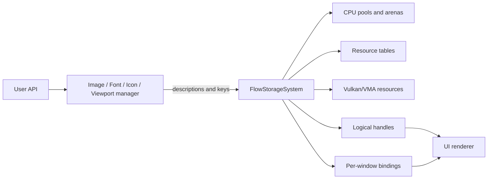
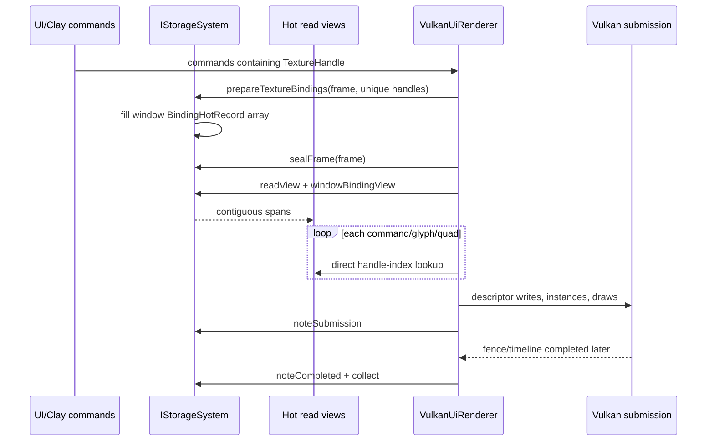

# Understanding the Flow Storage System

## Purpose of this document

This document explains the storage system as a mental model rather than as a line-by-line walkthrough of `FlowStorageSystem.cpp`.

The main questions it answers are:

- What does the storage system actually store?
- Why are persistent pools and linear arenas both needed?
- What is the difference between data, a resource record, a handle, and a view?
- How will the UI renderer consume storage data without making a virtual call for every glyph or quad?
- What do the integer IDs, generations, revisions, tags, frame slots, and serials represent?
- What would an adopted `ImageManager` put into storage, and what would it keep itself?

The storage subsystem currently exists in isolation. `App`, `ImageManager`, `UiManager`, and `VulkanUiRenderer` have not yet been changed to use it. Code examples describing adoption are therefore target usage examples, not existing call sites.

---

## The broad idea

`FlowStorageSystem` is the internal owner of FlowUi runtime memory and backend resources.

Managers still answer user-facing questions:

- What does the key `"hero/logo"` mean?
- Which image should be replaced?
- Which font family should be selected?
- How large should an icon raster be?
- Which viewport does the user want?

The storage system answers backend questions:

- Where are the bytes?
- What Vulkan object owns them?
- Which logical handle identifies them?
- Which other objects depend on them?
- Which windows have bound them?
- Which submitted frames may still be using them?
- When can their memory be recycled?

The separation can be pictured as follows:



A manager does not give the renderer a pointer to an `ImageRecord`, a `VkImage`, or a descriptor slot. It gives UI code a logical handle. At frame preparation, storage translates logical handles into window-local binding records. During the hot render conversion loop, the renderer reads compact arrays directly.

---

## The four layers of stored data

The easiest way to understand the system is to keep four layers separate.

### 1. Physical bytes and backend objects

These are the actual storage resources:

- CPU byte slabs;
- transient CPU pages;
- copied image pixels;
- interned character data;
- Vulkan buffers;
- Vulkan images;
- Vulkan image views;
- Vulkan samplers;
- VMA allocations.

This is where memory is physically consumed.

### 2. Resource records

The system has typed tables containing records such as:

- `BlobRecord`;
- `BufferRecord`;
- `ImageRecord`;
- `ImageViewRecord`;
- `SamplerRecord`;
- `TextureColdRecord`;
- `TextureHotRecord`.

A record describes the physical object and its lifetime. For example, an image record contains the Vulkan image, its VMA allocation, dimensions/format description, current image layout, byte size, state, reference count, generation, and last-use submission serial.

Records are internal. Managers and render commands should not keep pointers to them because a table may grow or a slot may eventually be reused.

### 3. Logical handles

A handle is a stable value that says:

> Look in this typed table at this index, but accept the record only if its generation still matches.

For example:

```cpp
ImageHandle image{42, 3};
```

means:

- use image-table index `42`;
- this reference expects incarnation/generation `3` of that slot.

If index `42` is destroyed and later reused, its generation becomes `4`. The old `{42, 3}` handle then fails validation instead of accidentally referring to an unrelated new image.

Handles are what managers, logical texture references, uploads, and frame-use lists exchange.

### 4. Frame read views

A read view is a borrowed span over compact hot records:

```cpp
StorageReadView
WindowBindingView
```

It exists so the renderer can do this:

```cpp
const TextureHotRecord* texture = storageView.texture(handle);
const BindingHotRecord* binding = bindingView.binding(handle);
```

That lookup performs direct array indexing and a generation comparison. It does not call `IStorageSystem` virtually for every command, glyph, or instance.

The relationship is therefore:

```text
physical allocation
    described by a resource record
        identified by a generational handle
            exposed for a frame through a contiguous read view
```

---

## Why there are both persistent pools and linear arenas

They solve different lifetime problems.

### Persistent pool

A persistent allocation has an individual lifetime.

Examples include:

- a Clay context backing allocation;
- persistent input-field state;
- an immutable CPU blob;
- copied image data waiting for upload;
- long-lived resource metadata;
- interned string characters.

One persistent object can be removed while unrelated objects remain alive. Therefore, persistent memory needs individual allocation and release.

The current `PersistentPool` uses non-relocating slabs. A slab is one large byte allocation. Inside each slab, the pool maintains free blocks.

```text
Persistent slab
+--------------------------------------------------------------+
| allocation A | free | allocation B | allocation C | free     |
+--------------------------------------------------------------+
```

When allocating:

1. The pool searches a slab's free-block list.
2. It aligns the requested offset.
3. It splits the free block into an optional prefix, the allocation, and an optional suffix.
4. It assigns the allocation an `AllocationId`.
5. It returns a `MemoryBlock` containing the pointer, size, ID, and tag.

When releasing:

1. The pool finds the allocation using `AllocationId`.
2. The range becomes free.
3. Adjacent free ranges are merged.

```text
Before releasing B
+--------------------------------------------------------------+
| A | free | B | C | free                                     |
+--------------------------------------------------------------+

After releasing B and merging
+--------------------------------------------------------------+
| A | larger free range | C | free                             |
+--------------------------------------------------------------+
```

If no current slab can satisfy an allocation, the pool appends a larger slab. Existing pointers do not move.

This is important because Clay or a third-party parser may retain a pointer that cannot be repaired if a `vector`-like reallocation moves its backing memory.

#### String pool

Strings use a separate persistent pool because their behavior is special:

- an interned string is copied once;
- its character address must remain stable;
- `StringId` values are append-only;
- individual strings are currently not removed.

Separating string storage makes its capacity and high-water behavior visible independently of other persistent data.

### Linear arena

A linear arena is for many short-lived allocations that all die together.

Examples include:

- temporary Clay strings for one frame;
- temporary `TextureRef` payloads;
- glyph quads generated while converting text;
- `UiInstance` records;
- `UiRun` records;
- selection/highlight rectangles;
- temporary decoded data;
- worker-local command chunks.

The arena maintains only an offset into a page:

```text
Linear arena page
+--------------------------------------------------------------+
| used allocations in order                 | unused capacity   |
+--------------------------------------------------------------+
                                             ^ current offset
```

Allocating means:

1. Align the current offset.
2. Return the address at that offset.
3. Advance the offset.

There is no free-list search and no individual release. That is why a linear arena is extremely fast.

At the next safe frame reuse, the arena resets its offset to zero:

```text
After reset
+--------------------------------------------------------------+
| all capacity reusable                                        |
+--------------------------------------------------------------+
 ^ offset = 0
```

If a page fills, the arena appends an overflow page. Overflow pages do not move prior allocations and are retained for later high-water reuse. `trim()` can discard extra pages after pressure has subsided.

### The practical difference

| Question | Persistent pool | Linear arena |
|---|---|---|
| Lifetime | Arbitrary, per allocation | Whole frame/task epoch |
| Individual free | Yes | No |
| Allocation work | Find and split a free block | Align and advance an offset |
| Fragmentation | Possible; free blocks are merged | Almost none within an epoch |
| Reset | Not global | Entire arena resets at once |
| Pointer stability | Stable because slabs never move | Stable until the arena epoch is reset |
| Best for | Long-lived or independently owned data | High-volume temporary data |

Using only persistent pools for frame scratch would add unnecessary free-list work and fragmentation. Using only linear arenas for persistent state would force unrelated objects to share one lifetime and would make selective removal impossible.

That is why both exist.

---

## Memory ownership by domain

The current system stores memory through several mechanisms:

| Data | Physical owner |
|---|---|
| Persistent raw blocks | `PersistentPool` slabs |
| Interned characters | dedicated string `PersistentPool` |
| Immutable CPU blobs | persistent-pool allocation plus `BlobRecord` |
| Frame scratch | per-window, per-frame `LinearArena` |
| Decode scratch | per-window, per-frame decode `LinearArena` |
| Worker scratch | per-window, per-frame, per-worker `LinearArena` |
| Vulkan buffer/image memory | VMA through the existing `VulkanContext` allocator |
| Current upload staging | temporary mapped VMA buffer created by `flushUploads` |
| Image views and samplers | Vulkan object creation, recorded in typed tables |
| Logical texture data | hot and cold texture-table records |
| Window bindings | one contiguous `BindingHotRecord` vector per window |
| Upload and retirement work | queues of typed records |

The system owns these resources, but not all of its own metadata is pooled yet. Its bootstrap `vector`, `unordered_map`, and `deque` containers still use standard host allocations. Moving those containers to tracked PMR metadata pools remains a later polishing step.

---

## Hot data and cold data

Not every field should be fetched during rendering.

### Hot texture data

`TextureHotRecord` contains only information needed for quick validation and resolution:

```text
generation
revision
image-view index and generation
sampler index and generation
resource state
source width and height
```

The hot image-view and sampler arrays contain the minimum information needed to reach native handles.

The per-window `BindingHotRecord` contains:

```text
texture generation and revision
window-local descriptor index
binding revision
ready/loading/failed state
native image-view value
native sampler value
```

These arrays are compact and contiguous.

### Cold texture data

`TextureColdRecord` contains information needed for ownership and management:

```text
ResourceKey
full TextureViewDesc
reference count
last-use submission serial
```

The renderer does not need the user key, ownership count, or retirement serial while emitting every instance. Keeping those fields out of the hot record reduces unrelated memory brought into cache.

### Current layout choice

The current hot tables are compact Arrays of Structs: each texture's hot fields sit together. This is a good direct-handle lookup shape because one lookup wants most of one record.

Later profiling may show that some operations—such as scanning only resource states or generations—benefit from a more complete Structure-of-Arrays split. That optimization can be made inside `FlowStorageSystem` without changing handles or manager APIs.

---

## The identifier system

There are several kinds of integers because they answer different identity and lifetime questions. They are not interchangeable.

### Resource handle index and generation

Every typed resource handle contains:

```text
uint32 index
uint32 generation
```

The packed 64-bit representation is:

```text
63                       32 31                        0
+--------------------------+--------------------------+
| generation               | table index              |
+--------------------------+--------------------------+
```

#### `index`

The index identifies a position in one typed table.

An `ImageHandle{5, 2}` means image-table index 5. A `SamplerHandle{5, 2}` means sampler-table index 5. The C++ types prevent those two values from being mixed accidentally even though the integers happen to match.

Index zero is reserved:

- for most handles, it means invalid;
- for logical rendering bindings, descriptor index zero is the fallback slot.

#### `generation`

Generation identifies which lifetime currently occupies the index.

```text
Image table slot 5, generation 2: logo image
destroyed and safely recycled
Image table slot 5, generation 3: background image
```

An old `{5, 2}` handle does not match generation 3 and is rejected.

Generation is about object identity, not data freshness. Data freshness is represented by a revision.

### Texture revision

A `TextureHandle` can stay stable while its backing image view changes.

For example, replacing `"hero/logo"` should not force every UI object to obtain a new logical handle immediately. Storage keeps the same texture index/generation and increments `TextureHotRecord::revision`.

```text
TextureHandle {12, 1}
    revision 4 -> old image view
    revision 5 -> replacement image view
```

Window binding caches compare both handle generation and texture revision. A revision mismatch means:

> This is still the same logical texture, but this window must refresh what it binds.

Generation changes only after the logical texture is removed, retired, and its table slot is reused.

### Binding revision and descriptor index

#### `descriptorIndex`

This is a window-local logical shader slot.

The same app-wide texture may be:

```text
main window:      descriptorIndex 7
inspector window: descriptorIndex 3
```

The physical image is shared. Only its execution binding is duplicated.

Descriptor index zero is fallback.

#### `bindingRevision`

This increments when one window regenerates or invalidates a binding record. The renderer can use it to decide whether the actual Vulkan descriptor data for a frame/window generation needs updating.

`textureRevision` belongs to the shared logical texture. `bindingRevision` belongs to one window's cached binding.

### `StringId`

`StringId` is a 32-bit index into the interned string table.

```cpp
StringId logoName = storage.intern("hero/logo");
```

If another manager interns the same text, it receives the same ID. This avoids copying `"hero/logo"` into several maps and makes key comparison an integer comparison.

ID zero means empty/invalid string. String IDs are append-only in the current storage lifetime and are not recycled.

### `ResourceKey`

A resource key is structured identity:

```cpp
ResourceKey{
    .domain = ResourceDomain::Image,
    .name = logoName,
    .window = 0,
};
```

Its fields mean:

- `domain`: which semantic namespace owns the key;
- `name`: interned name;
- `window`: zero when app-shared, otherwise the owning window.

This avoids string concatenations such as `"image:" + key` and prevents an image named `"save"` from colliding with an icon named `"save"`.

### `AllocationId`

Every individually releasable `MemoryBlock` gets an `AllocationId`.

The pointer tells the caller where the bytes are. The allocation ID tells the persistent pool which slab, offset, size, and tag must be returned when released.

ID zero means invalid. The current implementation increments IDs and does not recycle them.

### `AllocationTag`

An allocation tag is not identity used by the renderer. It is diagnostic ownership metadata.

```cpp
AllocationTag{
    .memoryClass = MemoryClass::WindowPersistent,
    .resourceKind = ResourceKind::Invalid,
    .window = mainWindow,
    .frameSlot = InvalidFrameSlot,
    .debugName = clayArenaName,
};
```

The fields answer:

| Field | Question answered |
|---|---|
| `memoryClass` | What allocation/lifetime category is this? |
| `resourceKind` | What type of stored resource owns it? |
| `window` | Is it app-shared or attributable to one window? |
| `frameSlot` | Is it associated with one reusable frame slot? |
| `debugName` | What human-readable interned name describes it? |

`InvalidFrameSlot` is `UINT32_MAX`, which means the allocation is not frame-slot-specific. Frame slot zero is valid, so zero cannot be used for this purpose.

The full tag is the intended attribution schema. In the current interface, `allocatePersistent` accepts only `MemoryClass` and `debugName`; `FlowStorageSystem` therefore fills `resourceKind` as invalid, `window` as zero, and `frameSlot` as invalid for that generic call. Typed operations such as `createBlob` can fill their resource kind internally. A later allocation-context overload is needed before all window/resource attribution fields are populated in practice.

### `WindowId`

`WindowId` identifies one registered window storage scope. It is supplied by the future `App` window registry, not generated by storage.

Window ID zero means no window/app-shared when it appears in keys and tags. A registered window must have a nonzero ID.

### Frame slot, frame number, and frame epoch

These three integers describe different things.

#### `frameSlot`

A small index from zero to `framesInFlight - 1`. It identifies reusable per-frame allocations such as arenas, command resources, and future instance-buffer slices.

It repeats:

```text
0, 1, 0, 1, ...
```

The app may reuse a slot only after its previous GPU submission is complete.

#### `frameNumber`

A caller-supplied logical counter:

```text
1001, 1002, 1003, ...
```

It is useful for diagnostics and policies such as last-used frame, but storage does not use it as proof that GPU work is complete.

#### `FrameEpoch`

A globally increasing activation ID assigned by `beginFrame`.

Frame slot 0 may be activated many times, so `frameSlot == 0` alone cannot prove an `ArenaView` belongs to the current activation. The epoch detects stale tokens and views.

```text
window 1, slot 0, epoch 41
window 1, slot 0, epoch 43 after reuse
```

An arena or read view from epoch 41 must not be used during epoch 43.

### `UploadId` and `UploadTicket`

Each queued upload receives a monotonically increasing 64-bit `UploadId`. `UploadTicket` wraps that value.

It identifies an operation, not a resource. One image handle might participate in multiple uploads over its lifetime, and each operation has its own state.

```text
Queued -> Uploading -> Ready
                    -> Failed
```

ID zero means no valid upload operation.

### `SubmissionSerial`

Every submitted frame across every window receives one globally increasing serial.

```text
serial 20: main window
serial 21: inspector window
serial 22: main window
```

Resources used by a submitted frame are stamped with its serial. A resource retired after serial 21 cannot be destroyed until storage knows all serials through 21 are complete.

Completion may arrive out of order. If serial 22 completes before 21, storage records 22 but does not advance the contiguous completed watermark past 20.

This protects shared resources used by independently presenting windows.

### Flags and classifications that are not IDs

Some integer-backed enums describe policy rather than identity:

- `ResourceKind`: what table/resource type something belongs to;
- `ResourceDomain`: which semantic manager namespace owns a key;
- `MemoryClass`: what allocation lifetime/category applies;
- `ResourceState`: invalid, queued, decoding, uploading, ready, failed, or retiring;
- `AccessMode`: CPU/GPU read/write intent;
- `ResourceSharing`: app-shared, window-local, or frame-local;
- `MemoryPreference`: desired CPU/GPU memory placement;
- `ImageUsage` and `BufferUsage`: combinable backend-use flags;
- `StorageCapability`: supported optional storage behaviors.

They are tags or bit flags, not unique identifiers.

---

## Window and frame storage organization

One `FlowStorageSystem` owns all app-shared resource tables. Each registered window adds a `WindowState`.

```text
FlowStorageSystem
|
+-- shared blob/buffer/image/view/sampler/texture tables
|
+-- shared string and persistent pools
|
+-- upload and retirement queues
|
+-- WindowState: main window
|   +-- BindingHotRecord[]
|   +-- frame slot 0
|   |   +-- transient arena
|   |   +-- decode arena
|   |   +-- worker arenas
|   |   +-- used-resource list
|   +-- frame slot 1
|       +-- ...
|
+-- WindowState: inspector window
    +-- its own bindings and frame arenas
```

Heavy immutable content is stored once in the shared tables. Temporary execution state is duplicated per window/frame/worker.

This is why adding a window does not duplicate all loaded images or font atlases, but it does allocate its own descriptor mapping and scratch memory.

---

## How the UI renderer will use storage

The renderer uses several categories of data.

### 1. Shared immutable renderer resources

Examples:

- quad vertex buffer;
- placeholder image;
- placeholder sampler;
- shared font atlas images;
- compatible pipeline/layout objects.

Buffers and images will be created through storage and represented by `BufferHandle`, `ImageHandle`, `ImageViewHandle`, and `SamplerHandle`.

Pipeline objects are not yet represented by the current storage interface; that is a future renderer capability or extension.

### 2. Window/frame rendering resources

Examples:

- mapped instance buffer or frame slice;
- descriptor sets and pools;
- descriptor dirty/revision state;
- scratch instances and runs;
- command-recording temporary arrays.

The mapped instance buffer should become a `BufferHandle` with a window/frame ownership policy. `nativeBuffer()` exposes the mapped pointer for bulk copying after validation.

Temporary `UiInstance` and `UiRun` arrays should use a frame or worker arena instead of independent `std::vector` heap growth.

Actual descriptor sets are not yet created by `FlowStorageSystem`. The existing implementation produces logical binding records containing descriptor indices and native image-view/sampler values. Renderer adoption must connect those records to descriptor writes.

### 3. Logical texture references in UI commands

Today, `TextureRef::id` is a renderer slot. In the target model, it represents or contains a `TextureHandle`.

Clay render commands then carry logical resource identity rather than a window-specific descriptor number.

This matters because the same command/data can be meaningful in multiple windows.

### Renderer consumption sequence

#### Step A: UI building creates logical references

Image/icon/viewport UI elements store `TextureHandle` values in their render-command payloads.

Text commands identify a font/atlas handle plus atlas layer. Font glyph metrics will eventually be exposed through a similar immutable font read view. The current storage implementation reserves font handle types but does not yet implement font metric tables.

#### Step B: gather unique textures

Before sealing the frame, the renderer or a preprocessing pass scans commands and collects unique logical texture handles:

```cpp
std::vector<TextureHandle> uniqueTextures = gatherUniqueTextures(commands);
storage.prepareTextureBindings(frame, uniqueTextures);
```

This is one virtual call for the batch, not one virtual call per rendered instance.

Storage checks each window's cache:

- matching generation and revision: cache hit;
- new handle or changed revision: allocate/reuse a logical descriptor index and refresh native handles.

This is also the point to obtain the frame arena and reserve the output spans that conversion will fill:

```cpp
ArenaView scratch = storage.frameArena(frame, MemoryClass::FrameTransient);
std::span<UiInstance> instances = scratch.allocateArray<UiInstance>(estimatedInstanceCount);
std::span<UiRun> runs = scratch.allocateArray<UiRun>(estimatedRunCount);
```

#### Step C: seal and borrow views

```cpp
storage.sealFrame(frame);

StorageReadView resources = storage.readView(frame);
WindowBindingView bindings = storage.windowBindingView(frame);
```

The hot tables cannot be mutated while these sealed views are active.

#### Step D: convert commands to instances

```cpp
for (const RenderCommand& command : commands) {
    if (command.type == Textured) {
        TextureHandle handle = command.texture.handle;
        const BindingHotRecord* binding = bindings.binding(handle);

        UiInstance& instance = instances[nextInstance++];
        instance.texIndex = binding ? binding->descriptorIndex : 0;
        // Fill geometry, UV, tint, and other instance fields.
    }
}
```

The repeated operation is array lookup. No interface dispatch or string lookup occurs here.

#### Step E: batch descriptor writes

For bindings whose `bindingRevision` is newer than the descriptor generation's recorded revision, the renderer writes:

```text
descriptorIndex
nativeImageView
nativeSampler
```

Loading, failed, or invalid records use descriptor index zero/fallback.

#### Step F: upload instance data and record draws

The renderer obtains its storage-owned mapped instance buffer:

```cpp
NativeBufferView gpuInstances = storage.nativeBuffer(instanceBufferHandle);
std::memcpy(gpuInstances.mapped, instances.data(), usedBytes);
storage.trackUse(frame, instanceBufferHandle);
```

It records draw calls using `descriptorIndex` already placed in each instance.

#### Step G: submission stamps lifetime

```cpp
SubmissionToken submission = storage.noteSubmission(windowId, frame.frameSlot);
```

The texture resolution and `trackUse` calls built a compact used-resource list. `noteSubmission` stamps those resources with the new serial.

When the app later observes the Vulkan fence/timeline completion:

```cpp
storage.noteCompleted(submission);
storage.collect();
```

Only then can retired instance buffers, image views, textures, or other objects be recycled.

### Renderer data flow diagram



---

## An ImageManager adoption example

### What the manager should keep

After adoption, `ImageManager` should remain a user-facing name/policy layer.

A minimal manager record could look conceptually like:

```cpp
struct ImageEntry {
    StringId key = 0;
    StringId sourcePath = 0;
    TextureHandle texture{};
    UploadTicket upload{};
};

IStorageSystem* storage_ = nullptr;
FlatMap<StringId, ImageEntry> imagesByKey_;
```

The manager may keep:

- the mapping from user key to image entry;
- source/reload policy;
- whether registration was new or a replacement;
- public error and warning behavior;
- optional loading status exposed to users.

It should not keep:

- `VkImage`;
- `VmaAllocation`;
- `VkImageView`;
- `VkSampler`;
- a private upload command pool;
- per-frame retirement buckets;
- a renderer descriptor slot as resource identity;
- a duplicate owned copy of every key/path string.

### Registering an image

Suppose the user calls:

```cpp
app.images().registerImage("hero/logo", "assets/logo.png");
```

#### Step 1: intern identity strings

```cpp
StringId keyId = storage_->intern("hero/logo");
StringId pathId = storage_->intern("assets/logo.png");

ResourceKey storageKey{
    .domain = ResourceDomain::Image,
    .name = keyId,
    .window = 0, // app-shared
};
```

The characters are stored once in the string pool. Manager maps can compare `StringId` integers.

#### Step 2: decode into temporary memory

Image decoding produces RGBA bytes. During a frame-aware/asynchronous adoption, decode scratch should come from a decode arena. Because current `stb_image` controls its own result allocation, the first migration may decode normally and immediately copy into a storage blob.

```cpp
DecodedImage decoded = decodePng(path);

BlobHandle pixels = storage_->createBlob(
    std::as_bytes(std::span(decoded.rgba)),
    keyId);
```

The blob owns immutable CPU pixels until upload finishes.

#### Step 3: create the GPU image

```cpp
ImageHandle image = storage_->createImage(ImageDesc{
    .width = decoded.width,
    .height = decoded.height,
    .depth = 1,
    .layers = 1,
    .mipLevels = 1,
    .format = PixelFormat::Rgba8Srgb,
    .type = ImageType::Image2D,
    .usage = ImageUsage::Sampled | ImageUsage::TransferDestination,
    .memory = MemoryPreference::DeviceLocal,
    .sharing = ResourceSharing::AppShared,
    .access = AccessMode::ReadOnly,
    .debugName = keyId,
});
```

This creates:

- one image-table record;
- one Vulkan image;
- one VMA allocation;
- an `ImageHandle` identifying the record.

The image begins queued because it expects uploaded content.

#### Step 4: create or acquire dependencies

```cpp
ImageViewHandle view = storage_->createImageView(image, ImageViewDesc{
    .type = ImageType::Image2D,
    .arrayLayerCount = 1,
    .debugName = keyId,
});

SamplerHandle sampler = storage_->acquireSampler(SamplerDesc{
    .minFilter = FilterMode::Linear,
    .magFilter = FilterMode::Linear,
    .addressU = AddressMode::ClampToEdge,
    .addressV = AddressMode::ClampToEdge,
    .addressW = AddressMode::ClampToEdge,
    .debugName = keyId,
});
```

Creating the view retains the image. Acquiring a common sampler will normally reuse the same sampler record used by other images with identical settings.

#### Step 5: publish the logical texture

```cpp
bool inserted = false;
TextureHandle texture = storage_->publishTexture(
    storageKey,
    TextureViewDesc{
        .imageView = view,
        .sampler = sampler,
        .uv0x = 0.0f,
        .uv0y = 0.0f,
        .uv1x = 1.0f,
        .uv1y = 1.0f,
        .sourceWidth = static_cast<int32_t>(decoded.width),
        .sourceHeight = static_cast<int32_t>(decoded.height),
    },
    &inserted);
```

Publishing the texture retains the image view and sampler. The logical texture is app-shared and can later be resolved by any window.

Because the image is not uploaded yet, the texture state is queued. Rendering it currently falls back to slot zero.

#### Step 6: enqueue the pixel upload

```cpp
UploadTicket upload = storage_->enqueueUpload(UploadRequest{
    .destination = UploadDestination::Image,
    .source = pixels,
    .sourceOffset = 0,
    .byteCount = decoded.byteCount,
    .destinationImage = image,
    .imageRegion = ImageRegion{
        .width = decoded.width,
        .height = decoded.height,
        .layerCount = 1,
    },
    .finalState = ResourceState::Ready,
    .releaseSourceWhenComplete = false,
});
```

The upload record temporarily retains both the source blob and destination image. The manager can release its temporary construction ownership after the dependency graph is established:

```cpp
storage_->releaseImageView(view);
storage_->releaseSampler(sampler);
storage_->releaseImage(image);
storage_->releaseBlob(pixels); // upload still retains it
```

The texture retains its view and sampler; the view retains its image; the upload retains its source and destination until completion.

#### Step 7: save only the manager-facing entry

```cpp
imagesByKey_.insert_or_assign(keyId, ImageEntry{
    .key = keyId,
    .sourcePath = pathId,
    .texture = texture,
    .upload = upload,
});
```

### What this image looks like inside storage

Conceptually, the saved graph is:

```text
String table
    keyId  -> "hero/logo"
    pathId -> "assets/logo.png"

ResourceKey { Image, keyId, app-shared }
    -> TextureHandle { texture index, generation }

TextureHotRecord[texture index]
    generation
    revision
    image-view index/generation
    sampler index/generation
    state
    source dimensions

TextureColdRecord[texture index]
    ResourceKey
    full TextureViewDesc
    last-use serial
    ownership data

ImageViewRecord
    VkImageView
    retained ImageHandle
    generation/state/last-use

ImageRecord
    VkImage
    VMA allocation
    format/dimensions/usage
    layout/state/byte size
    generation/reference count/last-use

SamplerRecord
    VkSampler
    normalized sampler description
    cache key/reference count/generation

UploadRecord, until flush completes
    UploadId/state
    retained BlobHandle
    retained ImageHandle
    byte range and image region

BlobRecord, until upload releases it
    persistent CPU pixel MemoryBlock
```

The manager's record and the storage graph serve different purposes. The manager record answers “which texture belongs to this user key?” The storage records answer “where are its CPU/GPU objects and when are they safe to destroy?”

### Getting an image for UI use

`ImageManager::getTexture` should perform only a cold manager lookup and construct a public texture reference:

```cpp
TextureRef ImageManager::getTexture(std::string_view key) const {
    StringId keyId = storage_->intern(key); // a find-only path may be added later
    auto found = imagesByKey_.find(keyId);
    if (found == imagesByKey_.end()) return fallbackTextureRef();

    TextureMetadata metadata = storage_->textureMetadata(found->second.texture);
    return TextureRef{
        .handle = found->second.texture,
        .sourceWidth = metadata.sourceWidth,
        .sourceHeight = metadata.sourceHeight,
    };
}
```

The important part is that `TextureRef` carries a logical `TextureHandle`, not a descriptor index.

The UI renderer later resolves that handle for the active window during batch preparation.

### Consuming the same image in two windows

```text
ImageManager entry
    -> one TextureHandle
        -> one ImageViewHandle
            -> one ImageHandle / VMA allocation

main window BindingHotRecord
    descriptorIndex 7

inspector window BindingHotRecord
    descriptorIndex 3
```

Only binding state is duplicated. The decoded resource, Vulkan image, view, and sampler remain shared.

### Replacing the image

If the user registers `"hero/logo"` again:

1. Decode and create a new blob/image/view.
2. Upload or queue the new image.
3. Call `replaceTexture` using the same `ResourceKey`.
4. Keep the same `TextureHandle` index/generation.
5. Increment the texture revision.
6. Future window binding preparation sees the revision change.
7. Old image-view/image resources remain alive until their last submitted serial completes.

This avoids an invalid intermediate state and avoids waiting for the whole device.

One detail to polish during real adoption is publication timing: the manager may prefer to keep the old ready backing visible until the replacement upload becomes ready, then commit the texture replacement atomically. The current primitives support that policy, but the manager must choose when to call `replaceTexture`.

### Removing the image

When the manager removes a key:

```cpp
storage_->removeTexture(storageKey);
imagesByKey_.erase(keyId);
```

New lookups fail immediately, but the texture record and backing graph are only reclaimed after all submissions that used them are complete.

Descriptor slots in each window become reusable only after texture retirement is safe.

---

## Reference counting versus submission lifetime

These protect against two different hazards.

### Reference count

Reference counts answer:

> Does another logical storage object still own this resource?

For example:

- a texture retains an image view;
- an image view retains an image;
- an upload retains its source blob and destination image.

An image cannot begin final retirement while a live image view still owns it.

### Last-use submission serial

Submission serials answer:

> Even if no logical owner wants this resource anymore, could the GPU still be reading it?

A resource is physically destroyed only when both are true:

1. Its final logical reference has been released.
2. Its last-use submission serial is at or below the completed watermark.

```text
logical ownership ended
        +
GPU use completed
        =
memory may be recycled
```

---

## Resource states

`ResourceState` describes availability and lifecycle:

| State | Meaning |
|---|---|
| `Invalid` | No live resource occupies this record for the handle generation |
| `Queued` | Created/requested but work has not started or content is absent |
| `Decoding` | CPU decode work is in progress; reserved for asynchronous adoption |
| `Uploading` | GPU upload work is in progress |
| `Ready` | Valid for normal consumption |
| `Failed` | Creation/decode/upload failed; consumers should use fallback |
| `Retiring` | Removed from new ownership/lookup but retained until safe destruction |

The state is part of hot texture/binding data so the renderer can select fallback without chasing cold error information.

---

## Frame synchronization in plain language

The frame protocol exists to make borrowed spans and transient arenas safe.

### Before sealing

The frame may:

- allocate scratch;
- prepare texture bindings;
- grow relevant arrays;
- build commands.

### After sealing

The renderer may borrow contiguous views. Storage rejects operations that could relocate or rewrite hot tables while those views are active.

### At submission

The borrowed read-view lifetime ends. Storage stamps used resources with a submission serial.

### At completion

The app tells storage which serial's fence/timeline completed. Storage advances a contiguous watermark and can collect safe retirement records.

This first implementation uses a conservative control mutex and mutation-phase rule. Future multithreading will likely queue mutations and publish immutable snapshots at a barrier, but the handles and views can remain the same.

---

## What the system already provides and what adoption still must add

### Already implemented

- stable typed generational handles;
- persistent slab allocation;
- string interning;
- growable frame/decode/worker linear arenas;
- CPU blobs;
- VMA buffers and images;
- image views and deduplicated samplers;
- logical texture publication/replacement/removal;
- per-window logical bindings;
- contiguous hot read views;
- central synchronous uploads;
- reference dependencies;
- submission serial tracking;
- out-of-order completion handling;
- deferred retirement;
- statistics and budgets.

### Still needed during renderer/manager adoption

- change `TextureRef` from renderer slot identity to `TextureHandle` identity;
- install a real fallback image/view/sampler for slot zero;
- connect `BindingHotRecord` changes to actual Vulkan descriptor-set writes;
- move renderer instance/run scratch into arenas;
- move renderer instance buffers into storage handles;
- add font metric/atlas read views for glyph lookup;
- migrate manager maps and system metadata to tracked PMR allocation;
- replace synchronous per-upload staging with a mapped ring and completion tickets;
- add imported/borrowed swapchain and viewport resource semantics;
- replace conservative mutation rejection with queued publication for parallel windows.

---

## Final mental model

The storage system is not one giant byte array and it is not a replacement for manager semantics.

It is a coordinated set of storage strategies chosen by lifetime:

```text
independently owned CPU data
    -> persistent pools

temporary frame/task data
    -> linear arenas

GPU buffers and images
    -> typed VMA-backed records

stable app identity
    -> generational handles and ResourceKey

fast frame consumption
    -> contiguous hot read views

window-specific GPU binding
    -> BindingHotRecord arrays and descriptor indices

safe destruction
    -> reference dependencies + submission serials
```

Managers decide what data means. Storage decides where it lives and how long it must survive. The renderer receives an immutable frame-oriented view of exactly the hot information it needs.

That is the core design: centralized ownership without forcing hot rendering code through a centralized virtual lookup for every piece of UI.
