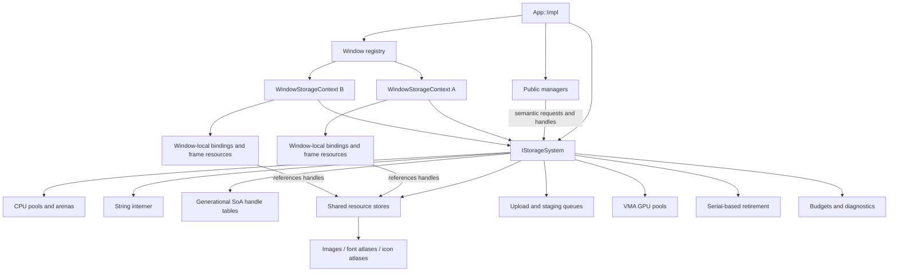
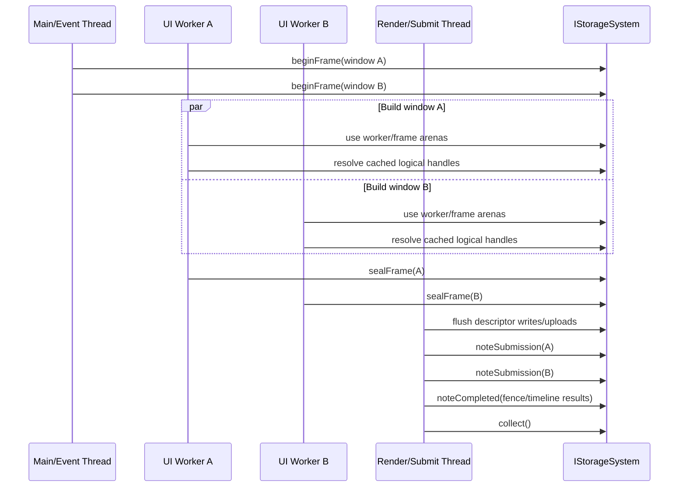

# FlowUi Storage System Design

## Status and intent

This document proposes the first core architectural upgrade required before FlowUi adopts multiple windows and a future multi-threaded renderer: replace the narrow `IUiTextureRegistry` boundary with an app-owned `IStorageSystem`.

`IStorageSystem` is not a user-facing manager. Managers remain the public, domain-specific API used to load fonts, register images, request icons, create viewports, and interact with UI state. The storage system is the internal backend that owns, allocates, indexes, shares, uploads, retires, and reports all memory used by the FlowUi runtime.

The most important design rule is:

> Managers own policy and user-facing meaning. `IStorageSystem` owns storage, identity, lifetime, synchronization, and backend representation.

The interface is designed before its first concrete implementation so that:

- the initial implementation can remain relatively simple and synchronous;
- later allocators, caches, Vulkan strategies, descriptor models, and public manager APIs can change independently;
- multiple windows do not duplicate heavy resources;
- future worker threads do not require a new ownership model;
- hot frame paths are data-oriented and avoid global locks and per-frame heap allocation;
- memory use can be measured by subsystem, scope, window, resource type, and CPU/GPU domain.

This is an architectural report, not an instruction to expose Vulkan or allocator controls to normal FlowUi users.

---

## Executive decision

FlowUi should introduce one `IStorageSystem` per `App`. That system should provide several cohesive capabilities behind one internal interface:

1. CPU persistent allocation and string interning.
2. Per-window, per-frame, and per-worker transient arenas.
3. Generational handle tables for every stored runtime object.
4. Shared CPU assets and shared GPU resources.
5. Window-local GPU bindings and frame-local rendering allocations.
6. Central upload scheduling and staging memory.
7. Submission tracking and deferred destruction.
8. Memory budgets, eviction, diagnostics, and leak reporting.

The first implementation should be named `VulkanStorageSystem`. The interface name should remain backend-neutral enough that a different Vulkan strategy, a test storage system, or a future renderer backend can implement it.

`IStorageSystem` must not become an untyped `allocate(size)` service that leaves ownership spread across managers. Its primary API should be semantic: create an image, publish a texture view, resolve a texture for a window, allocate frame scratch, intern a string, submit an upload, or retire a handle. Low-level byte allocation is still needed for Clay and third-party libraries, but it is a supporting capability rather than the dominant API.

---

## What “all FlowUi runtime memory” means

The storage system must own or account for every allocation made on behalf of FlowUi after `App` construction.

There are several different memory domains, and they cannot safely be collapsed into one physical allocation:

| Domain | Examples | Storage-system responsibility |
|---|---|---|
| CPU persistent | resource tables, font metrics, interned keys, SVG source/parse data, manager records | Allocate from persistent pools; expose stable handles; track exact requested and committed bytes |
| CPU transient | Clay strings, render instances, runs, glyph quads, input overrides, temporary decode metadata | Serve from scoped arenas/rings; bulk reset only after the owning frame/task is finished |
| CPU staging | decoded pixels, upload payloads, mapped transfer buffers | Pool and reuse staging pages; associate them with upload completion serials |
| GPU device/local | images, font/icon atlases, viewport targets, vertex/instance buffers | Allocate through VMA-backed pools; suballocate where appropriate; use dedicated allocations when required |
| Vulkan objects | image views, samplers, descriptor pools/sets, command pools/buffers, pipelines | Create centrally or through storage-owned backend services; count objects and host estimates; destroy by lifetime scope |
| Window/backend | native-window objects and backend-owned callback/input state | Own FlowUi wrappers and account for known allocations; opaque GLFW/OS allocations can only be reported as external/unobservable |
| Third-party opaque | Clay context memory, plutosvg parser state, stb decode buffers | Supply caller-owned memory where the library allows it; otherwise wrap allocation hooks or record the allocation as externally owned |
| Driver/OS opaque | Vulkan driver bookkeeping, presentation engine, native compositor | Not directly allocatable or exactly measurable by FlowUi; track created objects and query budgets where APIs permit |

Therefore, “allocate one large chunk at startup” should mean:

> Reserve a small number of planned pools once at startup, one per memory domain and lifetime class, then suballocate privately from them. Grow with additional non-relocating slabs only when telemetry proves the initial reservation was insufficient.

It must not mean one literal byte array containing CPU objects, Vulkan device memory, native windows, and driver state. Vulkan memory types, alignment, mapping rules, dedicated-allocation requirements, and OS ownership make that impossible and undesirable.

The system should report memory with three certainty levels:

- **Exact:** FlowUi-controlled CPU block sizes and VMA allocation sizes.
- **Estimated:** host cost of Vulkan objects and container capacity.
- **External/opaque:** driver, OS, and third-party memory that cannot be queried exactly.

This qualification makes the promise auditable rather than misleading.

---

## Current architecture and why the existing interface is insufficient

The current `IUiTextureRegistry` has five responsibilities:

```cpp
registerOrReplaceSlot(...);
updateSlotBinding(...);
removeSlot(...);
containsSlot(...);
```

Its implementation in `src/FlowUi.cpp`:

- maps duplicated namespaced strings to shader slot integers;
- stores descriptor image info;
- grows descriptor capacity by doubling;
- calls `vkDeviceWaitIdle()` during descriptor capacity growth;
- retires slots using the current frame index;
- directly mutates a single `VulkanUiRenderer`.

The resource managers still own almost everything important:

| Current owner | Memory/resources currently owned |
|---|---|
| `ImageManager` | decoded image workflow, `VkImage`, VMA allocation, view, sampler, upload command pool, key map, path strings, per-frame retirement buckets |
| `IconManager` | copied SVG source, plutosvg documents, atlas pages, free rectangles, image allocations/views, sampler, command pool, request maps, variant map, eviction state |
| `FontManager` | family/name maps, glyph and kerning containers, atlas image/allocation/view/sampler, upload command pool, temporary page pixels |
| `ViewPortManager` | images per frame, allocation/view/layout metadata, command pools/buffers, descriptor keys and slots, key maps, missing-key strings |
| `UiManager` | Clay backing allocation, one string arena per frame, interaction vectors, input-field maps, shortcut maps, development runtime containers |
| `VulkanUiRenderer` | pipelines, descriptor objects, placeholder images, vertex/instance buffers, descriptor arrays, per-frame dirty flags, instance/run scratch vectors |
| `App::Impl` | all of the above plus window, input, swapchain, frame objects, and layout-tracking vectors |

This has four immediate problems.

First, a manager is both public API and backend allocator. Changing how images are uploaded or stored requires changing `ImageManager` internals.

Second, texture identity is currently a renderer-local descriptor slot. A `TextureRef` does not identify the resource independently of a window or descriptor set. That cannot scale cleanly to multiple windows.

Third, retirement by a frame-index bucket assumes one frame timeline. With multiple independently presenting windows, frame index does not prove that every GPU user has finished.

Fourth, normal growth can stop the whole device because descriptor capacity rebuild calls `vkDeviceWaitIdle()`.

The replacement must move the ownership boundary below all managers, not merely rename `IUiTextureRegistry`.

---

## Target ownership graph



There is exactly one shared storage system per app. Each window registers a lightweight `WindowStorageContext` in that system. Per-worker contexts are added later without changing resource identity.

---

## Core concepts and types

### Strong identifiers

Do not pass raw indices or raw pointers across the manager/storage boundary.

```cpp
namespace FlowUi::detail {

using WindowId = uint64_t;
using SubmissionSerial = uint64_t;
using StringId = uint32_t;

enum class ResourceDomain : uint16_t {
    Image,
    Icon,
    Font,
    Viewport,
    Renderer,
    Development,
};

struct ResourceKey {
    ResourceDomain domain = ResourceDomain::Image;
    StringId name = 0;
    WindowId window = 0; // zero for app-shared; non-zero for window-scoped data
    auto operator<=>(const ResourceKey&) const = default;
};

enum class ResourceKind : uint8_t {
    Invalid,
    CpuBlob,
    GpuBuffer,
    GpuImage,
    ImageView,
    Sampler,
    TextureView,
    FontFace,
    FontAtlas,
    SvgDocument,
    IconVariant,
    ViewportTarget,
};

template <ResourceKind Kind>
struct Handle {
    uint32_t index = 0;
    uint32_t generation = 0;

    explicit operator bool() const noexcept {
        return index != 0;
    }
    auto operator<=>(const Handle&) const = default;
};

using BlobHandle        = Handle<ResourceKind::CpuBlob>;
using BufferHandle      = Handle<ResourceKind::GpuBuffer>;
using ImageHandle       = Handle<ResourceKind::GpuImage>;
using ImageViewHandle   = Handle<ResourceKind::ImageView>;
using SamplerHandle     = Handle<ResourceKind::Sampler>;
using TextureHandle     = Handle<ResourceKind::TextureView>;
using FontFaceHandle    = Handle<ResourceKind::FontFace>;
using FontAtlasHandle   = Handle<ResourceKind::FontAtlas>;
using SvgDocumentHandle = Handle<ResourceKind::SvgDocument>;
using ViewportHandle    = Handle<ResourceKind::ViewportTarget>;

} // namespace FlowUi::detail
```

Index zero is reserved as the invalid/fallback handle. A generation prevents an old reference from silently resolving to a new object after a slot is reused.

Handles should be trivially copyable and cheap enough to appear in Clay render-command payloads. They are logical identities, not Vulkan objects and not descriptor slots.

### Resource key versus handle

A string key is a manager-facing lookup name. A handle is storage-facing identity.

- Keys may be replaced or removed.
- Handles are immutable identities with generations.
- Replacing `ResourceKey{Image, "hero/logo", appShared}` keeps the logical texture handle stable, publishes a new immutable backing resource plus revision, and retires the old backing. Removing the key invalidates the handle generation once prior uses are safe.
- Renderer caches key on handles, never on strings.
- Strings are interned once. Hot paths compare `StringId`, not `std::string`.

### Logical texture versus physical image

These must be different records.

```cpp
struct TextureViewDesc {
    ImageViewHandle imageView{};
    SamplerHandle sampler{};
    float uv0x = 0.0f;
    float uv0y = 0.0f;
    float uv1x = 1.0f;
    float uv1y = 1.0f;
    int32_t sourceWidth = 0;
    int32_t sourceHeight = 0;
};
```

One physical image can back:

- a whole user image;
- many icon atlas regions;
- many font faces in an atlas array;
- a viewport image view for a particular frame slot.

The texture handle points to a small logical view record. The physical image remains shared. Updating an icon request to a different atlas region changes or republishes the logical view; it does not copy the page.

### Scope tokens

Storage operations that are sensitive to window, frame, thread, or GPU lifetime must require an explicit token.

```cpp
struct FrameToken {
    WindowId window = 0;
    uint32_t frameSlot = 0;
    uint64_t frameNumber = 0;
    uint32_t workerIndex = 0;
};

struct UploadTicket {
    uint64_t value = 0;
};

struct SubmissionToken {
    WindowId window = 0;
    SubmissionSerial serial = 0;
};

struct MemoryBlock {
    void* data = nullptr;
    size_t size = 0;
    uint32_t allocationId = 0;
};

struct ArenaView {
    void* implementation = nullptr;

    void* allocate(size_t bytes, size_t alignment);

    template <typename T>
    std::span<T> allocateArray(size_t count);
};
```

This avoids hidden dependence on `currentFrameIndex_`, which is unsafe once two windows or worker threads advance independently.

`MemoryBlock` is an owned persistent allocation returned to an integration that requires a stable pointer. `ArenaView` is a non-owning, scope-limited allocator view; it must not outlive its `FrameToken`, and individual arena allocations are never released separately.

---

## Proposed `IStorageSystem` interface surface

The following is the target contract. Exact spelling can evolve during implementation, but the separation of responsibilities should remain.

```cpp
#pragma once

#include <cstddef>
#include <cstdint>
#include <span>
#include <string_view>

namespace FlowUi::detail {

enum class MemoryClass : uint8_t {
    Persistent,
    ResourceMetadata,
    StringPool,
    WindowPersistent,
    FrameTransient,
    WorkerTransient,
    DecodeTransient,
    UploadStaging,
};

enum class ResourceState : uint8_t {
    Invalid,
    Queued,
    Decoding,
    Uploading,
    Ready,
    Failed,
    Retiring,
};

enum class AccessMode : uint8_t {
    ReadOnly,
    CpuWrite,
    GpuWrite,
    CpuAndGpuWrite,
};

struct StorageConfig;
struct StorageStats;
struct ResourceStats;
struct ImageDesc;
struct ImageViewDesc;
struct BufferDesc;
struct SamplerDesc;
struct TextureViewDesc;
struct TextureMetadata;
struct ResolvedTextureBinding;
struct WindowStorageDesc;
struct WindowStorageSnapshot;
struct FrameStorageDesc;
struct UploadRequest;
struct UploadTicket;
struct SubmissionToken;
struct RetirementRequest;

class IStorageSystem {
public:
    virtual ~IStorageSystem() = default;

    // Lifecycle and capabilities
    virtual void initialize(const StorageConfig& config) = 0;
    virtual void shutdown() noexcept = 0;
    virtual uint32_t interfaceVersion() const noexcept = 0;
    virtual uint64_t capabilities() const noexcept = 0;

    // Window and frame scopes
    virtual void registerWindow(WindowId id, const WindowStorageDesc& desc) = 0;
    virtual void unregisterWindow(WindowId id, SubmissionSerial lastUse) = 0;
    virtual FrameToken beginFrame(WindowId id, const FrameStorageDesc& desc) = 0;
    virtual void sealFrame(const FrameToken& frame) = 0;
    virtual void cancelFrame(const FrameToken& frame) noexcept = 0;

    // Controlled CPU memory for layout/third-party integration
    virtual MemoryBlock allocatePersistent(
        size_t bytes,
        size_t alignment,
        MemoryClass memoryClass,
        StringId debugName) = 0;
    virtual void releasePersistent(MemoryBlock block) noexcept = 0;
    virtual ArenaView frameArena(const FrameToken& frame, MemoryClass memoryClass) = 0;
    virtual ArenaView workerArena(const FrameToken& frame, uint32_t workerIndex) = 0;

    // Strings and immutable blobs
    virtual StringId intern(std::string_view value) = 0;
    virtual std::string_view string(StringId id) const noexcept = 0;
    virtual BlobHandle createBlob(std::span<const std::byte> bytes, StringId debugName) = 0;
    virtual std::span<const std::byte> readBlob(BlobHandle handle) const noexcept = 0;
    virtual void releaseBlob(BlobHandle handle, SubmissionSerial lastUse = 0) = 0;

    // Backend resources
    virtual BufferHandle createBuffer(const BufferDesc& desc) = 0;
    virtual ImageHandle createImage(const ImageDesc& desc) = 0;
    virtual ImageViewHandle createImageView(ImageHandle image, const ImageViewDesc& desc) = 0;
    virtual SamplerHandle acquireSampler(const SamplerDesc& desc) = 0;
    virtual void releaseBuffer(BufferHandle buffer, SubmissionSerial lastUse = 0) = 0;
    virtual void releaseImage(ImageHandle image, SubmissionSerial lastUse = 0) = 0;
    virtual void releaseImageView(ImageViewHandle view, SubmissionSerial lastUse = 0) = 0;
    virtual void releaseSampler(SamplerHandle sampler, SubmissionSerial lastUse) = 0;

    // Logical textures used by managers and UI commands
    virtual TextureHandle publishTexture(
        ResourceKey key,
        const TextureViewDesc& desc,
        bool* inserted = nullptr) = 0;
    virtual TextureHandle replaceTexture(
        ResourceKey key,
        const TextureViewDesc& desc) = 0;
    virtual bool removeTexture(ResourceKey key, SubmissionSerial lastUse) = 0;
    virtual TextureHandle findTexture(ResourceKey key) const noexcept = 0;
    virtual TextureMetadata textureMetadata(TextureHandle texture) const noexcept = 0;

    // Window-local descriptor/binding resolution
    virtual ResolvedTextureBinding resolveTexture(
        const FrameToken& frame,
        TextureHandle texture) = 0;
    virtual void trackUse(const FrameToken& frame, BufferHandle buffer) = 0;
    virtual void trackUse(const FrameToken& frame, ImageHandle image) = 0;
    virtual void invalidateWindowBindings(WindowId id, TextureHandle texture) = 0;
    virtual WindowStorageSnapshot windowSnapshot(WindowId id) const = 0;

    // Uploads and synchronization
    virtual UploadTicket enqueueUpload(const UploadRequest& request) = 0;
    virtual ResourceState uploadState(UploadTicket ticket) const noexcept = 0;
    virtual void flushUploads() = 0;
    virtual SubmissionToken noteSubmission(WindowId id, uint32_t frameSlot) = 0;
    virtual void noteCompleted(SubmissionToken submission) = 0;
    virtual SubmissionSerial completedSerial() const noexcept = 0;

    // Destruction and reclamation
    virtual void retire(const RetirementRequest& request) = 0;
    virtual void collect() = 0;
    virtual void trim(uint64_t targetBytes) = 0;

    // Observability
    virtual StorageStats stats() const = 0;
    virtual ResourceStats resourceStats(ResourceKind kind) const = 0;
    virtual bool validateHandle(ResourceKind kind, uint32_t index, uint32_t generation) const noexcept = 0;
    virtual void setBudget(uint64_t cpuBytes, uint64_t gpuBytes) = 0;
};

} // namespace FlowUi::detail
```

### Why this is one interface but several capabilities

Managers need one stable dependency to install during app initialization. Internally, the implementation should still be composed of focused services:

```cpp
class VulkanStorageSystem final : public IStorageSystem {
    CpuPoolSet cpuPools_;
    TransientArenaSet transientArenas_;
    StringInterner strings_;
    ResourceTables resources_;
    VulkanObjectStore vkObjects_;
    WindowBindingStore windowBindings_;
    UploadScheduler uploads_;
    RetirementQueue retirements_;
    StorageTelemetry telemetry_;
};
```

The public virtual surface is not the intended per-instance hot path. Managers cross it when creating, finding, replacing, or removing resources. During rendering, a frame-local view can cache concrete arrays and avoid repeated virtual calls:

```cpp
struct FrameStorageView {
    std::span<const TextureRecord> textures;
    DescriptorWriter descriptorWriter;
    LinearArena* scratch = nullptr;
    WindowBindingTable* bindings = nullptr;
};
```

`beginFrame()` can produce or make this view available. This preserves backend pluggability without paying virtual dispatch for every glyph or quad.

---

## Supporting descriptor types

The interface must use backend-neutral descriptions for manager-facing creation. Vulkan handles belong in the concrete implementation or an explicit interop view.

```cpp
struct ImageDesc {
    uint32_t width = 1;
    uint32_t height = 1;
    uint32_t layers = 1;
    PixelFormat format = PixelFormat::Rgba8Srgb;
    ImageUsage usage = ImageUsage::Sampled;
    MemoryPreference memory = MemoryPreference::DeviceLocal;
    ResourceSharing sharing = ResourceSharing::AppShared;
    AccessMode access = AccessMode::ReadOnly;
    bool evictable = false;
    StringId debugName = 0;
};

struct UploadRequest {
    ResourceKind destinationKind = ResourceKind::Invalid;
    ImageHandle destinationImage{};
    BufferHandle destinationBuffer{};
    BlobHandle source{};
    uint64_t sourceOffset = 0;
    uint64_t byteCount = 0;
    ImageRegion imageRegion{};
    ResourceState finalState = ResourceState::Ready;
};

struct TextureMetadata {
    ResourceState state = ResourceState::Invalid;
    int32_t sourceWidth = 0;
    int32_t sourceHeight = 0;
    uint32_t revision = 0;
};

struct ResolvedTextureBinding {
    uint32_t descriptorIndex = 0;
    uint32_t bindingRevision = 0;
    ResourceState state = ResourceState::Invalid;
};
```

For user-provided Vulkan viewport rendering, expose a deliberately narrow interop query rather than raw internals throughout the interface:

```cpp
struct VulkanImageInterop {
    VkImage image = VK_NULL_HANDLE;
    VkImageView view = VK_NULL_HANDLE;
    VkFormat format = VK_FORMAT_UNDEFINED;
    VkExtent3D extent{};
    VkImageLayout expectedLayout = VK_IMAGE_LAYOUT_UNDEFINED;
};

virtual VulkanImageInterop vulkanImageInterop(ImageHandle image) const = 0;
```

This query should exist only in the Vulkan-specific extension interface, for example `IVulkanStorageInterop`, discoverable from `IStorageSystem`. It should not contaminate the backend-neutral core contract.

---

## Function semantics and possible implementations

### Lifecycle

| Function | Contract | First implementation | Future implementation |
|---|---|---|---|
| `initialize` | Reserve pools, create fallback resources, establish budgets | Create CPU slabs, VMA allocator pools, staging ring, tables, placeholder image/sampler | Use persisted telemetry to right-size initial reservations by app profile |
| `shutdown` | Stop intake, wait only as required, destroy in dependency order, report leaks | `vkDeviceWaitIdle()` is acceptable at final shutdown | Drain timelines/fences and emit full resource lifetime report |
| `capabilities` | Advertise supported optional behavior | synchronous uploads, Vulkan descriptors | async decode/upload, descriptor indexing, sparse residency, memory-priority support |

Initialization must create handle index zero as the permanent fallback texture. Missing, loading, or failed resources resolve safely without special renderer branches.

### Window and frame scope

| Function | Contract | Possible implementation |
|---|---|---|
| `registerWindow` | Allocate only window-local execution/binding state | Create descriptor arena, per-frame descriptor sets, instance-buffer slices, transient arenas, and binding table for the window |
| `unregisterWindow` | Stop new resolutions and retire local objects after last GPU use | Mark window context closing; attach descriptor pools/buffers to the provided submission serial |
| `beginFrame` | Select a reusable frame epoch known to be safe | Assert/wait that the window frame fence completed; reset CPU arena offsets and descriptor-write batch; return `FrameToken` |
| `sealFrame` | Freeze frame-visible storage before recording/submission | Publish immutable spans, flush CPU writes, close descriptor batch |
| `cancelFrame` | Roll back/reset an unsubmitted epoch | Discard queued descriptor writes and reset transient offsets; never retire globally shared resources |

No API should infer the active window from a global variable.

### CPU persistent and transient memory

`allocatePersistent` exists for integrations such as Clay or libraries that require raw backing storage. Normal managers should prefer typed resources and blobs.

Possible implementation:

- Reserve an initial persistent virtual region or heap slab.
- Divide it into size classes for small stable objects and page allocators for variable blocks.
- Allocate additional slabs geometrically when a class is exhausted.
- Never relocate an existing slab, so pointers given to Clay or a parser remain valid.
- Record allocation tag, requested size, actual size, alignment, thread, and scope.
- Use `std::pmr::memory_resource` adapters so FlowUi containers can allocate from the system without custom container types everywhere.

Transient arenas:

- are linear bump allocators;
- are partitioned by window × frame slot × worker;
- reset in bulk only when the corresponding fence/epoch is safe;
- grow by appending an overflow page, never by moving the active page;
- retain overflow pages for later high-water reuse;
- can release surplus pages under `trim()` after a quiet period.

An overflow must not immediately throw as the current UI string arena does. The default protocol is:

1. Attempt allocation from the current page.
2. Try an already-retained overflow page.
3. Commit a new geometrically sized page, subject to budget.
4. Emit a telemetry event recording requested bytes, old high-water mark, and call-site tag.
5. Fail with a typed `StorageError::BudgetExceeded` only if the budget or address space prevents growth.

### Strings

`intern()` should use a hash table mapping content to a compact `StringId` and an append-only character pool.

- Manager maps store `StringId`, not multiple `std::string` copies.
- Paths can use a normalized/interned path ID plus an optional original display string.
- Namespaces become structured fields (`ResourceKind`, manager/domain ID, user key ID), not concatenated strings such as `"image:" + key`.
- String data is immutable and safe for concurrent readers.
- Initial implementation may lock interning; future implementation can queue new strings per thread and merge at synchronization points.

This directly removes duplicated namespaced keys currently found in manager maps, registry maps, viewport per-frame keys, and diagnostics.

### Resource creation

`createImage()` should:

1. validate dimensions, format, usage, and budget;
2. allocate a record slot and generation;
3. choose a VMA pool/memory type;
4. create the Vulkan image and allocation;
5. populate Structure-of-Arrays metadata;
6. return an immutable handle;
7. leave state as `Queued` or `Uploading` until content is ready.

Images are immutable by default. A changed image normally creates new backing storage and atomically publishes a new texture revision. Mutable images are allowed only for explicit cases such as viewport render targets and atlas pages, with declared access and synchronization rules.

`acquireSampler()` should hash normalized sampler descriptions and return a shared sampler handle. Images, icons, fonts, and viewports using the same sampling policy should not each create an identical sampler.

Creation returns one owning handle reference. A texture-view record retains its image view and sampler transitively; an image view retains its image. Matching `release*()` calls drop the caller's ownership and enqueue dependency-aware retirement when the final reference is gone. Handles copied only to build a frame are borrowed uses, not new ownership references.

`resolveTexture()` automatically adds the logical texture and its transitive backing resources to the frame's compact used-resource list. `trackUse()` performs the same operation for non-texture images and buffers used directly by render/viewport code. At `noteSubmission()`, the storage system stamps those records with the assigned submission serial. This is how `lastUse` is derived in normal operation; explicit `lastUse` arguments are chiefly for teardown, imported resources, and exceptional integration paths.

### Texture publication and replacement

`publishTexture(key, desc)` creates the stable logical texture identity associated with a manager key. It should not allocate a descriptor slot immediately.

`replaceTexture()` should provide transactional behavior:

1. The new image/view/upload is fully created first.
2. A new texture revision is published atomically.
3. New frame resolutions observe the new revision.
4. Existing submitted frames continue using their already-resolved old binding.
5. The old backing objects retire after their last submission serial.

This eliminates both invalid intermediate bindings and the need to wait for the whole device.

### Window-local texture resolution

Each window has a binding cache keyed by `(texture.index, texture.generation, texture.revision)`.

```cpp
ResolvedTextureBinding resolveTexture(FrameToken frame, TextureHandle texture) {
    WindowBindingTable& table = windows_[frame.window].bindings;
    const TextureRecord& record = textures_.get(texture);

    if (!record.ready()) {
        return table.fallbackBinding(frame.frameSlot);
    }

    if (auto hit = table.find(record.identityAndRevision())) {
        return *hit;
    }

    const uint32_t slot = table.acquireSlot(frame.frameSlot);
    table.queueDescriptorWrite(slot, resourceView(record), frame.frameSlot);
    return table.insert(record.identityAndRevision(), slot);
}
```

The cache is window-local because descriptor sets and their mutation are window/frame execution state. The physical image and sampler are shared app-wide.

Descriptor growth must not use `vkDeviceWaitIdle()`. Preferred strategies, in order of increasing capability, are:

1. Allocate a new, larger descriptor pool/set generation for future frames; retire the old generation after its last submission.
2. Use multiple fixed-size descriptor pages and encode page/slot in render batching.
3. Use descriptor indexing/update-after-bind where supported and beneficial.
4. Use descriptor buffers in a future optional backend.

The first implementation should choose option 1 because it works on the current architecture and preserves simple shader-facing slots.

### Upload scheduling

All managers should stop creating private upload command pools.

The storage system owns:

- one upload scheduler per Vulkan device/queue strategy;
- a persistently mapped staging ring or page pool;
- transfer command pools per submitting thread/queue family;
- batched image transitions and copies;
- upload tickets and completion state.

The first implementation may make `flushUploads()` synchronous at manager API boundaries to preserve current behavior. The handle/status model already permits later asynchronous decoding and uploading:

```text
Queued -> Decoding -> Uploading -> Ready
                         |           |
                         +-> Failed <-+
```

Loading textures resolve to the fallback binding. Managers can preserve their current bool-returning public calls initially, then add asynchronous APIs later without changing storage representation.

### Submission and retirement

A global monotonic submission serial is assigned whenever any window submits work.

```cpp
SubmissionToken IStorageSystem::noteSubmission(WindowId window, uint32_t frameSlot);
void IStorageSystem::noteCompleted(SubmissionToken token);
```

Every binding/resource used by a submitted frame records or contributes to its last-use serial. Destruction requests carry the greatest serial that may reference the resource. `collect()` destroys only records whose last-use serial is known complete.

With multiple queues, one scalar `minCompletedSerialAcrossWindows()` is safe only if completion tracking understands gaps. A robust implementation keeps submitted serial records and advances a contiguous completed watermark after observing individual fence/timeline completion. A later implementation can use Vulkan timeline semaphores.

Retirement order is dependency-aware:

```text
descriptor/binding no longer visible
    -> image view retired
        -> image allocation retired
            -> sampler reference released
                -> handle-table slot generation incremented and recycled
```

Routine replacement, resize, eviction, and window closing must not call `vkDeviceWaitIdle()`.

### Diagnostics and budgets

`StorageStats` should include at least:

- CPU reserved, committed, requested, live, peak, and fragmentation estimate;
- transient capacity and high-water mark per window/frame/worker;
- upload staging capacity, queued bytes, in-flight bytes, and stalls;
- GPU allocated/live/retired bytes by resource type and memory heap;
- handle counts, free slots, generations, and invalid-handle events;
- resource state counts;
- descriptor slots used/free/retired per window;
- cache hits/misses and binding resolutions per window;
- number and size of growth events;
- externally opaque object counts;
- eviction count and avoided duplicate bytes.

Budgets are policy inputs, not hard-coded allocator sizes. The storage system should query `VK_EXT_memory_budget` when available and distinguish a FlowUi soft budget from actual heap exhaustion.

---

## Data-oriented internal layout

The storage system should not use one heap-allocated polymorphic object per resource. Use generational sparse handles with dense or paged Structure-of-Arrays storage.

Example GPU image table:

```cpp
struct ImageTable {
    std::vector<uint32_t> generations;
    std::vector<ResourceState> states;
    std::vector<VkImage> images;
    std::vector<VmaAllocation> allocations;
    std::vector<uint32_t> widths;
    std::vector<uint32_t> heights;
    std::vector<uint16_t> layers;
    std::vector<PixelFormat> formats;
    std::vector<uint64_t> byteSizes;
    std::vector<SubmissionSerial> lastUseSerials;
    std::vector<StringId> debugNames;
    std::vector<uint32_t> freeIndices;
};
```

Benefits:

- validation touches only generation/state arrays;
- budget scans touch only byte size/state arrays;
- retirement scans touch only state/serial arrays;
- renderer resolution touches compact view/sampler/metadata arrays;
- cold fields such as debug strings do not enter hot cache lines;
- allocation of records is batched and predictable.

For tables requiring stable addresses, use fixed-size pages rather than a single vector that relocates. Handles remain indices, so internal arrays may also compact if a separate sparse-to-dense mapping is used.

Use flat/open-addressing hash tables or sorted vectors where profiling supports them. `std::unordered_map<std::string, ...>` should not be the default hot lookup structure.

### Hot/cold split

Texture data should be split approximately as follows:

```cpp
struct TextureHotData {
    ImageViewHandle view;
    SamplerHandle sampler;
    uint32_t revision;
    ResourceState state;
};

struct TextureColdData {
    StringId key;
    StringId debugName;
    int32_t sourceWidth;
    int32_t sourceHeight;
    uint64_t byteEstimate;
    EvictionPolicy eviction;
};
```

Renderer resolution should not pull paths, user keys, warnings, or diagnostic text into cache.

### Allocation-free steady-state frames

After a representative warm-up, normal frames should perform zero general heap allocations in:

- UI string/texture payload creation;
- Clay layout;
- glyph emission;
- render instance/run construction;
- descriptor resolution for already-seen textures;
- input snapshot processing;
- viewport command recording.

Capacity misses grow storage at explicit synchronization points and are visible in telemetry. Scratch vectors should become spans over frame arenas or `pmr::vector` instances backed by those arenas.

---

## Initial reservation and growth policy

### Do not guess one enormous fixed default

Over-reserving commits unnecessary memory and harms the UX goal. Under-reserving causes frequent growth. The initial configuration should express expected counts and soft byte budgets, while the system measures real high-water marks.

```cpp
struct StorageConfig {
    uint64_t initialPersistentCpuBytes = 4ull * 1024 * 1024;
    uint64_t initialStringBytes = 1ull * 1024 * 1024;
    uint64_t initialDecodeScratchBytes = 8ull * 1024 * 1024;
    uint64_t initialUploadStagingBytes = 16ull * 1024 * 1024;
    uint64_t transientBytesPerFramePerWindow = 1ull * 1024 * 1024;
    uint64_t transientBytesPerWorker = 1ull * 1024 * 1024;

    uint32_t expectedImages = 256;
    uint32_t expectedTextureViews = 512;
    uint32_t expectedFonts = 16;
    uint32_t expectedWindows = 2;
    uint32_t expectedBindingsPerWindow = 512;

    uint64_t cpuSoftBudgetBytes = 256ull * 1024 * 1024;
    uint64_t gpuSoftBudgetBytes = 512ull * 1024 * 1024;
    float growthFactor = 1.5f;
    bool allowRuntimeGrowth = true;
};
```

The values above are illustrative, not final defaults. They must be validated on real apps and platforms.

### Growth rules

- Small metadata/string slabs: 1.5× to reduce over-allocation.
- Large frame/staging/GPU buffers: next power of two or 1.5× depending on copy/rebuild cost.
- GPU images: allocate exact dimensions within pooled VMA blocks; never enlarge an image allocation in place.
- Descriptor capacity: create a new generation; do not destroy live sets.
- Font atlas arrays: grow by a measured layer batch or add pages; avoid copying all old layers if paged atlases are acceptable.
- Icon atlases: add pages up to the cache budget, then evict cold variants; never duplicate a page per window.
- Transient arena overflow: retain the high-water page for reuse, with age-based trimming.

Every growth event must be attributable to a resource kind and scope. Silent growth defeats memory optimization.

### Optional learned sizing

Later, FlowUi can serialize only non-sensitive aggregate high-water statistics in a user cache. The next launch can reserve near the previous 95th percentile. This offers “allocate once at startup” behavior without imposing a large universal default.

---

## Sharing and duplication policy

The governing rule from the multi-window design remains valid:

> Duplicate cheap execution state. Share immutable heavy resources. Bind shared resources per window.

### Kept once per app/device

| Resource | Why |
|---|---|
| Interned strings and normalized resource keys | Immutable and identical across windows |
| Decoded immutable image resource | Same content; GPU image can be sampled from every window |
| Font face metadata, glyphs, kerning, and atlas images | Read-mostly and expensive |
| Parsed SVG documents | Source does not depend on window |
| Icon atlas pages and cached raster variants | Expensive; texture view/UV can be referenced by all windows |
| Samplers | Deduplicate by normalized description |
| Shader modules, compatible layouts, and compatible pipelines | Device-global when render-format compatibility allows |
| Upload scheduler and staging pool | Device/queue service |
| Handle tables, budgets, and retirement queue | App-global identity and lifetime |
| Placeholder/fallback resources | Universal fallback |

Pipelines may require variants by swapchain format. Those variants are cached once per compatible render-target key, not blindly per window.

### Duplicated per window

| Resource | Why |
|---|---|
| Native window, surface, swapchain, image views | Bound to one OS window/surface |
| Input queue and UI interaction state | Window-specific event stream |
| Clay context and persistent Clay arena | Layout state is window-specific and Clay current-context mutation is not shared concurrently |
| Frame fences/semaphores/command pools/buffers | Independent window submission lifecycle |
| Descriptor sets/binding table | Mutable execution state; safe parallel recording |
| Instance buffers and render scratch | Frame/window output differs |
| Viewport resources by default | Desired size and render callback usage are window-local |
| Transient frame arenas | Bulk reset follows that window's completion epoch |
| Swapchain layout tracking and timing | Surface/frame-specific |

### Duplicated per frame slot

- transient CPU page/epoch;
- writable instance-buffer slice;
- descriptor set generation or descriptor-write batch;
- viewport render target when simultaneous frames require independent images;
- command recording scratch;
- fence-associated used-resource list or compact last-use update list.

### Duplicated per worker

- linear scratch arena;
- temporary command/instance chunk;
- upload/decode scratch where the third-party library is not thread-safe;
- small local mutation queue.

### Intentionally not shared

Mutable viewport images and frame buffers should not be shared by default even if user keys match. Explicit cross-window sharing can be added as an advanced manager policy with synchronization declared by the caller.

### Temporary duplication allowed during replacement

Old and new immutable resource generations may coexist until the GPU finishes using the old one. This is deliberate bounded duplication and is preferable to a global stall.

The storage budget must include live plus retired bytes so rapid replacement cannot hide memory pressure.

---

## Multi-threading model

The interface should support future threads even if the first implementation calls it from one thread.

### Ownership rules

- Shared resource tables are read-mostly after publication.
- Resource creation/replacement/removal is submitted as a mutation or executed under a short table-specific lock.
- Each window binding table has a single recording owner at a time.
- Each worker writes only to its own arena and output chunk.
- GPU submission and completion tracking has one orchestrating owner or a serialized queue.
- No manager holds a pointer into a resizable container.
- Published resource records are immutable for the duration of a frame snapshot.

### Future execution sequence



### Avoiding global locks

Hot reads use a frame snapshot or stable paged arrays. Cache misses may lock only the relevant window binding table. New manager mutations can enter an MPSC queue. The render/storage owner drains those mutations at a defined phase before frame sealing.

String interning and resource creation are not expected per glyph or quad. A lock there is acceptable initially, measurable, and replaceable later.

---

## How each current subsystem changes

### `IUiTextureRegistry`

The old interface is removed after migration. During transition it can be implemented as a thin adapter over `IStorageSystem`:

```cpp
class LegacyUiTextureRegistryAdapter final : public IUiTextureRegistry {
    IStorageSystem& storage_;
    WindowId window_;
};
```

However, this adapter cannot deliver full multi-window correctness because its API accepts raw `VkImageView`, `VkSampler`, and returns a window/renderer slot. It is only a temporary migration tool.

The permanent replacement is logical texture publication plus frame/window resolution.

### `ImageManager`

After migration, `ImageManager` owns no Vulkan objects, upload command pool, retirement buckets, or heap strings.

It keeps only user-facing policy and, if useful, a map from interned user key to logical texture handle. Even that map may live in a storage namespace.

```cpp
bool ImageManager::registerImage(std::string_view key, std::string_view path) {
    const StringId keyId = storage_->intern(key);
    const DecodedImage decoded = decoder_->decode(path, storage_->decodeArena());

    ImageHandle image = storage_->createImage(makeImageDesc(decoded, keyId));
    BlobHandle pixels = storage_->createBlob(decoded.bytes(), keyId);
    UploadTicket upload = storage_->enqueueUpload(makeUpload(image, pixels));
    TextureHandle texture = storage_->replaceTexture(
        resourceKey(ResourceDomain::Image, keyId),
        makeTextureView(image, decoded));

    imageKeys_.insert_or_assign(keyId, texture);
    return /* was newly inserted */;
}
```

In the final asynchronous form, decode should also be scheduled and `TextureMetadata::state` reports loading/failed/ready.

`getTexture()` returns a `TextureRef` containing logical texture identity and metadata, never a descriptor slot.

### `IconManager`

Split current behavior into policy and storage:

- Manager policy: SVG registration semantics, requested size bucketing, reuse tolerance, LRU choice.
- Storage: SVG bytes/document allocation hooks, atlas images, shared sampler, raster upload, logical texture views, last-use serial, byte accounting.

Parsed SVG documents and atlas pages are shared once per app. A requested icon key maps to a stable logical texture handle. When layout determines a size variant, the manager/storage cooperation chooses the atlas region and publishes a new view revision. Each window resolves that same revision into its own descriptor cache.

No copied SVG source should use an untracked `std::malloc`. Prefer a plutosvg allocation callback when available; otherwise allocate a storage blob and record the opaque parser allocation separately.

### `FontManager`

Font metadata should become compact, shared, immutable records stored by handle.

- Replace per-variant `unordered_map<uint32_t, uint32_t>` with a compact sorted codepoint table or a dense/sparse hybrid chosen from font coverage.
- Replace kerning `unordered_map` with sorted packed pairs or a flat hash table.
- Intern names and metadata.
- Store glyph arrays contiguously.
- Store atlas images through `ImageHandle`/`FontAtlasHandle`.
- Acquire a shared sampler.
- Submit page uploads through the central upload scheduler.

Atlas growth should publish a new atlas binding revision and retire the old image safely. A future paged atlas strategy can avoid copying all existing layers without changing `FontManager` public API.

### `ViewPortManager`

Viewports remain manager-visible and window-local by default. Their image, view, command resources, and texture publication move into the storage system under a window scope.

Viewport resize becomes transactional:

1. Allocate new per-frame target images.
2. Publish new logical view revisions for future frames.
3. Retire old target generations after each last-use serial.
4. Do not update live descriptors in place and do not wait for device idle.

Vulkan interop uses `IVulkanStorageInterop` to obtain the current frame's raw image/view/layout contract. The returned raw handles are borrowed and valid only for the documented frame/resource generation.

### `UiManager`

Each window still owns a `UiManager`, but `UiManager` no longer allocates its own `unique_ptr<char[]>` arenas.

- Clay persistent memory comes from `allocatePersistent(..., MemoryClass::WindowPersistent)`.
- UI strings and stored `TextureRef` values come from `frameArena(token, FrameTransient)`.
- constructed-element stacks, interaction snapshots, input override arrays, and temporary selection data use storage-backed `pmr` containers or frame arenas.
- persistent input-field text/state uses window-persistent allocations.
- development runtime state uses an explicit development memory tag so it can be measured separately.

Clay's arena cannot grow after `Clay_Initialize` without recreating the context. Therefore its capacity is a planned window-persistent allocation. The storage system tracks it, but Clay-specific policy must still select a sufficient size. A future safe Clay-context rebuild can be a `UiManager` feature, not an allocator trick.

### `InputFieldManager`, `ShortcutManager`, and development runtime

These are easy to overlook but are included in “all runtime memory.”

- Persistent maps use `pmr` allocators backed by the window-persistent pool.
- Per-frame selections, carets, overrides, and key-processing arrays use frame arenas.
- Static template state pools in the element system should migrate to app-scoped storage; process-global mutable state conflicts with multiple `App` objects and deterministic shutdown.
- Dev registries may be app-shared immutable data, while dev UI state remains window-local.

### `VulkanUiRenderer`

Split it into:

```cpp
struct SharedUiRendererResources {
    // Pipeline/layout variants and immutable quad data, represented by storage handles.
};

struct WindowUiRendererResources {
    // Window/frame binding context and execution state, owned by storage window scope.
};
```

The renderer should consume borrowed views; it should not allocate, resize, or destroy storage itself.

```cpp
void renderUi(
    const SharedUiRendererResources& shared,
    const FrameStorageView& storage,
    const Clay_RenderCommandArray& commands,
    VkCommandBuffer cmd,
    VkExtent2D extent);
```

Instance buffer growth becomes a storage request that creates a new buffer generation and retires the old one. Renderer scratch is obtained before conversion and reused.

### Vulkan context, frames, and swapchain

`VulkanContext` still owns device identity/queues or becomes part of a device backend, but resource allocations flow through storage.

- VMA allocator and custom `VkAllocationCallbacks` belong to or are installed by `VulkanStorageSystem`.
- Swapchain images are externally owned Vulkan images registered as borrowed resources; FlowUi owns only their views and tracking.
- Per-window frame command objects are registered under window/frame scopes.
- submission serials are recorded alongside fences/timeline values.
- swapchain recreation retires old views/swapchain-dependent objects through the same completion model.

Native surface and swapchain lifetime can remain in `AppWindow` initially while storage accounts for dependent FlowUi allocations. The end-state should still have one clear destroy owner for every object.

---

## `TextureRef` and compatibility

Current `TextureRef::id` is documented as a manager-owned `uint32_t` texture registry slot. That meaning must change because descriptor slots are window-local.

Recommended target:

```cpp
struct TextureRef {
    detail::TextureHandle handle{}; // logical app-scoped texture identity
    float uv0x = 0.0f;
    float uv0y = 0.0f;
    float uv1x = 1.0f;
    float uv1y = 1.0f;
    TextureFitMode fitMode = TextureFitMode::Contain;
    TextureSamplingMode samplingMode = TextureSamplingMode::Linear;
    bool tintEnabled = false;
    int32_t sourceWidth = 0;
    int32_t sourceHeight = 0;
};
```

If source compatibility requires retaining `uint32_t id` temporarily, it must become an app-scoped logical texture-table ID, not a descriptor index. Generation can be stored in a second field or packed into the 32 bits with a documented capacity tradeoff. A 64-bit generational handle is safer and should be the eventual representation.

During render-command conversion:

```cpp
TextureHandle logical = command.texture.handle;
ResolvedTextureBinding binding = storage.resolveTexture(frame, logical);
instance.texIndex = binding.descriptorIndex;
```

Thus the same `TextureRef` can be used in any window belonging to the same `App`. Cross-app handles are invalid; debug builds should include an app/storage cookie in validation metadata.

---

## Example end-state code

### App initialization

```cpp
struct App::Impl {
    AppConfig config{};
    std::unique_ptr<detail::IStorageSystem> storage;
    SharedUiRendererResources sharedRenderer{};
    FontManager fonts;
    ImageManager images;
    IconManager icons;
    std::vector<std::unique_ptr<AppWindow>> windows;
};

void App::Impl::init() {
    // Create instance/device first so the Vulkan implementation can build GPU pools.
    initDeviceAndMainSurface();

    storage = std::make_unique<detail::VulkanStorageSystem>(vk);
    storage->initialize(makeStorageConfig(config));

    fonts.setStorage(storage.get());
    images.setStorage(storage.get());
    icons.setStorage(storage.get());

    sharedRenderer = createSharedRendererResources(*storage, config);
    createMainWindowStorageContext();
}
```

### Window creation

```cpp
WindowId App::Impl::createWindow(const WindowConfig& cfg) {
    auto window = createAppWindow(cfg);
    storage->registerWindow(window->id, detail::WindowStorageDesc{
        .framesInFlight = config.vk.framesInFlight,
        .initialTextureBindings = config.storage.expectedBindingsPerWindow,
        .initialInstanceBytesPerFrame = config.storage.initialInstanceBytesPerFrame,
        .debugName = storage->intern(cfg.title),
    });
    windows.push_back(std::move(window));
    return windows.back()->id;
}
```

### Frame lifecycle

```cpp
void App::Impl::beginFrame(WindowId id) {
    AppWindow& window = findWindow(id);
    waitForReusableFrameSlot(window);

    window.storageFrame = storage->beginFrame(id, {
        .frameSlot = window.frames.currentFrame,
        .frameNumber = window.frameNumber,
    });

    window.ui.beginFrame(
        window.storageFrame,
        window.input,
        window.logicalWidth,
        window.logicalHeight);
}

void App::Impl::drawFrame(WindowId id) {
    AppWindow& window = findWindow(id);
    storage->sealFrame(window.storageFrame);
    renderer.record(sharedRenderer, *storage, window, window.storageFrame);
    const auto submission = submit(window);
    storage->noteSubmission(id, window.frames.currentFrame);
    pollCompletedSubmissions();
    storage->collect();
}
```

### Public manager usage remains simple

```cpp
app.images().registerImage("hero/logo", "assets/logo.png");
app.icons().registerFromFile("toolbar/save", "assets/save.svg");

TextureRef logo = app.images().getTexture("hero/logo");
TextureRef save = app.icons().textureRef("toolbar/save");

// The same logical references can be drawn in the main and inspector windows.
drawMain(app.ui(), logo, save);
drawInspector(app.ui(inspectorWindow), logo, save);
```

No user-facing code chooses sharing, descriptor slots, upload queues, or which window owns the image.

### Manager backend swapping

```cpp
class ImageManager {
public:
    bool registerImage(std::string_view key, std::string_view path);
    TextureRef getTexture(std::string_view key) const;

private:
    friend class App;
    void setStorage(detail::IStorageSystem* storage) { storage_ = storage; }
    detail::IStorageSystem* storage_ = nullptr;
};
```

A test can install `CpuTestStorageSystem` to validate manager semantics without a Vulkan device. A different Vulkan storage strategy can change pooling and descriptors without changing `ImageManager`.

---

## Error handling and transactional guarantees

Storage failures should be typed internally:

```cpp
enum class StorageError {
    InvalidHandle,
    InvalidDescriptor,
    BudgetExceeded,
    OutOfHostMemory,
    OutOfDeviceMemory,
    UploadFailed,
    Unsupported,
    ScopeViolation,
    ResourceBusy,
};
```

Manager APIs may continue translating these to `std::runtime_error` until FlowUi adopts a public result type.

Required guarantees:

- Failed creation publishes no partially initialized resource.
- Failed replacement leaves the old resource and key valid.
- Removal makes the key unavailable to new lookups immediately but keeps submitted uses alive.
- Invalid/stale handles resolve to fallback in release builds and produce diagnostics; debug builds may assert at the boundary.
- Budget failure does not force eviction of pinned or in-flight resources.
- `shutdown()` is idempotent and performs dependency-ordered cleanup.

---

## Cache and eviction policy

Not all resources are equally evictable.

| Resource | Default policy |
|---|---|
| User-registered image | Resident until removed; optionally evictable if source path/blob can reload |
| Font metadata | Resident |
| Active font atlas page | Resident/pinned while fonts reference it |
| Icon raster variant | Evictable LRU; SVG document remains the regeneration source |
| SVG document | Resident until removed; potentially reparsable from retained source blob |
| Viewport target | Window-owned, non-evictable while viewport exists |
| Pipeline variant | Cacheable; evict only at explicit trim/safe point |
| Descriptor binding | Window-local cache; reclaim when texture generation is gone and serial is complete |
| Decode/upload scratch | Transient and immediately reusable after completion |

Eviction decisions belong to manager/resource policy, while the storage system supplies bytes, last-use data, pin state, and safe retirement. This preserves the manager/storage responsibility line.

---

## Memory accounting model

Each stored allocation carries a compact tag:

```cpp
struct AllocationTag {
    MemoryClass memoryClass;
    ResourceKind resourceKind;
    WindowId window;      // zero means app-shared
    uint32_t frameSlot;   // UINT32_MAX means not frame-scoped
    StringId debugName;
};
```

Accounting should distinguish:

```text
reserved >= committed >= allocator-owned >= requested/live
```

For GPU resources, also distinguish:

```text
VMA block bytes
  = live resource bytes
  + retired-but-in-flight bytes
  + reusable free suballocation bytes
  + alignment/fragmentation
```

This lets diagnostics answer useful UX questions:

- Which window creates the most transient pressure?
- Are icon variants or user images consuming GPU budget?
- Did a descriptor-capacity growth happen this frame?
- How many bytes are duplicated per window?
- How many bytes are temporarily retained for safe GPU retirement?
- Is startup reservation too high or too low?

---

## Configuration surface

The storage system itself remains internal, but `AppConfig` may expose high-level policy:

```cpp
struct StorageConfig {
    uint64_t cpuSoftBudgetBytes = 256ull * 1024 * 1024;
    uint64_t gpuSoftBudgetBytes = 512ull * 1024 * 1024;
    uint64_t transientBytesPerFramePerWindow = 1ull * 1024 * 1024;
    uint64_t uploadStagingBytes = 16ull * 1024 * 1024;
    uint32_t expectedImages = 256;
    uint32_t expectedTextureBindingsPerWindow = 512;
    bool allowRuntimeGrowth = true;
    bool asynchronousUploads = false;
    bool enableDetailedTracking = false;
};
```

Normal users should not configure:

- allocator algorithms;
- VMA memory type indices;
- whether managers or Clay contexts are shared;
- descriptor pool page sizes;
- lock or queue strategy;
- handle bit layouts;
- retirement serial implementation.

Those are backend implementation details and can be automatically chosen from capabilities and telemetry.

---

## Implementation boundaries and dependency direction

Recommended internal files:

```text
include/internal/storage/
    StorageHandles.hpp
    StorageDescriptors.hpp
    IStorageSystem.hpp
    IVulkanStorageInterop.hpp
    StorageStats.hpp

src/storage/
    VulkanStorageSystem.hpp
    VulkanStorageSystem.cpp
    CpuPoolSet.hpp/.cpp
    StringInterner.hpp/.cpp
    ResourceTables.hpp/.cpp
    WindowBindingStore.hpp/.cpp
    UploadScheduler.hpp/.cpp
    RetirementQueue.hpp/.cpp
```

Dependency direction:

```text
Public App/managers
        |
        v
internal IStorageSystem + opaque handles/descriptors
        |
        v
VulkanStorageSystem / test implementation
        |
        v
Vulkan + VMA + platform/third-party allocation hooks
```

Managers must not include `VulkanStorageSystem.hpp`. The core storage interface should avoid including VMA. Only the optional Vulkan interop interface includes Vulkan types.

Avoid exposing `std::pmr::memory_resource` directly to public users. It is useful inside FlowUi, but semantic storage handles remain the cross-subsystem contract.

---

## Migration plan

### Phase 0: measurement before movement

- Add allocation tags and current memory/object counts.
- Record current high-water marks for UI strings, Clay arena, renderer scratch, instance buffers, font/icon pages, images, and viewports.
- Add tests for current image replace/remove behavior and viewport resize lifetime.

This data informs initial pool sizes and catches regressions.

### Phase 1: handles, strings, CPU pools, and frame tokens

- Add `StorageHandles.hpp`, `StringInterner`, persistent pools, and frame arenas.
- Give each frame operation an explicit `WindowId`/`FrameToken`, even while only one window exists.
- Move UI string arenas and renderer scratch to storage-backed allocations.
- Adapt Clay persistent allocation to storage.
- Preserve all public behavior.

### Phase 2: GPU resource store and central upload scheduler

- Move images/views/samplers/buffers and upload command pools below the interface.
- Convert `ImageManager` first because its ownership model is simplest.
- Use serial-based retirement in the single-window app.
- Remove manager-owned per-frame destruction buckets.

### Phase 3: logical textures and per-window bindings

- Change `TextureRef` semantics from descriptor slot to logical handle.
- Add window binding contexts even with one main window.
- Replace the `IUiTextureRegistry` implementation with the new resolver.
- Eliminate `vkDeviceWaitIdle()` from texture-capacity growth.

### Phase 4: fonts and icons

- Move font atlas images/uploads and metadata containers.
- Move SVG source/documents, icon pages, regions, variants, and uploads.
- Deduplicate samplers and strings.
- Validate icon eviction and atlas revision behavior under in-flight frames.

### Phase 5: viewports and renderer resource split

- Move viewport targets/command allocations into window scope.
- Introduce Vulkan interop leases/views.
- Split shared renderer pipeline resources from window/frame resources.

### Phase 6: multi-window `AppWindow`

- Apply the ownership model from `MULTI_WINDOW_DESIGN.md`.
- Register/unregister storage contexts for each window.
- Verify the same image/font/icon handles across multiple windows with distinct binding tables.
- Close/recreate windows without waiting for unrelated windows.

### Phase 7: worker threads and asynchronous uploads

- Add worker arenas and frame snapshots.
- Route mutations through queues.
- Parallelize UI build, instance generation, and command recording by window.
- Enable async decode/upload without public resource identity changes.

### Phase 8: optimize from telemetry

- Replace remaining node-heavy maps in hot data.
- Tune pool reservations and growth factors.
- Add budget-driven cache trimming.
- Consider descriptor indexing/buffers and timeline semaphores based on supported hardware.

---

## Required tests

### Handle and lifetime tests

- stale generation never resolves to a reused object;
- failed replacement preserves the old resource;
- removal prevents new lookup but submitted frames remain valid;
- dependency destruction order is correct;
- closing one window does not retire a shared image used by another;
- shutdown reports no live FlowUi-owned allocations.

### Memory tests

- steady-state representative frame performs no general heap allocations;
- transient overflow grows once, is reused, and can later trim;
- startup reservations remain within configured budgets;
- retired bytes are included in pressure metrics;
- allocation tags correctly attribute app-shared and window-local bytes.

### Multi-window tests

- one logical texture resolves to different descriptor slots in two windows;
- two windows can advance different frame slots safely;
- descriptor growth in one window does not stall or invalidate another;
- resource replacement between two window submissions preserves both generations;
- secondary-window destruction retires only its bindings/frame state.

### Threading tests

- concurrent read resolution observes an immutable frame snapshot;
- manager mutation queue publishes only at the defined phase;
- worker arenas never overlap;
- race detector runs cover window creation/destruction and resource replacement;
- completion watermark handles out-of-order window fence completion.

### Backend and failure tests

- forced CPU/GPU budget exhaustion is transactional;
- upload failure resolves fallback and reports state;
- device-lost cleanup is idempotent;
- test storage implementation can run manager tests without Vulkan;
- Vulkan interop rejects expired frame/resource leases in debug builds.

---

## Risks and design cautions

### A “god interface” can couple unrelated policy

Mitigation: keep one installable `IStorageSystem` facade but compose focused internal services and optionally expose narrow capability views. Managers use only the semantic subset they need.

### Raw allocation APIs can recreate the current ownership problem

Mitigation: make handles and semantic resource creation the normal path. Raw blocks are reserved for Clay/third-party integration and require tags/scopes.

### One huge startup allocation can waste memory

Mitigation: pool by domain/lifetime, commit conservatively, grow in non-relocating slabs, and tune from high-water telemetry.

### Descriptor index changes can invalidate recorded UI commands

Mitigation: UI commands store logical handles. Resolution to descriptor indices occurs during frame conversion against the frame's window binding generation.

### Immutable replacement temporarily duplicates GPU memory

Mitigation: include retired bytes in budgets, throttle replacement under pressure, and prefer bounded temporary duplication to device-wide stalls.

### Third-party libraries may allocate internally

Mitigation: use allocator callbacks where possible. Where impossible, explicitly report the allocation category as external/opaque rather than claiming exact control.

### Vulkan resources are not all interchangeable

Mitigation: use typed handles and descriptions. Never return an untyped `ResourceHandle` that lets a buffer be mistaken for an image or a borrowed swapchain image be destroyed.

### Public access to font Vulkan resources complicates backend abstraction

Mitigation: preserve Vulkan functionality through an explicit optional interop interface and borrowed lifetime contract, rather than embedding raw Vulkan objects in general resource records.

---

## Acceptance criteria for the first complete storage-system upgrade

The upgrade is architecturally complete when all of the following are true:

- Every FlowUi-controlled runtime allocation is owned by or allocated through `IStorageSystem` and has a memory tag.
- Unavoidable OS/driver/third-party opaque allocations are explicitly accounted for as external, not silently omitted.
- Managers own no `VkImage`, VMA allocation, upload command pool, descriptor slot, or frame retirement bucket.
- `TextureRef` identifies a logical app resource, not a renderer/window descriptor slot.
- Heavy images, font atlases, icon atlases, SVG documents, and samplers exist once per app unless policy explicitly requests another copy.
- Every window owns independent bindings, transient arenas, renderer frame resources, layout context, and submission state.
- Normal steady-state frames allocate no general CPU heap memory.
- Runtime growth never relocates published pointers/records and does not require `vkDeviceWaitIdle()`.
- GPU destruction is driven by actual submission completion across all windows.
- Resource creation and replacement are transactional.
- Memory statistics can explain total CPU/GPU use, peaks, growth, duplication, retirement, and opaque external categories.
- A non-Vulkan test implementation can exercise manager behavior through the same interface.

---

## Final architectural rule

`IStorageSystem` should be the only internal authority that knows where FlowUi runtime data physically lives and when it can be reused or destroyed.

Managers know **what** the user requested. Windows know **where** work is presented. The renderer knows **how** to consume a frame snapshot. The storage system alone knows **where the bytes and backend objects live, which logical handle owns them, who may currently use them, and when their storage is safe to recycle**.

That separation gives FlowUi the plug-and-play boundary being targeted:

- manager APIs can evolve without rewriting Vulkan allocation;
- Vulkan storage strategies can evolve without changing user APIs;
- multiple windows share expensive content without sharing mutable execution state;
- worker threads operate on isolated arenas and immutable resource snapshots;
- memory optimization becomes measurable and centralized rather than scattered across managers.

This should be implemented before the broad `App`/`AppWindow` multi-window refactor, while explicitly introducing window and frame identities from day one. Doing so turns the later multi-window work into registration and orchestration of already-correct storage scopes instead of another resource-ownership rewrite.
